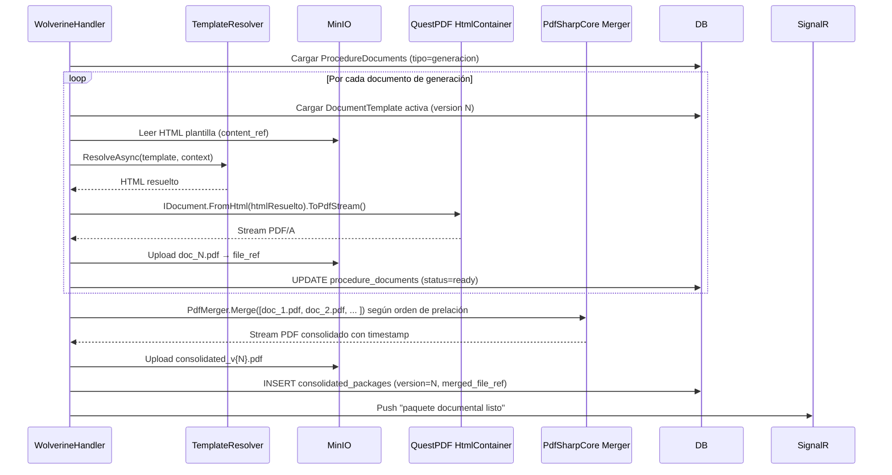

# ADR-0012: Motor de Generación Dinámica y Merge de PDF Documental

**Fecha:** 2026-06-10
**Status:** Propuesto
**Deciders:** Líder Técnico FLIT
**Autor:** Architecture Agent (architecture-agent v2.0)
**Tags:** arquitectura, backend, pdf, documentos, plantillas, merge, questpdf
**Relaciona:** ADR-0005 (QuestPDF in-process), ADR-0006 (MinIO), ADR-0009 (parametrización)
**Features ADO:** #9729 CONSOLIDACIÓN-DOCUMENTAL, #9568 PARAMETRIZADOR (plantillas)

---

## Contexto

El Feature #9568 permite al SuperAdmin definir documentos de **generación automática** asociados a tipos de trámite, con **plantillas parametrizables** (campos dinámicos mapeados a datos del trámite, actores y consultas externas). El Feature #9729 exige:

- Generación automática de documentos construibles desde plantillas al cerrar el stepper.
- Merge en **PDF único** con timestamp, ordenado parametrizablemente por OT + tipo de trámite.
- Descarga con nombre `TRAMITE_id_tipo_fecha.pdf`.
- **Regeneración versionada** ante cambios (nueva versión del paquete consolidado).
- Auditoría completa: origen, versión de plantilla, fuentes de datos.
- OUT of scope: edición del PDF, OCR, reordenamiento manual por usuario final, firma digital del PDF.

El repo ya tiene ADR-0005 (QuestPDF in-process para PDFs estructurados tipo recibo/certificado). El nuevo requerimiento es diferente: las plantillas **no son conocidas en tiempo de compilación** — son definidas por el administrador en runtime desde el parametrizador.

### Restricciones

| # | Restricción |
|---|---|
| C1 | Las plantillas se crean/modifican desde admin sin despliegue |
| C2 | Las plantillas deben poder mapearse a datos del trámite, actores y resultados de consultas externas |
| C3 | Las plantillas se versionan — un trámite radicado conserva la versión con la que fue generado |
| C4 | El merge PDF debe respetar el orden de prelación parametrizable por OT y tipo de trámite |
| C5 | Imagen Docker core-api debe mantenerse ≤200 MB (ADR-0005 C1) |
| C6 | AOT-compatible (ADR-0005 C6) |
| C7 | PDF/A mínimo para archivado legal (Ley 594/2000) |

---

## Decisión

Extender el enfoque de ADR-0005 (QuestPDF) con un **motor de resolución de plantillas basado en HTML+marcadores almacenados en MinIO**, resueltas en tiempo de ejecución y renderizadas a PDF via QuestPDF `HtmlContainer` o un pipeline HTML→PDF in-process. El merge de múltiples PDFs se implementa via `PdfMerger` de PdfSharp (MIT, ~3MB, sin Chromium).

---

## Alternativas consideradas

### Opción 1: QuestPDF con templates C# compilados — extender ADR-0005

**Descripción:** Cada tipo de documento de generación tiene una clase C# template (como en ADR-0005: `ReceiptTemplate`, `CertificateTemplate`). Agregar un nuevo tipo de documento → nueva clase C# + deploy.

**Pros:**
- Totalmente alineado con ADR-0005 sin infraestructura adicional.
- Máxima tipificación y seguridad en tiempo de compilación.
- AOT-compatible probado (ADR-0005).
- Rendimiento óptimo: sin parsing de templates en runtime.

**Cons:**
- **Viola el principio de parametrización total**: agregar un documento requiere modificar código y desplegar.
- Imposible para el SuperAdmin definir nuevos documentos desde la UI.
- Las plantillas definidas por el negocio (FUR, Impronta, Compraventa) tienen layouts que el equipo no puede anticipar.
- Las plantillas deben poder cambiar sin involucrar al equipo de desarrollo.

**Esfuerzo estimado:** S (para documentos conocidos) / Inviable (para parametrización total)
**Riesgos principales:** Viola el requisito funcional central del Feature #9568.

---

### Opción 2 (recomendada): QuestPDF + Plantillas HTML con marcadores en MinIO + HtmlContainer

**Descripción:** Las plantillas se almacenan como **HTML con marcadores** `{{campo.origen.ruta}}` en MinIO (referenciados por `document_templates.content_ref`). Un motor de resolución en `Flit.Modules.Documents` carga la plantilla, resuelve los marcadores con datos del `TemplateContext`, y pasa el HTML resultante a QuestPDF via `IHtmlContent` (o `RazorLight` para templates más expresivos). El merge de N PDFs usa `PdfSharpCore` (MIT) en memoria, sin escribir a disco.

**Pros:**
- Cumple parametrización total: plantilla definida desde UI, guardada en MinIO.
- QuestPDF sigue siendo el motor de renderizado → imagen Docker no crece significativamente.
- PdfSharpCore (MIT, ~3MB) para merge de PDFs: sin overhead, sin Chromium.
- Versionamiento natural: `document_templates.content_ref` apunta a un objeto MinIO inmutable por versión.
- `TemplateContext` puede incluir cualquier fuente de datos del trámite (campos, actores, RUNT, SIMIT, identidad).
- Alineado con ADR-0005 — extiende, no reemplaza.

**Cons:**
- El HTML de las plantillas debe ser compatible con QuestPDF `HtmlContainer` (no es HTML arbitrario completo — es un subconjunto).
- El administrador necesita conocer los marcadores disponibles (mitigado con UI de asistente de marcadores en el parametrizador).
- Testing de plantillas: cambiar una plantilla en admin puede romper la generación → pipeline CI debe tener golden-file tests de muestra.
- `PdfSharpCore` agrega ~3MB a la imagen Docker (mínimo, aceptable vs ADR-0005 C1 de ≤200MB).

**Esfuerzo estimado:** M
**Riesgos principales:** Compatibilidad HTML con QuestPDF HtmlContainer; aprendizaje del motor de marcadores por el SuperAdmin.

---

### Opción 3: Servicio externo de rendering HTML→PDF (Playwright/Chromium)

**Descripción:** Plantillas en HTML/CSS completo (sin restricciones). Un microservicio separado `services/pdf-renderer/` con Playwright .NET o Puppeteer convierte HTML a PDF.

**Pros:**
- Plantillas en HTML/CSS completo — diseñadores pueden maquetar con herramientas conocidas.
- Soporte de estilos complejos, fuentes web, imágenes, tablas.
- Separación de concerns: el servicio PDF no conoce nada de dominio.

**Cons:**
- Rechazado explícitamente en ADR-0005 por imagen Docker +1.2GB.
- Viola ADR-0004 (consolidación, sin nuevos servicios fuera de .NET y Python).
- Cold start 2-4s por instancia; RAM 150-300 MB por render concurrente.
- Sobre-ingeniería para el volumen estimado (50-20.000 PDFs/día).

**Esfuerzo estimado:** L
**Riesgos principales:** Todos los documentados en ADR-0005 Opción 2. Rechazado.

---

## Tradeoff aceptado

Se elige **Opción 2 (QuestPDF + HTML marcadores + PdfSharpCore merge)** porque:

1. Cumple parametrización total — requisito innegociable.
2. Extiende ADR-0005 sin contradecirlo.
3. PdfSharpCore (MIT, ~3MB) es la librería más liviana para merge in-process y es AOT-compatible.
4. La restricción de HTML compatible con QuestPDF HtmlContainer es manejable con la UI de asistente de marcadores.
5. La Opción 3 está explícitamente rechazada por ADR-0005.

---

## Diseño detallado

### Motor de resolución de plantillas

```csharp
// Flit.Modules.Documents/Application/TemplateResolver.cs
public sealed class TemplateResolver
{
    // Carga la plantilla HTML desde MinIO (por content_ref de document_templates)
    // Construye el TemplateContext con datos del trámite
    // Reemplaza {{campo.origen.ruta}} con valores del contexto
    // Retorna HTML resuelto listo para QuestPDF

    public async Task<string> ResolveAsync(
        DocumentTemplate template,
        TemplateContext context,
        CancellationToken ct)
    {
        var html = await _fileStorage.ReadTextAsync(template.ContentRef, ct);
        return Regex.Replace(html, @"\{\{([^}]+)\}\}", m =>
            context.Resolve(m.Groups[1].Value) ?? $"[{m.Groups[1].Value}:NO_DATA]");
    }
}

// TemplateContext incluye:
// - procedure.* (campos del trámite)
// - actors[].* (datos de cada actor)
// - vehicle.* (resultado RUNT)
// - identity.* (resultado liveness)
// - ot.* (datos del organismo)
public sealed class TemplateContext
{
    public ProcedureData Procedure { get; init; }
    public IReadOnlyList<ActorData> Actors { get; init; }
    public VehicleQueryResult? Vehicle { get; init; }
    public IdentityValidation? Identity { get; init; }
    public OtOrganismData Ot { get; init; }

    public string? Resolve(string path) { /* JSONPath-like resolution */ }
}
```

### Pipeline de generación (Wolverine handler)



### Estructura de proyecto

```
Flit.Modules.Documents/
├── Domain/
│   ├── Entities/
│   │   ├── DocumentType.cs
│   │   ├── DocumentTemplate.cs      ← content_ref a MinIO
│   │   ├── TemplateField.cs
│   │   ├── ProcedureDocument.cs
│   │   └── ConsolidatedPackage.cs
│   └── Interfaces/
│       └── IDocumentGenerator.cs
├── Application/
│   ├── Commands/
│   │   ├── GenerateProcedureDocumentsCommand.cs   ← Wolverine handler
│   │   └── ConsolidateDocumentsCommand.cs
│   └── Services/
│       ├── TemplateResolver.cs
│       └── DocumentOrderResolver.cs   ← respeta prelación por OT+tipo trámite
└── Infrastructure/
    ├── Pdf/
    │   ├── QuestPdfDocumentRenderer.cs    ← HTML → PDF via QuestPDF
    │   └── PdfSharpMerger.cs              ← N PDFs → 1 PDF consolidado
    └── Persistence/
        └── DocumentsDbContext.cs
```

### Versionamiento de paquetes

```sql
-- Cada regeneración incrementa version
INSERT INTO documents.consolidated_packages
  (procedure_id, version, merged_file_ref, created_at)
SELECT
  $1,
  COALESCE(MAX(version), 0) + 1,
  $2,
  now()
FROM documents.consolidated_packages
WHERE procedure_id = $1;
-- La versión anterior queda en MinIO para auditoría (no se borra)
```

---

## Consecuencias

### Lo que se gana
- Parametrización total de documentos: el SuperAdmin define/actualiza plantillas sin deploy.
- Versionamiento: trámites radicados conservan la versión de plantilla original.
- Merge PDF in-process sin Chromium → imagen Docker ≤200MB mantenida.
- Auditoría completa: `procedure_documents.template_version_id` + `origin` + `generated_at`.

### Lo que se pierde / costo aceptado
- Las plantillas HTML deben ser compatibles con QuestPDF HtmlContainer (subconjunto de HTML/CSS).
- El administrador necesita conocer los marcadores disponibles (UI de asistente obligatoria en #9568).
- Golden-file tests obligatorios para detectar regresiones de renderizado cuando se actualiza QuestPDF.

---

## ADRs relacionados

- ADR-0005 — QuestPDF in-process (esta decisión extiende, no contradice).
- ADR-0006 — MinIO: las plantillas y los PDFs generados se almacenan en MinIO.
- ADR-0009 — Motor de parametrización: `DocumentTemplate` es una entidad de config versionada.

---

## Notas operativas

- **backend-agent:** Implementar `TemplateResolver`, `QuestPdfDocumentRenderer`, `PdfSharpMerger`. Agregar `PdfSharpCore` a `Directory.Packages.props`. El `IDocumentGenerator` orquesta el pipeline completo.
- **database-agent:** Schema `documents` con tablas `document_types`, `document_templates`, `template_fields`, `procedure_documents`, `consolidated_packages`. Soft delete en `document_templates`.
- **frontend-agent:** En `features/procedures-config`: UI de diseño de plantillas con asistente de marcadores. En `features/documents`: visor de estado documental con descarga del paquete consolidado.
- **security-agent:** Validar que los HTML de plantillas se sanitizan antes de almacenar en MinIO (prevenir XSS en el visor documental del frontend).
- **qa-agent:** TCs de golden-file: verificar que el PDF consolidado contiene los datos correctos del trámite. TC de regeneración: verificar que `version` incrementa y la versión anterior permanece en MinIO.

---

*Creado por: Architecture Agent — 2026-06-10 | Estado: Propuesto*
*Para promover a Aceptado: PR separada con aprobación del Líder Técnico humano*
