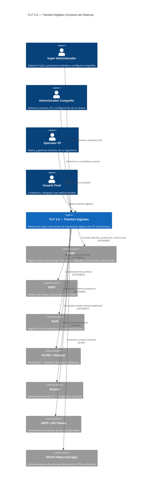
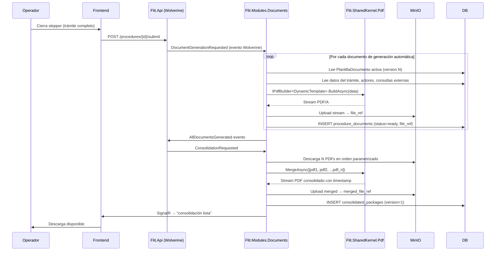
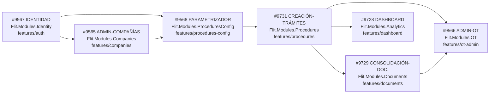

# Diseño Macro: Arquitectura Global — Trámites Digitales de Tránsito (FLIT 2.0)

**Fecha:** 2026-06-10
**Autor:** Architecture Agent (architecture-agent v2.0)
**Estado:** Propuesto — validación requerida por Líder Técnico
**Cubre:** Features ADO #9567, #9565, #9568, #9731, #9729, #9728, #9566
**ADRs generados:** ADR-0009, ADR-0010, ADR-0011, ADR-0012, ADR-0013
**Pre-requisito para:** Diseños detallados por Feature, descomposición en HUs, `database-agent` Fase 2b

---

## 1. Visión general

FLIT 2.0 es una plataforma SaaS multi-tenant de **tramitación digital ante Organismos de Tránsito colombianos**. El principio rector es la **parametrización total**: ningún trámite, documento, actor, regla de consulta ni flujo de firma está hardcodeado. Todo se configura desde administración sin despliegue.

La plataforma cubre el ciclo completo:
1. **Onboarding y gobernanza** — tenants, compañías, usuarios, permisos.
2. **Parametrización** — motor low-code para definir tipos de trámite, pasos, documentos y reglas.
3. **Ejecución** — stepper dinámico, consultas externas (RUNT/Verifik/SIMIT/RUES), firmas biométricas.
4. **Consolidación documental** — generación automática de documentos desde plantillas, merge PDF.
5. **Analítica** — dashboard multi-tenant con exportaciones Excel/PDF.
6. **OT** — administración de Organismos de Tránsito, integración Quipux, prelación documental.

---

## 2. Diagrama de Contexto (C4 — Nivel 1)



---

## 3. Descomposición en Módulos

### 3.1 Backend — Proyectos `Flit.Modules.*`

Cada módulo es un **proyecto de biblioteca de clases .NET** con su propia Clean Architecture interna (Domain → Application → Infrastructure). Se registran en `Flit.Api/Program.cs` como extensiones de módulo.

| Proyecto | Feature ADO | Schema BD | Responsabilidad |
|---|---|---|---|
| `Flit.Modules.Identity` | #9567 | `identity` | JWT, RBAC/ABAC, tenants, usuarios, roles, permisos, sesiones, invitaciones, reset password |
| `Flit.Modules.Companies` | #9565 | `companies` | Consola SaaS compañías, configuración tenant, proxy RUNT Strategy, matriz firmas, métodos de recaudo |
| `Flit.Modules.ProceduresConfig` | #9568 | `procedures_config` | Motor low-code de parametrización: tipos de trámite, pasos, secciones, campos, conectores API, motor de reglas |
| `Flit.Modules.Procedures` | #9731 | `procedures` | Runtime ejecución: grilla, stepper dinámico, actores, consultas background, biometría, firmas, copropiedades |
| `Flit.Modules.Documents` | #9729 | `documents` | Maestro documental: tipos, plantillas versionadas, generación automática, merge PDF, auditoría |
| `Flit.Modules.Analytics` | #9728 | `analytics` | Dashboard analítico: KPIs, exportación Excel/PDF, acceso multi-tenant SuperAdmin vs TenantAdmin |
| `Flit.Modules.OT` | #9566 | `ot` | Admin Organismos de Tránsito: modo Dashboard/Quipux, webhooks, motor reglas dinámico, prelación documental, etiquetas |
| `Flit.Modules.Integrations` | transversal | `integrations` | Conectores externos: RUNT/Verifik/Intempo (Strategy), SIMIT, RUES, Quipux; logs de payload por tenant |
| `Flit.Modules.Notifications` | transversal | `notifications` | Notificaciones email + SignalR; SMTP nativo vs API cliente configurable |
| `Flit.Modules.Files` | transversal | `files` | Proxy MinIO: upload/download/presigned URLs (ADR-0006) |
| `Flit.Modules.Audit` | transversal | `audit` | Bitácora transversal de cambios (quién, qué, cuándo, valor anterior/nuevo) |

**Proyectos de soporte** (ya existentes o a crear):

| Proyecto | Responsabilidad |
|---|---|
| `Flit.Api` | Host ASP.NET Core 10: bootstrap, middleware, registro de módulos |
| `Flit.Gateway` | YARP API Gateway: JWT RS256 al borde, rate-limiting, CORS (ADR-0007) |
| `Flit.Infrastructure` | DbContext compartido, EF Core migrations, seeding |
| `Flit.SharedKernel` | Tipos base: Entity, AggregateRoot, DomainEvent, Result<T>, TenantId, UserId |
| `Flit.SharedKernel.Pdf` | QuestPDF: IPdfBuilder<T>, templates, ADR-0005 |

**Estructura de módulo canónica:**

```
services/core-api/src/Flit.Modules.<Nombre>/
├── Flit.Modules.<Nombre>.csproj
├── Domain/
│   ├── Entities/
│   ├── ValueObjects/
│   ├── Events/
│   └── Interfaces/   ← IRepository, IConnector (sin dependencias de infraestructura)
├── Application/
│   ├── Commands/     ← Wolverine handlers
│   ├── Queries/
│   └── DTOs/
├── Infrastructure/
│   ├── Persistence/  ← EF Core configurations, repositories
│   ├── Connectors/   ← implementaciones de IXxxConnector
│   └── ModuleExtensions.cs
└── Contracts/        ← eventos de dominio publicados entre módulos (cross-module)
```

### 3.2 Frontend — Features `frontend/src/features/*`

Frontend: **React 19 + Vite 5 + TypeScript + TailwindCSS + TanStack Query 5 + Zod + PrimeReact**.  
Arquitectura **feature-sliced** con los 4 estados obligatorios: loading, error, empty, data.

| Feature | Feature ADO | Slug de ruta | Rol mínimo |
|---|---|---|---|
| `features/auth` | #9567 | `/login`, `/invite/:token`, `/reset-password` | público |
| `features/companies` | #9565 | `/admin/companies` | SuperAdmin |
| `features/procedures-config` | #9568 | `/admin/procedures-config` | SuperAdmin |
| `features/procedures` | #9731 | `/procedures` | Operador, Usuario |
| `features/documents` | #9729 | `/procedures/:id/documents` | Operador |
| `features/dashboard` | #9728 | `/dashboard` | TenantAdmin, SuperAdmin |
| `features/ot-admin` | #9566 | `/admin/ot` | TenantAdmin, SuperAdmin |

**Feature-sliced canónico:**

```
frontend/src/features/<nombre>/
├── api/
│   ├── <nombre>.schemas.ts   (Zod — valida respuestas)
│   └── <nombre>.api.ts       (hooks TanStack Query)
├── components/               (UI específica)
├── pages/                    (Route-level components)
└── hooks/                    (lógica reutilizable)
```

**Shared** (ya parcialmente existente):

```
frontend/src/shared/
├── api/client.ts             (Axios + interceptors JWT)
├── components/ui/            (DashboardLayout, FlitModal, FlitFormField, etc.)
├── hooks/
└── types/
```

---

## 4. Modelo de Datos Conceptual Global

### 4.1 Diagrama ER por bounded context

```mermaid
erDiagram
  %% ── IDENTITY ─────────────────────────────────────────────────
  tenants {
    uuid id PK
    string slug
    string name
    bool is_active
  }
  users {
    uuid id PK
    uuid tenant_id FK
    string email
    string password_hash
    string status
    timestamptz last_login_at
    timestamptz deleted_at
  }
  roles {
    uuid id PK
    uuid tenant_id FK
    string slug
    string name
    bool is_system
  }
  permissions {
    uuid id PK
    string slug
    string module
    string action
  }
  user_roles { uuid user_id FK; uuid role_id FK }
  role_permissions { uuid role_id FK; uuid permission_id FK }
  sessions {
    uuid id PK
    uuid user_id FK
    string jti
    timestamptz expires_at
    bool is_revoked
  }
  invitations {
    uuid id PK
    uuid tenant_id FK
    string email
    string token_hash
    string status
    timestamptz expires_at
  }

  tenants ||--o{ users : "alberga"
  tenants ||--o{ roles : "define"
  users ||--o{ user_roles : "tiene"
  roles ||--o{ user_roles : "asignado a"
  roles ||--o{ role_permissions : "tiene"
  permissions ||--o{ role_permissions : "otorgado en"
  users ||--o{ sessions : "abre"

  %% ── COMPANIES ────────────────────────────────────────────────
  companies {
    uuid id PK
    uuid tenant_id FK
    string nit
    string name
    string status
    jsonb config
  }
  company_signature_matrix {
    uuid id PK
    uuid company_id FK
    string actor_role
    string signature_type
  }
  company_ot_enabled {
    uuid id PK
    uuid company_id FK
    string procedure_type_slug
  }

  tenants ||--|| companies : "es"
  companies ||--o{ company_signature_matrix : "configura"
  companies ||--o{ company_ot_enabled : "habilita"

  %% ── PROCEDURES_CONFIG ────────────────────────────────────────
  procedure_types {
    uuid id PK
    uuid tenant_id FK
    string slug
    string name
    string family
    string scope
    int version
    bool is_active
  }
  procedure_steps {
    uuid id PK
    uuid procedure_type_id FK
    int order
    string name
    string step_type
  }
  form_sections {
    uuid id PK
    uuid step_id FK
    int order
    string name
    jsonb metadata
  }
  form_fields {
    uuid id PK
    uuid section_id FK
    int order
    string field_type
    string name
    bool is_required
    jsonb config
  }
  api_connectors {
    uuid id PK
    uuid procedure_type_id FK
    string endpoint
    string verb
    jsonb param_bindings
    int step_order
  }
  rule_sets {
    uuid id PK
    uuid procedure_type_id FK
    string name
    jsonb conditions
    jsonb actions
  }
  actor_definitions {
    uuid id PK
    uuid procedure_type_id FK
    string role
    string allowed_nature
    int min_count
    int max_count
    bool is_required
  }
  query_rules {
    uuid id PK
    uuid actor_definition_id FK
    string subject_type
    string entry_key
    bool is_blocking
    jsonb verifications
  }

  procedure_types ||--o{ procedure_steps : "contiene"
  procedure_steps ||--o{ form_sections : "tiene"
  form_sections ||--o{ form_fields : "tiene"
  procedure_types ||--o{ api_connectors : "usa"
  procedure_types ||--o{ rule_sets : "tiene"
  procedure_types ||--o{ actor_definitions : "define"
  actor_definitions ||--o{ query_rules : "tiene"

  %% ── PROCEDURES ───────────────────────────────────────────────
  procedures {
    uuid id PK
    uuid tenant_id FK
    uuid company_id FK
    uuid procedure_type_snapshot_id FK
    string composite_id
    string status
    uuid assigned_user_id FK
    timestamptz submitted_at
    jsonb step_data
  }
  procedure_actors {
    uuid id PK
    uuid procedure_id FK
    uuid actor_definition_id FK
    string nature
    string document_number
    jsonb query_results
    bool identity_validated
  }
  procedure_signatures {
    uuid id PK
    uuid procedure_id FK
    uuid actor_id FK
    string signature_type
    string status
    string file_ref
  }
  vehicle_queries {
    uuid id PK
    uuid procedure_id FK
    string plate
    string vin
    jsonb runt_payload
    jsonb simit_payload
    timestamptz queried_at
  }

  procedures ||--o{ procedure_actors : "involucra"
  procedures ||--o{ procedure_signatures : "requiere"
  procedures ||--o{ vehicle_queries : "ejecuta"

  %% ── DOCUMENTS ────────────────────────────────────────────────
  document_types {
    uuid id PK
    string name
    string load_type
    string allowed_formats
    bool is_reusable
  }
  procedure_type_documents {
    uuid id PK
    uuid procedure_type_id FK
    uuid document_type_id FK
    string role
    bool is_required
    int order
    uuid actor_definition_id FK
  }
  document_templates {
    uuid id PK
    uuid document_type_id FK
    int version
    string content_ref
    string status
  }
  template_fields {
    uuid id PK
    uuid template_id FK
    string marker
    string data_source
    string data_path
  }
  procedure_documents {
    uuid id PK
    uuid procedure_id FK
    uuid document_type_id FK
    uuid template_version_id FK
    string origin
    string status
    string file_ref
    timestamptz generated_at
  }
  consolidated_packages {
    uuid id PK
    uuid procedure_id FK
    int version
    string merged_file_ref
    timestamptz created_at
  }

  document_types ||--o{ procedure_type_documents : "aplicado en"
  document_types ||--o{ document_templates : "versiona"
  document_templates ||--o{ template_fields : "mapea"
  procedures ||--o{ procedure_documents : "acumula"
  procedures ||--o{ consolidated_packages : "consolida"

  %% ── INTEGRATIONS ─────────────────────────────────────────────
  connector_configs {
    uuid id PK
    uuid tenant_id FK
    string connector_type
    string provider
    jsonb credentials_ref
    bool is_primary
    int priority
  }
  integration_logs {
    uuid id PK
    uuid tenant_id FK
    string connector_type
    string operation
    jsonb request_payload
    jsonb response_payload
    int http_status
    int duration_ms
    timestamptz logged_at
  }
  identity_validations {
    uuid id PK
    uuid procedure_id FK
    uuid actor_id FK
    string provider
    string verdict
    string liveness_ref
    string document_photo_ref
    timestamptz validated_at
  }

  connector_configs ||--o{ integration_logs : "genera"
  procedures ||--o{ identity_validations : "requiere"

  %% ── OT ───────────────────────────────────────────────────────
  ot_organisms {
    uuid id PK
    uuid tenant_id FK
    string name
    string mode
    bool quipux_enabled
    jsonb quipux_config
  }
  ot_document_order {
    uuid id PK
    uuid ot_id FK
    uuid procedure_type_id FK
    jsonb ordered_document_ids
    timestamptz updated_at
  }
  ot_document_labels {
    uuid id PK
    uuid ot_id FK
    string slug
    string display_name
    bool is_active
  }

  tenants ||--o{ ot_organisms : "administra"
  ot_organisms ||--o{ ot_document_order : "personaliza"
  ot_organisms ||--o{ ot_document_labels : "usa"
```

### 4.2 Resumen de entidades clave por módulo

| Módulo | Entidades principales | Snapshots / Versionado |
|---|---|---|
| Identity | Tenant, User, Role, Permission, Session, Invitation | Session.jti en blacklist Redis |
| Companies | Company, CompanyConfig (jsonb), SignatureMatrix, OtEnabled | CompanyConfig versionada |
| ProceduresConfig | ProcedureType, Step, FormSection, FormField, ApiConnector, RuleSet, ActorDefinition | SnapshotConfig al radicar (ADR-0010) |
| Procedures | Procedure, ProcedureActor, Signature, VehicleQuery | step_data como JSONB snapshot |
| Documents | DocumentType, DocumentTemplate (versiones), TemplateField, ProcedureDocument, ConsolidatedPackage | document_templates.version |
| Integrations | ConnectorConfig, IntegrationLog, IdentityValidation | logs inmutables |
| Analytics | Vistas materializadas sobre procedures + actors | Actualización por evento |
| OT | OtOrganism, OtDocumentOrder, OtDocumentLabel | ordered_document_ids JSONB |

---

## 5. Estrategia Multi-Tenant

**Patrón elegido:** Shared Database + Shared Schema + `tenant_id` + Row Level Security PostgreSQL.
Ver **ADR-0010** para tradeoffs completos.

### 5.1 Columna `tenant_id` en todas las tablas de negocio

```sql
-- Toda tabla de negocio incluye:
tenant_id uuid NOT NULL
  REFERENCES identity.tenants(id)
  ON DELETE RESTRICT;

-- Índice compuesto obligatorio:
CREATE INDEX ix_<tabla>_tenant_id_<pk> ON <schema>.<tabla>(tenant_id, id)
  WHERE deleted_at IS NULL;
```

### 5.2 Row Level Security (RLS)

```sql
-- Patrón canónico para cada tabla de negocio:
ALTER TABLE procedures.procedures ENABLE ROW LEVEL SECURITY;
ALTER TABLE procedures.procedures FORCE ROW LEVEL SECURITY;

CREATE POLICY tenant_isolation ON procedures.procedures
  USING (tenant_id = current_setting('app.tenant_id')::uuid);
```

### 5.3 Claims JWT y contexto de tenant

El JWT emitido por `Flit.Modules.Identity` incluye:

```jsonc
{
  "sub": "<user_id>",
  "tid": "<tenant_id>",          // ← tenant claim
  "roles": ["operator", "admin"],
  "perms": ["tramites.create", "tramites.admin.maestro"],  // ← permisos string
  "jti": "<uuid>",               // ← para blacklist de revocación
  "exp": 1718000000
}
```

El middleware de `Flit.Gateway` valida el JWT (RS256). El `tid` claim se propaga como header `X-Tenant-Id` al backend. En `Flit.Infrastructure`, el `TenantContextMiddleware` ejecuta:

```sql
SET LOCAL app.tenant_id = '<tenant_id_del_request>';
```

antes de cada query, activando RLS automáticamente.

### 5.4 SuperAdmin multi-tenant

El Super Administrador tiene un tenant especial `system` con acceso bypass. En el middleware:

```csharp
if (user.HasRole("superadmin"))
    // NO SET app.tenant_id → RLS no aplica para superadmin
    // O bien: SET app.tenant_id = '00000000-...' y política especial
```

---

## 6. Estrategia de Integraciones Externas

**Patrón elegido:** Strategy con interfaces de dominio + implementaciones intercambiables + hot-failover automático.
Ver **ADR-0011** para tradeoffs completos.

### 6.1 Interfaces de dominio (en `Flit.Modules.Integrations/Domain/Interfaces/`)

```csharp
public interface IRuntConnector
{
    Task<VehicleQueryResult> QueryVehicleAsync(string plate, CancellationToken ct);
    Task<PersonQueryResult> QueryPersonAsync(string documentNumber, CancellationToken ct);
    Task<RestrictionQueryResult> QueryRestrictionsAsync(string documentNumber, CancellationToken ct);
}

public interface ISimittConnector
{
    Task<FinesQueryResult> QueryFinesAsync(string documentNumber, CancellationToken ct);
}

public interface IRuesConnector
{
    Task<LegalEntityQueryResult> QueryLegalEntityAsync(string nit, CancellationToken ct);
}

public interface IIdentityValidationConnector
{
    Task<LivenessResult> ValidateLivenessAsync(ValidateLivenessRequest request, CancellationToken ct);
}

public interface IQuipuxConnector
{
    Task NotifyStatusChangeAsync(QuipuxStatusNotification notification, CancellationToken ct);
}
```

### 6.2 Implementaciones (en `Flit.Modules.Integrations/Infrastructure/Connectors/`)

```
Connectors/
├── Runt/
│   ├── VerifikRuntConnector.cs        ← proveedor primario (real)
│   ├── IntempoRuntConnector.cs        ← proveedor secundario (fallback)
│   └── MockRuntConnector.cs           ← DEV/TEST
├── Simit/
│   ├── SimitConnector.cs
│   └── MockSimitConnector.cs
├── Rues/
│   ├── RuesConnector.cs
│   └── MockRuesConnector.cs
├── Identity/
│   ├── VerifikIdentityConnector.cs    ← liveness real
│   └── MockIdentityConnector.cs
└── Quipux/
    ├── QuipuxConnector.cs
    └── MockQuipuxConnector.cs
```

### 6.3 Hot-failover automático (Strategy + Circuit Breaker)

```
Request → ConnectorRouter → PrimaryConnector (Verifik)
               │ timeout >4s o 5xx
               └──→ SecondaryConnector (Intempo)
                         │ fallo
                         └──→ CircuitBreaker (OPEN) → respuesta degradada
```

El `ConnectorConfig` por tenant define qué proveedor es primario. El `ConnectorRouter` implementa el failover transparente. Cada request genera un `IntegrationLog` con payload completo (request + response + duración).

### 6.4 Selector de implementación por entorno

```csharp
// ModuleExtensions.cs
if (env.IsDevelopment())
    services.AddScoped<IRuntConnector, MockRuntConnector>();
else
    services.AddScoped<IRuntConnector, ConnectorRouter<IRuntConnector>>();
```

---

## 7. Estrategia de Parametrización

**Principio:** configuración como datos, no como código.
Ver **ADR-0009** para tradeoffs del modelo de datos (JSONB vs tablas relacionales vs híbrido).

### 7.1 Snapshot de configuración al radicar

Cuando se radica un trámite (`Procedure.status = Submitted`), se crea una snapshot inmutable de la configuración vigente del `ProcedureType`. Los campos `form_fields.config`, `rule_sets.conditions`, `rule_sets.actions` se almacenan en `procedures.step_data` y en una tabla de snapshot. Esto garantiza que un cambio posterior en la parametrización no afecte trámites ya radicados.

```
ProcedureType (v3) ──→ Procedure[TRASP-02] snapshot → config_snapshot_id → (inmutable)
ProcedureType (v4) ──→ Procedure[TRASP-03] snapshot → config_snapshot_id → (inmutable)
```

### 7.2 Motor de reglas (rule engine)

Las `RuleSet` definen condiciones (AND/OR, operadores ==, !=, >, <, Contains) y acciones UI (mostrar/ocultar campo/sección, mostrar toast, mostrar modal). El motor evalúa reglas en tiempo de ejecución (frontend + validación backend).

La estructura de `conditions` y `actions` en JSONB es un árbol de nodos:

```json
{
  "operator": "AND",
  "nodes": [
    { "field": "actor.nature", "op": "==", "value": "juridica" },
    { "field": "vehicle.restrictions", "op": "Contains", "value": "EMBARGO" }
  ],
  "actions": [
    { "type": "show", "target": "section.representante_legal" },
    { "type": "modal", "message": "Vehículo con embargo detectado" }
  ]
}
```

### 7.3 Versionamiento de configuración

```
ProcedureType: version = 1, 2, 3... (incrementa con cada cambio)
DocumentTemplate: version = 1, 2, 3... (no se edita, se crea nueva versión)
```

El campo `procedure_type_snapshot_id` en `Procedure` apunta a la versión exacta con la que inició.

---

## 8. Estrategia de Generación / Consolidación Documental

Ver **ADR-0012** para tradeoffs del motor de generación.

### 8.1 Ciclo de vida de un documento generado



### 8.2 Motor de plantillas dinámico

Las plantillas (HTML con marcadores `{{campo.origen.ruta}}`) se almacenan en `document_templates.content_ref` (archivo en MinIO). El motor de resolución:

1. Lee `template_fields` para el `template_version_id`.
2. Construye un `TemplateContext` con datos del trámite, actores, consultas externas, identidad validada.
3. Resuelve cada `{{marker}}` → valor del contexto.
4. Pasa el HTML renderizado a `QuestPDF` via `HtmlToPdfContent` (extensión del ADR-0005).

### 8.3 Regeneración versionada

Ante cambio de actor o corrección documental, `consolidated_packages.version` incrementa. La versión anterior queda en MinIO para auditoría. El PDF descargado siempre es la versión más reciente.

---

## 9. Orden de Implementación y Dependencias entre Módulos



**Dependencias transversales** (disponibles desde la iteración 1):

- `Flit.Modules.Integrations` — requerido por `Procedures` (#9731) y `Companies` (#9565)
- `Flit.Modules.Notifications` — requerido por `Identity` (invitaciones) y `Procedures` (alertas)
- `Flit.Modules.Files` — requerido por `Documents` (#9729) y `Procedures` (#9731)
- `Flit.Modules.Audit` — transversal desde el inicio

**Sprints sugeridos** (sin nombrar el activo):

| Sprint | Features ADO | Módulos |
|---|---|---|
| S+1 | #9567 IDENTIDAD | Identity, Notifications (email) |
| S+2 | #9565 ADMIN-COMPAÑÍAS | Companies, Integrations (scaffold) |
| S+3 | #9568 PARAMETRIZADOR | ProceduresConfig |
| S+4 | #9731 CREACIÓN-TRÁMITES | Procedures, Integrations (full) |
| S+5 | #9729 CONSOLIDACIÓN-DOC. | Documents, SharedKernel.Pdf (extensión) |
| S+6 | #9728 DASHBOARD + #9566 ADMIN-OT | Analytics, OT |

---

## 10. Tabla de Tradeoffs de Decisiones Macro

| # | Decisión | Opción A | Opción B | Opción C | **Recomendada** | ADR |
|---|---|---|---|---|---|---|
| 1 | Motor parametrización formularios | JSONB puro (todo en una columna) | Tablas relacionales puras (ProcedureType, Step, Field, ...) | Híbrido: tablas para estructura + JSONB para metadata extendida | **C — Híbrido** | ADR-0009 |
| 2 | Estrategia multi-tenant | Schema por tenant | Base de datos por tenant | Shared DB + tenant_id + RLS PostgreSQL | **C — Shared DB + RLS** | ADR-0010 |
| 3 | Integraciones externas | HTTP directo sin failover | Strategy + interfaces + hot-failover automático | Outbox + queue para todas las consultas | **B — Strategy + failover** | ADR-0011 |
| 4 | Motor generación/merge PDF | QuestPDF con templates C# hardcoded | QuestPDF + plantillas dinámicas desde BD (HTML + marcadores) | Servicio externo Playwright/Chromium | **B — QuestPDF + BD** | ADR-0012 |
| 5 | Invalidación sesión en tiempo real | JWT corto + Refresh Token en BD (sin blacklist) | **JWT ≤15 min + JTI blacklist IMemoryCache + SignalR push logout** | JWT ultracorto 1-2 min + refresh flood | **B — JWT + IMemoryCache + SignalR** (sin Redis) | ADR-0013 |

---

## 11. Archivos a Crear o Modificar

### Backend — `services/core-api/`

| Acción | Ruta |
|---|---|
| Crear | `src/Flit.Modules.Identity/Flit.Modules.Identity.csproj` |
| Crear | `src/Flit.Modules.Companies/Flit.Modules.Companies.csproj` |
| Crear | `src/Flit.Modules.ProceduresConfig/Flit.Modules.ProceduresConfig.csproj` |
| Crear | `src/Flit.Modules.Procedures/Flit.Modules.Procedures.csproj` |
| Crear | `src/Flit.Modules.Documents/Flit.Modules.Documents.csproj` |
| Crear | `src/Flit.Modules.Analytics/Flit.Modules.Analytics.csproj` |
| Crear | `src/Flit.Modules.OT/Flit.Modules.OT.csproj` |
| Crear | `src/Flit.Modules.Integrations/Flit.Modules.Integrations.csproj` |
| Crear | `src/Flit.Modules.Notifications/Flit.Modules.Notifications.csproj` |
| Crear | `src/Flit.Modules.Audit/Flit.Modules.Audit.csproj` |
| Modificar | `src/Flit.Infrastructure/Persistence/FlitDbContext.cs` (registrar DbSets por módulo) |
| Crear | `src/Flit.SharedKernel.Pdf/Flit.SharedKernel.Pdf.csproj` (ADR-0005) |
| Crear | Migraciones EF Core (database-agent Fase 2b, por módulo) |

### Frontend — `frontend/src/`

| Acción | Ruta |
|---|---|
| Crear | `features/auth/` (api, components, pages, hooks) |
| Crear | `features/companies/` |
| Crear | `features/procedures-config/` |
| Crear | `features/procedures/` |
| Crear | `features/documents/` |
| Crear | `features/dashboard/` |
| Crear | `features/ot-admin/` |
| Modificar | `shared/api/client.ts` (header X-Tenant-Id, interceptor 403→redirect) |

### Docs

| Acción | Ruta |
|---|---|
| Crear | `docs/designs/0000-arquitectura-macro-tramites-digitales.md` (este archivo) |
| Crear | `docs/decisions/ADR-0009-motor-parametrizacion-formularios-dinamicos.md` |
| Crear | `docs/decisions/ADR-0010-estrategia-multi-tenant-rls.md` |
| Crear | `docs/decisions/ADR-0011-patron-integraciones-externas-strategy-failover.md` |
| Crear | `docs/decisions/ADR-0012-motor-generacion-merge-pdf-documental.md` |
| Crear | `docs/decisions/ADR-0013-invalidacion-sesion-tiempo-real.md` |

---

## 12. Notas Operativas por Agente

### `database-agent`
- Materializar el DDL de referencia de la Sección 4 en migraciones EF Core.
- Asignar los schemas PostgreSQL: `identity`, `companies`, `procedures_config`, `procedures`, `documents`, `integrations`, `analytics`, `ot`, `notifications`, `audit`, `files`.
- Aplicar RLS en todas las tablas de negocio (ADR-0010).
- Crear índices compuestos `(tenant_id, id)` y parciales `WHERE deleted_at IS NULL`.
- Implementar trigger `tr_*_before_update_set_updated_at` y trigger de auditoría en `audit.audit_log`.
- Fase 2b obligatoria antes de cada Feature (empezando por Identity).

### `backend-agent`
- Implementar módulos en el orden: Identity → Companies → ProceduresConfig → Procedures → Documents → Analytics → OT.
- Para `Flit.Modules.Integrations`: implementar interfaces de dominio primero; implementaciones reales (Verifik, Intempo) después con `.env.verifik`.
- Para `Flit.Modules.Documents`: extender `Flit.SharedKernel.Pdf` con soporte de plantillas dinámicas (HTML + marcadores).
- Wolverine para todo manejo de comandos/eventos asincrónicos.
- No escribir DDL con RLS/triggers — delegar a `database-agent`.

### `frontend-agent`
- Features en el mismo orden que el backend.
- 4 estados obligatorios en toda lista/query: loading, error, empty, data.
- Interceptor Axios: adjuntar JWT del store, manejar 401 (refresh o redirect a /login), manejar **403 con redirect a dashboard** (sesión desalojada por cambio de privilegios — Feature #9567).
- Stepper de `features/procedures` debe ser completamente **data-driven**: leer steps/sections/fields del endpoint de config.

### `security-agent`
- Auditar módulo `Flit.Modules.Identity` antes del primer merge: JWT RS256, RBAC, blacklist, ABAC.
- Validar que `PII` (datos de identidad, biometría, RUNT payloads) estén marcados en schema con `COMMENT` y que los logs de integración no persistan credenciales.
- Revisar `dangerouslySetInnerHTML` en visor documental (frontend/documents).

### `qa-agent`
- TCs prioritarios: aislamiento de tenant (RLS), invalidación de sesión en tiempo real, failover de conector RUNT, snapshot de configuración al radicar, merge PDF con datos reales.

### `infra-agent`
- Configurar variable de entorno `REDIS_URL` para la blacklist de JWT (ADR-0013).
- Verificar extensión `pg_uuidv7` en PostgreSQL 17.
- Configurar MinIO buckets: `procedures-documents`, `consolidated-pdfs`, `identity-validations`, `integration-logs`.

---

## 13. Supuestos y Riesgos para Validación Humana

| # | Supuesto / Riesgo | Impacto | Validación requerida |
|---|---|---|---|
| S1 | RUNT tiene una API REST consultable vía Verifik con los campos esperados (placa, VIN, restricciones, conductores) | Alto | LT + equipo integración con Verifik |
| S2 | SIMIT expone consulta de multas por número de documento | Alto | LT + equipo integración |
| S3 | RUES expone existencia y representante legal de empresas | Alto | LT + equipo integración |
| S4 | Liveness biométrico (Verifik) es suficiente como única validación de identidad | Alto | LT + legal/compliance |
| S5 | Redis está disponible en el VPS para la blacklist de sesiones | Medio | Infra Agent + LT |
| S6 | El motor de plantillas HTML+marcadores es suficiente para todos los documentos (FUR, Impronta, Compraventa) | Medio | LT + diseñadores |
| S7 | Un solo schema PostgreSQL compartido con RLS es aceptable para los clientes (compañías) — no requieren aislamiento total | Alto | LT + comercial |
| S8 | ~~Frontend Next.js~~ — **Resuelto**: el frontend es React 19 + Vite 5 (confirmado por LT 2026-06-10). No hay migración a Next.js. AGENTS.md debe actualizarse para reflejar el stack real. | Cerrado | — |
| S9 | QuestPDF Community License (<$1M/año revenue) aplica para todo el roadmap de FLIT 2.0 | Medio | LT + financiero |
| S10 | Quipux tiene webhooks o callbacks para hot-update de estados | Medio | LT + equipo OT |

---

*Generado por: architecture-agent v2.0 — 2026-06-10*
*Estado: Propuesto. Promueve a Aceptado exclusivamente el Líder Técnico humano.*
