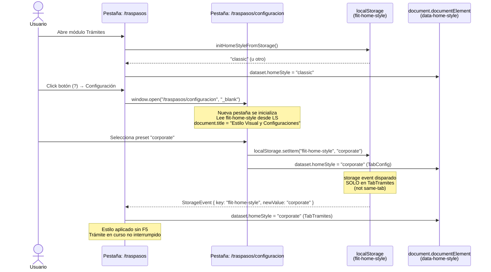

# Diseño: Reubicar Estilo Visual en configuración global del módulo Trámites

**Feature:** [#9304](https://dev.azure.com/FlitDevOps/FLIT%20-%20EVOLUTION/_workitems/edit/9304)  
**Arquitecto:** architecture-agent · supervisión Samuel Cardenas  
**Fecha:** 2026-06-01  
**Sprint objetivo:** `FLIT - EVOLUTION\Iteration 2`  
**ADR:** No requerido (ver justificación al final)

---

## Contexto

El módulo de Trámites (Traspasos vehiculares) embebe actualmente el componente `HomeStyleSelector` directamente en `TraspasosDashboardPage.tsx` (líneas 54–66), ocupando espacio visual en el flujo operativo principal. El negocio solicita separar la configuración de estilo en una ruta dedicada accesible desde el menú `(?)` de la barra superior, abriendo en nueva pestaña para no interrumpir un trámite en curso.

La lógica de persistencia (`localStorage`, clave `flit-home-style`, atributo `data-home-style` en `<html>`) fue introducida en Feature [#9237](https://dev.azure.com/FlitDevOps/FLIT%20-%20EVOLUTION/_workitems/edit/9237) y **no se modifica** en este diseño.

---

## Contrato API

**N/A** — La preferencia de estilo es 100 % cliente (`localStorage`). Sin cambios en endpoints `_apis/v1/traspasos/*`. Fase futura opcional: endpoint de preferencias de usuario si el PO lo prioriza.

---

## Alternativas evaluadas

### Opción 1 — `storage` event (escucha nativa del navegador)

**Mecanismo:** El `HomeStyleProvider` en la pestaña original (Trámites) escucha el evento global `storage` emitido cuando otra pestaña del **mismo origen** escribe en `localStorage`. Al detectar cambio en `flit-home-style`, llama `setStyleId(newValue)` que ya ejecuta `applyHomeStyle`.

**Pros:**
- API nativa sin dependencias adicionales.
- Cero overhead: solo dispara cuando cambia el valor (not on same-tab writes).
- Compatible con todos los navegadores modernos y móviles.
- Integración trivial con el `HomeStyleProvider` existente (añadir un `useEffect` con `addEventListener("storage", ...)`).
- Patrón ya reconocido en el equipo (used in DashboardLayout).

**Contras:**
- No dispara en la misma pestaña que escribe (by design, pero limita testeo unitario).
- Solo `localStorage` / `sessionStorage`; no funciona con IndexedDB o futuras stores.
- Si el usuario abre > 2 pestañas, cada escucha actualiza correctamente pero el evento no tiene payload de contexto (solo `key`, `oldValue`, `newValue`).

**Esfuerzo:** S  
**Riesgos:** Bajo. Solo añadir listener en `HomeStyleProvider`.

---

### Opción 2 — `BroadcastChannel` API

**Mecanismo:** Crear un canal `new BroadcastChannel("flit-home-style")`. La pestaña de configuración emite `channel.postMessage({ styleId })` al seleccionar preset; la pestaña de Trámites escucha con `channel.onmessage` y actualiza el contexto.

**Pros:**
- Más explícito y semánticamente correcto (canal dedicado al dominio).
- Funciona aunque localStorage esté bloqueado (Safari ITP).
- Puede transportar cualquier payload (no solo strings).
- Soporta múltiples pestañas simultáneas sin colisiones.

**Contras:**
- No soportado en IE11 (irrelevante) ni en Workers sin un polyfill.
- Requiere coordinar el ciclo de vida del canal (crear/cerrar) en efectos React.
- Añade superficie de superficie nueva al codebase; requiere justificación en ADR si se generaliza.
- Agrega complejidad de cleanup (`channel.close()` en return del efecto).
- Testeo requiere mock de `BroadcastChannel`.

**Esfuerzo:** M  
**Riesgos:** Medio. Mayor complejidad de ciclo de vida; fácil olvidar `close()`.

---

### Opción 3 — Solo F5 (sin sincronización entre pestañas)

**Mecanismo:** La pestaña de Trámites no escucha cambios externos. El usuario debe recargar manualmente para ver el nuevo estilo. El valor persiste en `localStorage` y se lee en el siguiente arranque del `HomeStyleProvider`.

**Pros:**
- Cero código extra.
- Retrocompatibilidad total (comportamiento actual de #9237).
- Menor superficie de bugs.

**Contras:**
- UX degradada: el usuario no ve el cambio reflejado en tiempo real en la pestaña de trámites.
- Contradice el criterio funcional CF-6: "los cambios se aplican globalmente… visible al volver a la pestaña original".
- No cumple los ACs de la HU3 (sincronización sin F5 requerida).

**Esfuerzo:** XS  
**Riesgos:** Incumplimiento directo de AC — **descartada**.

---

## Decisión

**Opción 1 — `storage` event.**

Justificación: API nativa, esfuerzo S, integración trivial en `HomeStyleProvider` existente con un único `useEffect`, y cobertura total de los ACs requeridos. `BroadcastChannel` (Opción 2) solo aportaría valor si el equipo necesita sincronizar estados más complejos que un string de estilo o si Safari ITP fuera un bloqueante activo; ninguno de los dos casos aplica en v1. La Opción 3 fue descartada por incumplir CF-6.

La implementación se limita a añadir en `HomeStyleProvider`:

```tsx
useEffect(() => {
  function handleStorage(e: StorageEvent) {
    if (e.key === HOME_STYLE_STORAGE_KEY && e.newValue) {
      const resolved = resolveHomeStyleId(e.newValue);
      setStyleIdState(resolved);
      applyHomeStyle(resolved);
    }
  }
  window.addEventListener("storage", handleStorage);
  return () => window.removeEventListener("storage", handleStorage);
}, []);
```

---

## Sequence Diagram



---

## Modelo de datos

**N/A** — sin cambios de schema en base de datos ni en contratos de API.  
El único "modelo" es la clave `flit-home-style` en `localStorage` (string; valores: `"classic" | "corporate" | "high-contrast"`), que ya existe desde #9237 y no se modifica.

---

## Archivos a crear / modificar en `frontend/`

### Archivos a modificar

| Archivo | Cambio |
|---------|--------|
| `src/features/traspasos/pages/TraspasosDashboardPage.tsx` | Eliminar `<section>` de Estilo Visual (líneas ~54–66) e import de `HomeStyleSelector` |
| `src/shared/components/ui/DashboardLayout.tsx` | Añadir `{ label: "Configuración", href: "/traspasos/configuracion", target: "_blank" }` a `HELP_MENU_ITEMS`; actualizar `handleMenuKeyDown` y `handleTriggerKeyDown` para N+1 ítems |
| `src/shared/hooks/use-home-style.tsx` | Añadir `useEffect` con listener `storage` en `HomeStyleProvider` |
| `src/App.tsx` | Añadir ruta `<Route path="/traspasos/configuracion" element={<TramitesConfigPage />} />` dentro del shell apropiado |

### Archivos a crear

| Archivo | Descripción |
|---------|-------------|
| `src/features/traspasos/pages/TramitesConfigPage.tsx` | Página `Estilo Visual y Configuraciones`: `useEffect` para `document.title`, card con `HomeStyleSelector`, los 4 estados FLIT (loading / error / empty / ready) |

### Archivos de tests a modificar / crear

| Archivo | Cambio |
|---------|--------|
| `src/features/traspasos/pages/TraspasosDashboardPage.spec.tsx` | Eliminar aserciones sobre `HomeStyleSelector` y la sección de Estilo Visual |
| `src/shared/components/ui/DashboardLayout.spec.ts` (si existe) | Añadir aserciones: ítem "Configuración" en menú `?`; apertura con `target="_blank"` |
| `src/shared/lib/home-style.spec.ts` (si existe) | Sin cambio (la lib no se modifica) |
| `src/shared/hooks/use-home-style.spec.tsx` (si existe) | Añadir test: listener `storage` → sincroniza `styleId` en pestaña receptora |
| `e2e/home-styles.spec.ts` | Extender: flujo menú `?` → Configuración → nueva pestaña → cambio preset → verificar `data-home-style` en pestaña original |
| `e2e/tramites-config.spec.ts` (nuevo) | Spec dedicado: carga de `TramitesConfigPage`, título de pestaña, 4 estados UI |

---

## Consideraciones de layout para `TramitesConfigPage`

La ruta `/traspasos/configuracion` se abre en `_blank`. Existen dos opciones de shell:

**Opción A (recomendada):** Reutilizar `TraspasosShell` (con sidebar y header) para coherencia visual. El usuario ve el mismo layout y puede navegar si lo desea. Implementación: una ruta adicional envuelta en `<TraspasosShell>`.

**Opción B:** Shell mínimo (solo header sin sidebar) para enfatizar que es una vista de configuración independiente. Mayor esfuerzo de creación de componente nuevo.

**Decisión:** Opción A. Reutilizar `TraspasosShell` respeta el principio de mínimo esfuerzo, evita crear componentes nuevos y es coherente con el diseño visual del módulo.

---

## Notas operativas por agente

### Frontend Agent (implementador principal)
- Seguir exactamente la lista de archivos a crear/modificar.
- En `DashboardLayout.tsx`: el array `HELP_MENU_ITEMS` es `const` tipado; al añadir el ítem de Configuración, actualizar todos los usos de `.length` en `handleTriggerKeyDown` y `handleMenuKeyDown` (los índices de wrap usan `HELP_MENU_ITEMS.length`).
- El nuevo ítem de Configuración debe renderizarse como `<a>` con `href="/traspasos/configuracion"` y `target="_blank"` (no como `<Link>` de react-router-dom, ya que la apertura en nueva pestaña desde `window.open` o `target="_blank"` es un requisito de negocio).
- `TramitesConfigPage.tsx`: usar `useEffect` para `document.title` y respetar los 4 estados de `HomeStyleSelector` (`loading`, `error`, `empty`, `ready`). La lógica de hidratación puede usar `useHomeStyle()` directamente; el Provider ya envuelve toda la app.
- El listener `storage` en `HomeStyleProvider` debe importar `resolveHomeStyleId` de `home-style.ts` para manejar valores inválidos en localStorage.

### QA Agent
- Escenarios P0 de smoke: ver tabla en `planificacion-9304-tramites-estilo-visual-config-2026-06-01.md`.
- Test E2E clave: `page.context().waitForEvent('page')` para capturar nueva pestaña; verificar `data-home-style` en pestaña original tras cambio en Config.
- Cobertura WCAG: foco del nuevo ítem del menú `?` con teclado; contraste del card en TramitesConfigPage.

### Security Agent
- Sin superficie nueva de ataque (no nuevos endpoints, no `dangerouslySetInnerHTML`).
- Verificar `target="_blank"` siempre acompañado de `rel="noopener noreferrer"` (ya es patrón en `HELP_MENU_ITEMS` existentes).
- `localStorage` no almacena PII; solo un string de ID de preset.

### Infra Agent
- Sin cambios de infraestructura. La nueva ruta es client-side (SPA). Verificar que `nginx` o el servidor de assets sirva `index.html` para `/traspasos/configuracion` (catch-all SPA ya debe estar configurado).

---

## ADR — No requerido

**Justificación:** El patrón de sincronización entre pestañas via `storage` event es una extensión incremental del patrón de estado cliente ya establecido en Feature #9237 (`localStorage` + `data-home-style`). No introduce dependencias nuevas, no contradice ningún ADR vigente (ADR-0001 a ADR-0007 cubren backend y stack general), y el patrón es ampliamente conocido y reversible. Una decisión de esta escala no sienta precedente arquitectónico que requiera documentación formal de ADR; queda documentada en este diseño.

Si el equipo decide en el futuro migrar a `BroadcastChannel` o a sincronización con backend, **ese** cambio sí requerirá un ADR nuevo.

---

*Diseño generado por architecture-agent bajo supervisión de Samuel Cardenas — 2026-06-01*
