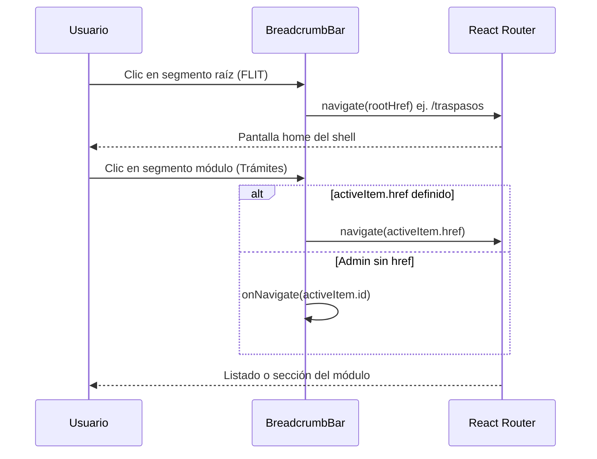

# Diseño — Feature #9388 Migas de pan clicables

**Estado:** Propuesto  
**Feature:** [#9388](https://dev.azure.com/FlitDevOps/FLIT%20-%20EVOLUTION/_workitems/edit/9388)  
**Módulo:** Frontend / UI compartida (`DashboardLayout`)  
**Complejidad:** S

## Contexto

El header global muestra migas de pan (`FLIT / Trámites`) como texto estático. En rutas anidadas (`/traspasos/nuevo`, `/traspasos/:id`, `/dashboard`, `/traspasos/configuracion`) el usuario no puede volver al listado del módulo con un clic en la miga, lo que reduce la fluidez frente al menú lateral.

**Componente actual:** `frontend/src/shared/components/ui/DashboardLayout.tsx` (líneas 421–431).

## Alternativas

| ID | Enfoque | Pros | Contras | Esfuerzo |
|----|---------|------|---------|----------|
| **A** | Reemplazar `<span>` por `<Link>` condicional inline | Diff mínimo; sin nuevos archivos | Lógica mezclada en layout; difícil testear segmentos | S |
| **B** | Subcomponente `BreadcrumbBar` + props `rootHref` | Separación clara; tests por segmento; reutilizable | ~40 líneas extra | S |
| **C** | Parser de `pathname` → N niveles dinámicos | Escalable a rutas profundas | Over-engineering; no hay CF de tercer nivel | M |

### Recomendación: **Opción B**

Justificación: el alcance es dos segmentos fijos (raíz + módulo). Un subcomponente mantiene `DashboardLayout` legible, facilita WCAG (`aria-current`) y los tests Vitest sin acoplar al shell completo.

## Comportamiento detallado



### Reglas por segmento

| Segmento | Destino | Render cuando |
|----------|---------|---------------|
| Raíz (`title`, ej. FLIT) | `rootHref` (default `/traspasos`) | Siempre enlace si `pathname !== rootHref` |
| Módulo (`activeItem.label`) | `activeItem.href` o `onNavigate(id)` | Enlace si la ruta actual es hija del módulo; `aria-current="page"` si ya estamos en la raíz del módulo |
| Sin `activeItem` | `subtitle` como texto | Fallback actual (sin enlace) |

### Casos CF → implementación

| CF | Ruta actual | Raíz | Módulo |
|----|-------------|------|--------|
| CF1 | `/traspasos/nuevo`, `/traspasos/:id` | Link → `/traspasos` | Link → `/traspasos` |
| CF2 | cualquier bajo traspasos | Link → `/traspasos` | según tabla |
| CF3 | `/dashboard` | Link → `/traspasos` | Link → `/dashboard` |
| CF4 | todos los links | `focus-visible:ring-2` + teclado nativo `<Link>` | |
| CF5 | 375px | mantener `truncate` en segmento módulo | |
| CF6 | Admin | N/A (`rootHref` no aplica o `/admin`) | `button`/`onNavigate` si no hay `href` |

## Cambios de API (props)

```typescript
interface DashboardLayoutProps {
  // ...existentes
  /** Ruta del segmento raíz de la miga (default: /traspasos) */
  rootHref?: string;
}
```

`AdminPanel` puede omitir `rootHref` o usar `rootHref="/admin"` si se define ruta base en el futuro.

## OpenAPI / DDL

**N/A** — cambio exclusivo de UI.

## Archivos a modificar

| Archivo | Cambio |
|---------|--------|
| `frontend/src/shared/components/ui/DashboardLayout.tsx` | `BreadcrumbBar`, `Link`, props `rootHref`, lógica enlace vs `aria-current` |
| `frontend/src/shared/components/ui/DashboardLayout.spec.ts` | Tests CF1–CF5 con `MemoryRouter` + rutas anidadas |
| `frontend/src/features/traspasos/components/traspasos-nav-cta.spec.tsx` | Ajuste si aserciones de breadcrumb cambian |

## Descomposición sugerida (Fase 3)

| HU | Tipo | SP | Alcance |
|----|------|-----|---------|
| #TBD `[FRONTEND]` Migas de pan clicables en DashboardLayout | FRONTEND | 3 | CF1–CF6, tests unitarios |

Una sola HU es suficiente (complejidad S, un componente compartido).

## Notas operativas

| Agente | Nota |
|--------|------|
| **frontend-agent** | Usar `Link` de `react-router-dom`; no `window.location`. Estilos link: `text-flit-primary hover:underline` + foco existente FLIT. |
| **qa-agent** | TC E2E opcional: desde detalle trámite, clic miga → listado. |
| **security-agent** | Sin superficie nueva; rutas internas ya validadas por router. |
| **code-review-agent** | Verificar que segmento actual no sea doble enlace redundante. |

## Riesgos

| Riesgo | Mitigación |
|--------|------------|
| Regresión truncado mobile (HU9282) | Conservar `truncate` en segmento módulo; test 375px existente |
| Admin sin `href` | Rama `onNavigate` documentada en CF6 |
| Dashboard dinámico RBAC | Usar `activeItem.href` del menú inyectado |

## ADR

**No requerido** — patrón estándar de navegación con React Router; no introduce dependencias ni decisión transversal.
