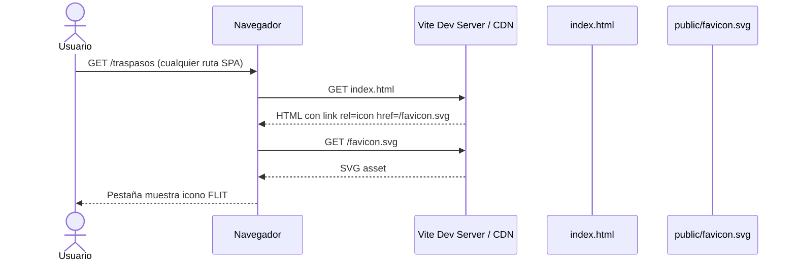

# Diseño: Favicon en pestaña del navegador

**Feature:** [#9389](https://dev.azure.com/FlitDevOps/FLIT%20-%20EVOLUTION/_workitems/edit/9389)  
**Arquitecto:** architecture-agent · supervisión Willyn Londoño Calle  
**Fecha:** 2026-06-02  
**Sprint objetivo:** `FLIT - EVOLUTION\Iteration 2`  
**ADR:** No requerido (cambio de asset estático sin decisión arquitectónica transversal)

---

## Contexto

La SPA FLIT (React 19 + Vite 5) no declara favicon en `frontend/index.html`. El navegador muestra el icono genérico. El sidebar ya incluye un ícono SVG de traspaso vehicular en `BrandLogo` (`DashboardLayout.tsx`, viewBox `0 0 24 24`), alineado con la identidad del módulo Traspasos.

**Estado actual relevante:**

| Archivo | Estado |
|---------|--------|
| `frontend/index.html` | Sin `<link rel="icon">` |
| `frontend/public/` | No existe aún (Vite lo soporta nativamente) |
| Backend / APIs | Sin impacto |

---

## Contrato API

**N/A** — Asset estático servido por Vite desde `frontend/public/`. Sin cambios en OpenAPI, base de datos ni servicios .NET/Python.

---

## Alternativas evaluadas

### Opción 1 — SVG estático en `public/` + `<link>` en `index.html` (recomendada)

**Mecanismo:** Crear `frontend/public/favicon.svg` derivado del path SVG de `BrandLogo`, con fondo redondeado azul FLIT (`#3B82F6`) y trazo blanco para legibilidad a 16×16 px. Referenciar en `index.html`:

```html
<link rel="icon" type="image/svg+xml" href="/favicon.svg" />
```

**Pros:**
- Patrón estándar Vite; cero dependencias.
- SVG escala sin pérdida en pestañas, marcadores y alta DPI.
- Coherente con ícono existente del sidebar.
- Build de producción copia `public/` tal cual a `dist/`.
- Esfuerzo mínimo (2 archivos).

**Contras:**
- Safari antiguo (< 12) prefiere PNG/ICO (bajo impacto en audiencia corporativa).
- Un solo asset no cambia por tema claro/oscuro del SO (aceptable en v1).
- Requiere crear carpeta `public/` (no existe hoy).

**Esfuerzo:** S  
**Riesgos:** Bajo.

---

### Opción 2 — PNG multi-resolución + ICO legacy

**Mecanismo:** Generar `favicon-16x16.png`, `favicon-32x32.png`, `apple-touch-icon.png` (180×180) y opcional `favicon.ico`. Múltiples `<link>` en `index.html`.

**Pros:**
- Compatibilidad máxima con navegadores legacy e iOS home screen.
- Control pixel-perfect a 16×16.

**Contras:**
- Múltiples assets que mantener sincronizados ante cambio de marca.
- Requiere herramienta externa o script de generación.
- Duplica el SVG ya existente en el codebase.
- Mayor diff en PR para un cambio cosmético.

**Esfuerzo:** M  
**Riesgos:** Bajo-medio (assets desincronizados).

---

### Opción 3 — Favicon dinámico vía React (`useEffect` + `document.head`)

**Mecanismo:** Inyectar `<link rel="icon">` desde un hook en `App.tsx`, potencialmente variando por ruta o tema.

**Pros:**
- Permite favicon distinto por módulo o tema en el futuro.
- Un solo punto de lógica en TypeScript.

**Contras:**
- Flash de icono genérico antes de hidratación React (FOUC de favicon).
- Complejidad innecesaria para un asset estático global.
- Peor SEO/primer paint que declararlo en HTML estático.
- Contradice CF5 (sin side effects en runtime de títulos/rutas).

**Esfuerzo:** M  
**Riesgos:** Medio — descartada para v1.

---

## Decisión

**Opción 1 — SVG estático en `public/` + `<link>` en `index.html`.**

Justificación: cumple los 6 criterios funcionales con el menor diff posible, reutiliza la geometría de `BrandLogo`, y sigue el patrón documentado de Vite para assets estáticos. La Opción 2 solo se adoptaría si QA reporta fallos en Safari/iOS legacy; la Opción 3 queda fuera de alcance v1.

**Asset propuesto (`favicon.svg`):**

- Fondo: rectángulo redondeado `#3B82F6` (flit-primary).
- Trazo: blanco `#FFFFFF`, paths de traspaso vehicular (mismos `d` que `BrandLogo`).
- viewBox: `0 0 32 32` con padding interno para legibilidad a tamaño mínimo.

**Opcional v1 (incluido en HU si SP lo permite):**

```html
<link rel="apple-touch-icon" href="/favicon.svg" />
```

---

## Sequence Diagram



---

## Archivos a crear / modificar

| Acción | Ruta | Detalle |
|--------|------|---------|
| **Crear** | `frontend/public/favicon.svg` | SVG marca FLIT (BrandLogo adaptado) |
| **Modificar** | `frontend/index.html` | Añadir `<link rel="icon">` en `<head>` |

**Sin cambios:** backend, Docker, CI, rutas React, `document.title` por página.

---

## Notas operativas

### Frontend (`frontend-agent`)

- Crear carpeta `frontend/public/` si no existe.
- No extraer SVG compartido a componente en v1 (evitar over-engineering); duplicar paths en asset estático es aceptable.
- Verificar en `npm run build` que `dist/favicon.svg` existe.

### QA (`qa-agent`)

- TC manual: abrir `/`, `/traspasos`, `/traspasos/configuracion` → favicon visible.
- TC: hard refresh (Ctrl+F5) → favicon persiste.
- TC: verificar que `document.title` por ruta no cambió.
- Navegadores: Chrome, Edge, Firefox en DEV.

### Security (`security-agent`)

- Sin PII en el asset.
- SVG estático sin scripts embebidos ni `foreignObject`.
- Sin nuevas dependencias npm.

### Infra (`infra-agent`)

- Sin cambios en Dockerfile si el build frontend ya copia `dist/` completo.
- Validar que nginx/CDN sirve `/favicon.svg` con `Content-Type: image/svg+xml`.

---

## Descomposición sugerida (Fase 3)

| HU | Tipo | SP | Descripción |
|----|------|-----|-------------|
| HU única | `[FRONTEND]` | 1 | Agregar favicon SVG y referencia en index.html |

Dependencias: ninguna. Una sola HU es suficiente (Feature trivial, < 40 SP total).

---

## Justificación: sin ADR

El cambio es un asset estático y una etiqueta HTML. No introduce dependencias, patrones nuevos ni decisiones que contradigan ADRs vigentes. Si en el futuro se requiere favicon dinámico por módulo o PWA manifest, se documentará en ADR dedicado.
