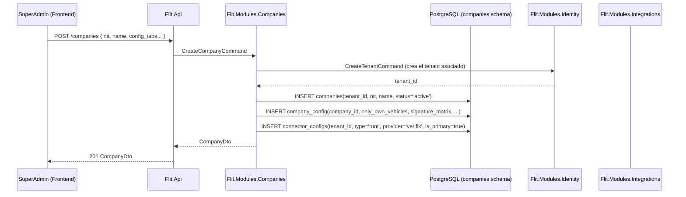
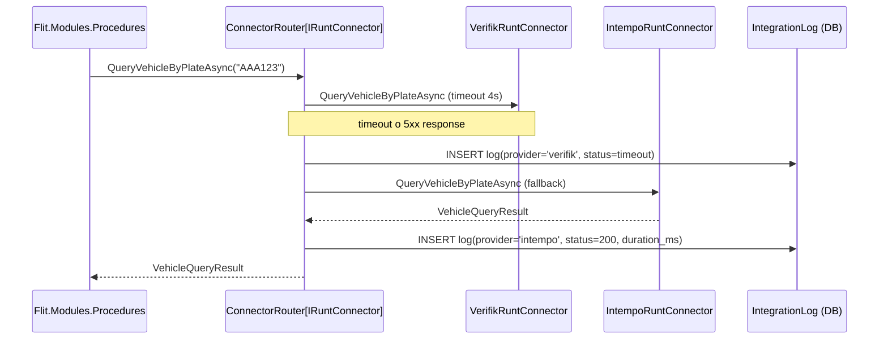

# Diseño: Feature #9565 — ADMIN-COMPAÑÍAS (Consola SaaS Multi-Tenant)

**Fecha:** 2026-06-10
**Autor:** Architecture Agent v2.0
**Estado:** Propuesto
**ADRs aplicables:** ADR-0010 (multi-tenant RLS), ADR-0011 (Strategy + failover RUNT)
**Módulo backend:** `Flit.Modules.Companies`
**Feature frontend:** `features/companies`
**Depende de:** Feature #9567 (IDENTIDAD)

---

## 1. Resumen y Alcance

### IN (incluido)
- Consola de gobierno SaaS exclusiva SuperAdmin: indexación B2B con filtros (ID, NIT, nombre, fechas) y paginación server-side.
- Formulario multi-pestaña de compañía: Matrícula Inicial, Traspasos, Configuración Empresa, Contingencia FLIT.
- Interceptor `only_own_vehicles`: bandera por tenant que restringe búsqueda solo a vehículos del tenant.
- Lista blanca `tenant_user_exceptions`: usuarios eximidos del interceptor `only_own_vehicles`.
- Matriz de firmas por actor (vendedor/comprador): tipos independientes (identidad digital, firma en pantalla, preasignada).
- Feature-flag baúl de firmas por tenant.
- Conmutador SMTP nativo vs API cliente para notificaciones.
- `notification_target`: a quién notificar (Comprador / Radicador / Ninguno).
- Métodos de recaudo habilitados por tenant.
- Proxy RUNT con patrón Strategy (Verifik/Intempo) configurado por tenant: hot-failover automático (timeout >4s o 5xx) y logs de payload.
- Matriz de OT (Organismos de Tránsito) habilitadas por tenant.

### OUT (excluido)
- Gestión de Organismos de Tránsito internos (Feature #9566).
- Parametrización de trámites (Feature #9568).
- Facturación/billing SaaS.
- Importación masiva de compañías.

---

## 2. Diagrama de Secuencia — Flujos Principales

### 2a. Creación/edición de compañía (SuperAdmin)



### 2b. Hot-failover proxy RUNT (por tenant)



---

## 3. Contratos API

| Método | Ruta | Descripción | Permisos |
|---|---|---|---|
| GET | `/companies` | Lista compañías (paginada, filtros) | `superadmin` |
| POST | `/companies` | Crea compañía + tenant | `superadmin` |
| GET | `/companies/{id}` | Detalle de compañía | `superadmin` |
| PUT | `/companies/{id}` | Actualiza datos básicos | `superadmin` |
| GET | `/companies/{id}/config` | Obtiene configuración multi-pestaña | `superadmin` |
| PUT | `/companies/{id}/config` | Actualiza configuración multi-pestaña | `superadmin` |
| GET | `/companies/{id}/config/signature-matrix` | Obtiene matriz de firmas | `superadmin` |
| PUT | `/companies/{id}/config/signature-matrix` | Actualiza matriz de firmas | `superadmin` |
| GET | `/companies/{id}/config/connector` | Configuración proxy RUNT del tenant | `superadmin` |
| PUT | `/companies/{id}/config/connector` | Actualiza proveedor RUNT y failover | `superadmin` |
| GET | `/companies/{id}/config/ot-enabled` | OTs habilitadas para el tenant | `superadmin` |
| PUT | `/companies/{id}/config/ot-enabled` | Actualiza OTs habilitadas | `superadmin` |
| GET | `/companies/{id}/user-exceptions` | Lista blanca de usuarios (only_own_vehicles bypass) | `superadmin` |
| POST | `/companies/{id}/user-exceptions` | Agrega usuario a lista blanca | `superadmin` |
| DELETE | `/companies/{id}/user-exceptions/{userId}` | Elimina de lista blanca | `superadmin` |
| GET | `/integration-logs` | Logs de payload RUNT/SIMIT por tenant (filtros) | `superadmin` |

```yaml
# GET /companies (query params)
params:
  page: int (default 1)
  page_size: int (default 20, max 100)
  nit: string?
  name: string?
  status: "active"|"inactive"?
  created_from: date?
  created_to: date?
response:
  data: CompanyListItem[]
  total: int
  page: int
  page_size: int

# CompanyListItem
  id: uuid
  nit: string
  name: string
  status: string
  tenant_slug: string
  created_at: datetime

# PUT /companies/{id}/config
request:
  # Pestaña Matrícula Inicial
  matricula_enabled: bool
  matricula_config: object?
  # Pestaña Traspasos
  traspasos_enabled: bool
  traspasos_config: object?
  # Pestaña Configuración Empresa
  only_own_vehicles: bool
  baul_firmas_enabled: bool    # feature-flag
  notification_target: "comprador"|"radicador"|"ninguno"
  smtp_mode: "native"|"api_cliente"
  smtp_config: object?         # host, port, credentials (encriptadas)
  # Pestaña Contingencia FLIT
  contingency_mode: bool
  contingency_config: object?

# PUT /companies/{id}/config/signature-matrix
request:
  entries:
    - actor_role: "vendedor"|"comprador"
      signature_type: "identidad_digital"|"firma_pantalla"|"preasignada"
```

---

## 4. Modelo de Datos

### Schema: `companies`

```sql
CREATE TABLE companies.companies (
  id          uuid DEFAULT gen_ulid() PRIMARY KEY,
  tenant_id   uuid NOT NULL REFERENCES identity.tenants(id) UNIQUE,
  nit         text NOT NULL,
  name        text NOT NULL,
  status      text NOT NULL DEFAULT 'active'
              CHECK (status IN ('active', 'inactive', 'suspended')),
  created_at  timestamptz NOT NULL DEFAULT now(),
  updated_at  timestamptz NOT NULL DEFAULT now(),
  deleted_at  timestamptz
);
-- No RLS aquí: solo SuperAdmin accede; usamos permiso de aplicación

-- Configuración multi-pestaña (una fila por company)
CREATE TABLE companies.company_configs (
  id                      uuid DEFAULT gen_ulid() PRIMARY KEY,
  company_id              uuid NOT NULL REFERENCES companies.companies(id) UNIQUE,
  only_own_vehicles       bool NOT NULL DEFAULT false,
  baul_firmas_enabled     bool NOT NULL DEFAULT false,
  notification_target     text NOT NULL DEFAULT 'radicador'
                          CHECK (notification_target IN ('comprador','radicador','ninguno')),
  smtp_mode               text NOT NULL DEFAULT 'native'
                          CHECK (smtp_mode IN ('native','api_cliente')),
  smtp_config_encrypted   bytea,        -- encriptado con clave del tenant
  matricula_config        jsonb NOT NULL DEFAULT '{}',
  traspasos_config        jsonb NOT NULL DEFAULT '{}',
  contingency_config      jsonb NOT NULL DEFAULT '{}',
  recaudo_methods         jsonb NOT NULL DEFAULT '[]',  -- lista de métodos habilitados
  updated_at              timestamptz NOT NULL DEFAULT now()
);

-- Matriz de firmas: tipo de firma por rol de actor
CREATE TABLE companies.company_signature_matrix (
  id              uuid DEFAULT gen_ulid() PRIMARY KEY,
  company_id      uuid NOT NULL REFERENCES companies.companies(id),
  actor_role      text NOT NULL,    -- "vendedor", "comprador", "representante_legal"
  signature_type  text NOT NULL
                  CHECK (signature_type IN ('identidad_digital','firma_pantalla','preasignada')),
  is_active       bool NOT NULL DEFAULT true,
  CONSTRAINT uq_signature_matrix_role UNIQUE (company_id, actor_role)
);

-- Lista blanca de excepciones (bypass only_own_vehicles)
CREATE TABLE companies.tenant_user_exceptions (
  id          uuid DEFAULT gen_ulid() PRIMARY KEY,
  company_id  uuid NOT NULL REFERENCES companies.companies(id),
  user_id     uuid NOT NULL REFERENCES identity.users(id),
  added_by    uuid,
  added_at    timestamptz NOT NULL DEFAULT now(),
  CONSTRAINT uq_tenant_user_exception UNIQUE (company_id, user_id)
);

-- OTs habilitadas por tenant
CREATE TABLE companies.company_ot_enabled (
  id              uuid DEFAULT gen_ulid() PRIMARY KEY,
  company_id      uuid NOT NULL REFERENCES companies.companies(id),
  ot_slug         text NOT NULL,   -- slug del Organismo de Tránsito
  procedure_family text NOT NULL,  -- "matricula_inicial", "traspasos", "otros"
  is_enabled      bool NOT NULL DEFAULT true,
  CONSTRAINT uq_company_ot_family UNIQUE (company_id, ot_slug, procedure_family)
);

-- Índices
CREATE INDEX ix_companies_nit        ON companies.companies(nit);
CREATE INDEX ix_companies_name       ON companies.companies(name);
CREATE INDEX ix_companies_status     ON companies.companies(status) WHERE deleted_at IS NULL;
```

**Nota:** La tabla `integrations.connector_configs` (schema `integrations`, creada por `Flit.Modules.Integrations`) almacena la configuración del proxy RUNT por tenant. Se referencia aquí pero el DDL lo gestiona `database-agent` al crear el módulo Integrations.

```sql
-- En schema integrations (referencia — DDL en Flit.Modules.Integrations)
-- connector_configs: { tenant_id, connector_type='runt', provider='verifik'|'intempo',
--                      credentials_ref, is_primary, priority, timeout_ms }
```

---

## 5. Componentes Backend

### `Flit.Modules.Companies`

```
Domain/
  Entities/         Company, CompanyConfig, SignatureMatrix, TenantUserException, OtEnabled
  Events/           CompanyCreated, CompanyConfigUpdated, RuntProviderChanged
  Interfaces/       ICompanyRepository, IConnectorConfigRepository

Application/
  Commands/
    CreateCompanyCommand + Handler       ← también crea tenant via IIdentityService
    UpdateCompanyConfigCommand + Handler
    UpdateSignatureMatrixCommand + Handler
    AddUserExceptionCommand + Handler
    RemoveUserExceptionCommand + Handler
    UpdateOtEnabledCommand + Handler
  Queries/
    ListCompaniesQuery + Handler          ← server-side filtering + paginación
    GetCompanyDetailQuery + Handler
    GetCompanyConfigQuery + Handler
    GetIntegrationLogsQuery + Handler

Infrastructure/
  Persistence/      CompanyRepository.cs, ConnectorConfigRepository.cs
  ModuleExtensions.cs
```

---

## 6. Componentes Frontend

### `features/companies`

```
features/companies/
├── api/
│   ├── companies.schemas.ts   (Zod: Company, CompanyConfig, SignatureMatrix)
│   └── companies.api.ts       (useCompanies, useCompany, useUpdateCompanyConfig,
│                               useSignatureMatrix, useIntegrationLogs)
├── components/
│   ├── CompaniesTable.tsx     (grid B2B con filtros, paginación server-side)
│   ├── CompanyForm/
│   │   ├── CompanyFormTabs.tsx         (tabs: Matrícula, Traspasos, Config, Contingencia)
│   │   ├── TabMatriculaInicial.tsx
│   │   ├── TabTraspasos.tsx
│   │   ├── TabConfigEmpresa.tsx        (only_own_vehicles, firmas, SMTP, notificaciones)
│   │   └── TabContingencia.tsx
│   ├── SignatureMatrixEditor.tsx        (tabla actor × tipo de firma)
│   ├── UserExceptionsManager.tsx        (lista blanca editable)
│   ├── OtEnabledMatrix.tsx             (OTs habilitadas por familia de trámite)
│   └── IntegrationLogsTable.tsx        (logs payload JSON, expandible)
└── pages/
    ├── CompaniesPage.tsx               (/admin/companies)
    └── CompanyDetailPage.tsx           (/admin/companies/:id)
```

### Estados UI

| Componente | Vacío | Cargando | Error | Con datos |
|---|---|---|---|---|
| CompaniesTable | "No hay compañías registradas" | Skeleton | ErrorState + Reintentar | Grid con filtros |
| IntegrationLogsTable | "Sin logs en el rango seleccionado" | Skeleton | ErrorState | Tabla expandible con JSON |
| SignatureMatrixEditor | — | Skeleton | — | Tabla actor × tipo firma |

---

## 7. Archivos a Crear / Modificar

### Backend
```
services/core-api/src/Flit.Modules.Companies/     [CREAR todo el módulo]
  Flit.Modules.Companies.csproj
  Domain/Entities/{Company, CompanyConfig, SignatureMatrix, TenantUserException, OtEnabled}.cs
  Application/Commands/{CreateCompany, UpdateCompanyConfig, UpdateSignatureMatrix,
                        AddUserException, UpdateOtEnabled}Command.cs + Handlers
  Application/Queries/{ListCompanies, GetCompanyDetail, GetCompanyConfig,
                       GetIntegrationLogs}Query.cs + Handlers
  Infrastructure/Persistence/{CompanyRepository, ConnectorConfigRepository}.cs
  Infrastructure/ModuleExtensions.cs

services/core-api/src/Flit.Infrastructure/
  Persistence/FlitDbContext.cs                     [MODIFICAR] (DbSets companies)
```

### Frontend
```
frontend/src/features/companies/                   [CREAR todo]
  api/{companies.schemas, companies.api}.ts
  components/{CompaniesTable, CompanyForm/*, SignatureMatrixEditor,
              UserExceptionsManager, OtEnabledMatrix, IntegrationLogsTable}.tsx
  pages/{CompaniesPage, CompanyDetailPage}.tsx
```

---

## 8. Notas Operativas

- **database-agent:** Crear schema `companies`. Tablas sin RLS (solo SuperAdmin accede; restricción a nivel de permiso de aplicación). Función de encriptación para `smtp_config_encrypted` (AES-256 con clave derivada del tenant_id desde variables de entorno).
- **backend-agent:** Al crear compañía, coordinarse con `Flit.Modules.Identity` para crear el tenant. La comunicación inter-módulo se hace via evento de dominio `CompanyCreated` (no llamada directa). Implementar paginación server-side en `ListCompaniesQuery` con OFFSET/LIMIT y total count.
- **frontend-agent:** El formulario multi-pestaña usa `react-hook-form` (o equivalente PrimeReact). `IntegrationLogsTable` muestra JSON colapsable con `JsonViewer`. Solo visible para SuperAdmin (validar claim de role en el route guard).
- **security-agent:** El `smtp_config_encrypted` no debe logearse ni exponerse en la respuesta de API. La clave de encriptación proviene de variables de entorno, nunca de BD. Auditar que `/admin/companies` esté protegido con permiso `superadmin`.
- **qa-agent:** TC de aislamiento: un TenantAdmin no puede acceder a `/companies`. TC de failover: configurar proveedor RUNT en timeout → verificar que se hace failover a Intempo y se genera log. TC de matriz de firmas: cambiar tipo de firma de vendedor → verificar que los trámites nuevos usan el tipo actualizado.

---

## 9. Descomposición Preliminar en HUs

| # | Título | Tipo | Dependencias |
|---|---|---|---|
| HU-9565-01 | CRUD de compañías con formulario multi-pestaña (backend) | [BACKEND] | HU-9567-01 (tenant) |
| HU-9565-02 | Configuración de proxy RUNT por tenant: Strategy + ConnectorConfig | [BACKEND] | HU-9565-01, ADR-0011 |
| HU-9565-03 | Matriz de firmas, lista blanca, OTs habilitadas y logs de payload | [BACKEND] | HU-9565-01 |
| HU-9565-04 | Frontend: consola de compañías con filtros, paginación y formulario multi-pestaña | [FRONTEND] | HU-9565-01 |
| HU-9565-05 | Frontend: matriz de firmas, excepciones de usuario y visor de logs de integración | [FRONTEND] | HU-9565-03, HU-9565-04 |

---

*Diseño generado por: Architecture Agent v2.0 — 2026-06-10 | Estado: Propuesto*
