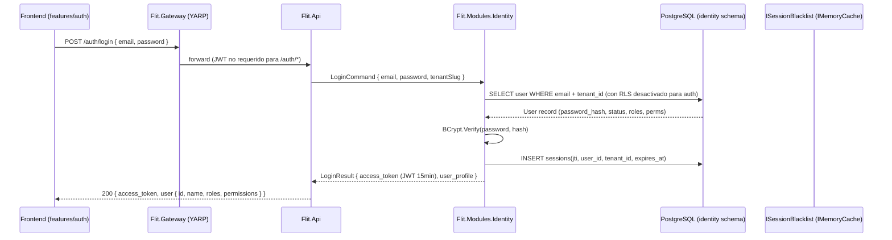
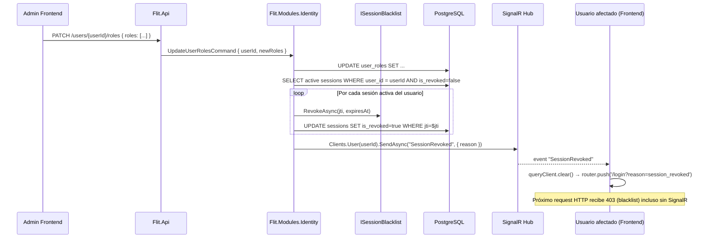
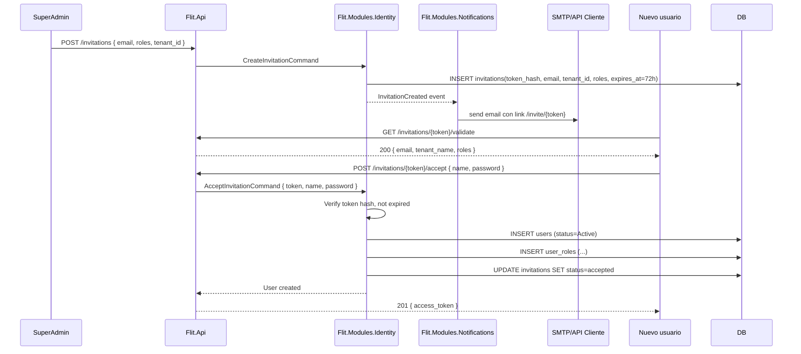

# Diseño: Feature #9567 — IDENTIDAD (JWT, RBAC/ABAC, Multi-Tenant)

**Fecha:** 2026-06-10
**Autor:** Architecture Agent v2.0
**Estado:** Propuesto
**ADRs aplicables:** ADR-0010 (multi-tenant RLS), ADR-0013 (invalidación sesión IMemoryCache)
**Módulo backend:** `Flit.Modules.Identity`
**Feature frontend:** `features/auth`
**Orden de implementación:** Sprint S+1 (fundación del stack)

---

## 1. Resumen y Alcance

### IN (incluido)
- Autenticación con JWT RS256 (emisión, validación, renovación).
- RBAC + ABAC multi-tenant con aislamiento estricto por tenant (ADR-0010).
- Permisos CRUD estándar + permisos string personalizados (slugs) mapeados a UI.
- Multi-rol aditivo (un usuario puede tener varios roles simultáneos).
- Onboarding por invitación email con token temporal (estado `Pendiente → Activo`).
- Olvido/reset de contraseña (email link con token temporal).
- Reset forzado de contraseña por admin.
- Desalojo inmediato de sesión ante cambio de privilegios (403 + redirect) — ADR-0013.
- Rol Super Administrador raíz inmutable con acceso multi-tenant (bypass RLS).

### OUT (excluido)
- SSO (OAuth2/SAML/OIDC).
- MFA (autenticación multifactor).
- Biometría de login.
- Social login.

---

## 2. Diagrama de Secuencia — Flujo Principal

### 2a. Login y emisión de JWT



### 2b. Cambio de privilegios → desalojo inmediato



### 2c. Onboarding por invitación



---

## 3. Contratos API

### Endpoints — `Flit.Modules.Identity`

| Método | Ruta | Descripción | Permisos |
|---|---|---|---|
| POST | `/auth/login` | Autenticación, retorna JWT | público |
| POST | `/auth/refresh` | Renueva JWT (si se implementa refresh token futuro) | público |
| POST | `/auth/forgot-password` | Solicita email de reset | público |
| POST | `/auth/reset-password` | Aplica nuevo password con token | público |
| GET | `/auth/me` | Perfil del usuario autenticado | autenticado |
| POST | `/invitations` | Crea invitación a nuevo usuario | `users.invite` |
| GET | `/invitations/{token}/validate` | Valida token de invitación | público |
| POST | `/invitations/{token}/accept` | Acepta invitación y crea usuario | público |
| GET | `/users` | Lista usuarios del tenant (paginado) | `users.read` |
| GET | `/users/{id}` | Detalle de usuario | `users.read` |
| POST | `/users` | Crea usuario directo (admin) | `users.create` |
| PATCH | `/users/{id}` | Actualiza datos de usuario | `users.update` |
| DELETE | `/users/{id}` | Soft-delete usuario | `users.delete` |
| PATCH | `/users/{id}/roles` | Actualiza roles del usuario → invalida sesión | `users.manage_roles` |
| PATCH | `/users/{id}/force-reset` | Fuerza reset de password | `users.manage_roles` |
| GET | `/roles` | Lista roles del tenant | `roles.read` |
| POST | `/roles` | Crea rol | `roles.create` |
| PATCH | `/roles/{id}` | Actualiza rol | `roles.update` |
| DELETE | `/roles/{id}` | Elimina rol (no-system) | `roles.delete` |
| GET | `/roles/{id}/permissions` | Lista permisos del rol | `roles.read` |
| PUT | `/roles/{id}/permissions` | Actualiza permisos del rol | `roles.update` |
| GET | `/permissions` | Catálogo de permisos del sistema | `roles.read` |
| GET | `/tenants` | Lista tenants (SuperAdmin) | `superadmin` |
| POST | `/tenants` | Crea tenant (SuperAdmin) | `superadmin` |

### Esquemas resumidos

```yaml
# POST /auth/login
request:
  email: string (email)
  password: string
  tenant_slug: string   # identifica el tenant
response:
  access_token: string  # JWT RS256
  expires_in: 900       # 15 min en segundos
  user:
    id: uuid
    name: string
    email: string
    roles: string[]
    permissions: string[]  # slugs: ["tramites.create", "users.read", ...]
    tenant_id: uuid
    tenant_name: string

# PATCH /users/{id}/roles
request:
  roles: uuid[]    # IDs de roles a asignar (reemplaza los existentes)
response:
  id: uuid
  roles: { id, slug, name }[]
  # Internamente: invalida sesiones activas del usuario

# POST /invitations
request:
  email: string
  roles: uuid[]
  tenant_id: uuid   # solo SuperAdmin puede especificar; los demás heredan el propio
response:
  id: uuid
  email: string
  expires_at: datetime
  status: "pending"

# POST /invitations/{token}/accept
request:
  full_name: string
  password: string        # min 8 chars, 1 upper, 1 number
  password_confirm: string
response:
  access_token: string
  user: { id, name, email, roles, permissions }
```

---

## 4. Modelo de Datos

### Schema: `identity`

```sql
-- Tenants (raíz del árbol multi-tenant)
CREATE TABLE identity.tenants (
  id          uuid DEFAULT gen_ulid() PRIMARY KEY,
  slug        text NOT NULL UNIQUE,
  name        text NOT NULL,
  is_active   bool NOT NULL DEFAULT true,
  created_at  timestamptz NOT NULL DEFAULT now(),
  updated_at  timestamptz NOT NULL DEFAULT now(),
  deleted_at  timestamptz
);

-- Usuarios
CREATE TABLE identity.users (
  id              uuid DEFAULT gen_ulid() PRIMARY KEY,
  tenant_id       uuid NOT NULL REFERENCES identity.tenants(id),
  email           text NOT NULL,
  full_name       text NOT NULL,
  password_hash   text NOT NULL,
  status          text NOT NULL DEFAULT 'active'
                  CHECK (status IN ('pending', 'active', 'suspended', 'deleted')),
  must_reset_pwd  bool NOT NULL DEFAULT false,
  created_at      timestamptz NOT NULL DEFAULT now(),
  updated_at      timestamptz NOT NULL DEFAULT now(),
  last_login_at   timestamptz,
  deleted_at      timestamptz,
  CONSTRAINT uq_users_email_tenant UNIQUE (email, tenant_id)
);
-- RLS
ALTER TABLE identity.users ENABLE ROW LEVEL SECURITY;
ALTER TABLE identity.users FORCE ROW LEVEL SECURITY;
CREATE POLICY tenant_isolation ON identity.users
  USING (tenant_id = current_setting('app.tenant_id', true)::uuid);

-- Roles
CREATE TABLE identity.roles (
  id          uuid DEFAULT gen_ulid() PRIMARY KEY,
  tenant_id   uuid NOT NULL REFERENCES identity.tenants(id),
  slug        text NOT NULL,
  name        text NOT NULL,
  description text,
  is_system   bool NOT NULL DEFAULT false,  -- roles de sistema no se eliminan
  created_at  timestamptz NOT NULL DEFAULT now(),
  CONSTRAINT uq_roles_slug_tenant UNIQUE (slug, tenant_id)
);
ALTER TABLE identity.roles ENABLE ROW LEVEL SECURITY;
CREATE POLICY tenant_isolation ON identity.roles
  USING (tenant_id = current_setting('app.tenant_id', true)::uuid);

-- Catálogo de permisos (global, no por tenant)
CREATE TABLE identity.permissions (
  id      uuid DEFAULT gen_ulid() PRIMARY KEY,
  slug    text NOT NULL UNIQUE,  -- ej: "tramites.create", "users.manage_roles"
  module  text NOT NULL,
  action  text NOT NULL,
  description text
);

-- Asignación usuario → roles
CREATE TABLE identity.user_roles (
  user_id     uuid NOT NULL REFERENCES identity.users(id) ON DELETE CASCADE,
  role_id     uuid NOT NULL REFERENCES identity.roles(id) ON DELETE CASCADE,
  tenant_id   uuid NOT NULL,
  assigned_at timestamptz NOT NULL DEFAULT now(),
  assigned_by uuid,
  PRIMARY KEY (user_id, role_id)
);
ALTER TABLE identity.user_roles ENABLE ROW LEVEL SECURITY;
CREATE POLICY tenant_isolation ON identity.user_roles
  USING (tenant_id = current_setting('app.tenant_id', true)::uuid);

-- Asignación rol → permisos
CREATE TABLE identity.role_permissions (
  role_id       uuid NOT NULL REFERENCES identity.roles(id) ON DELETE CASCADE,
  permission_id uuid NOT NULL REFERENCES identity.permissions(id) ON DELETE CASCADE,
  PRIMARY KEY (role_id, permission_id)
);

-- Sesiones (para revocación y auditoría — blacklist efectiva en IMemoryCache)
CREATE TABLE identity.sessions (
  id          uuid DEFAULT gen_ulid() PRIMARY KEY,
  user_id     uuid NOT NULL REFERENCES identity.users(id),
  tenant_id   uuid NOT NULL,
  jti         text NOT NULL UNIQUE,
  expires_at  timestamptz NOT NULL,
  is_revoked  bool NOT NULL DEFAULT false,
  revoked_at  timestamptz,
  revoked_by  uuid,
  created_at  timestamptz NOT NULL DEFAULT now()
);
ALTER TABLE identity.sessions ENABLE ROW LEVEL SECURITY;
CREATE POLICY tenant_isolation ON identity.sessions
  USING (tenant_id = current_setting('app.tenant_id', true)::uuid);

-- Índice para rehydratación de blacklist al arrancar
CREATE INDEX ix_sessions_active_revoked ON identity.sessions(user_id)
  WHERE is_revoked = false AND expires_at > now();

-- Invitaciones
CREATE TABLE identity.invitations (
  id            uuid DEFAULT gen_ulid() PRIMARY KEY,
  tenant_id     uuid NOT NULL REFERENCES identity.tenants(id),
  email         text NOT NULL,
  token_hash    text NOT NULL UNIQUE,
  roles_json    jsonb NOT NULL DEFAULT '[]',  -- roles a asignar al aceptar
  status        text NOT NULL DEFAULT 'pending'
                CHECK (status IN ('pending', 'accepted', 'expired', 'cancelled')),
  invited_by    uuid,
  expires_at    timestamptz NOT NULL,
  accepted_at   timestamptz,
  created_at    timestamptz NOT NULL DEFAULT now()
);

-- Reset de contraseña
CREATE TABLE identity.password_reset_tokens (
  id          uuid DEFAULT gen_ulid() PRIMARY KEY,
  user_id     uuid NOT NULL REFERENCES identity.users(id),
  token_hash  text NOT NULL UNIQUE,
  expires_at  timestamptz NOT NULL,
  used_at     timestamptz,
  created_at  timestamptz NOT NULL DEFAULT now()
);

-- Índices principales
CREATE INDEX ix_users_tenant_id    ON identity.users(tenant_id) WHERE deleted_at IS NULL;
CREATE INDEX ix_sessions_user_id   ON identity.sessions(user_id, is_revoked);
CREATE INDEX ix_user_roles_user_id ON identity.user_roles(user_id, tenant_id);
```

---

## 5. Componentes Backend

### `Flit.Modules.Identity` (Clean Architecture)

```
Domain/
  Entities/       Tenant, User, Role, Permission, Session, Invitation
  ValueObjects/   Email, PasswordHash, JwtToken, TenantSlug
  Events/         UserRolesChanged, InvitationCreated, PasswordResetRequested
  Interfaces/     IUserRepository, IRoleRepository, ISessionBlacklist, ITokenIssuer

Application/
  Commands/
    LoginCommand + Handler
    AcceptInvitationCommand + Handler
    CreateInvitationCommand + Handler
    UpdateUserRolesCommand + Handler     ← invalida sesiones
    ForcePasswordResetCommand + Handler
    ForgotPasswordCommand + Handler
    ResetPasswordCommand + Handler
  Queries/
    GetUserProfileQuery + Handler
    ListUsersQuery + Handler
    ListRolesQuery + Handler
    GetPermissionCatalogQuery + Handler
  DTOs/  UserDto, RoleDto, PermissionDto, TokenDto

Infrastructure/
  Persistence/
    UserRepository.cs
    RoleRepository.cs
    SessionRepository.cs
    InvitationRepository.cs
  Security/
    JwtTokenIssuer.cs         ← emite JWT RS256, incluye jti
    InMemorySessionBlacklist.cs  ← ISessionBlacklist (ADR-0013)
    PasswordHasher.cs
  ModuleExtensions.cs         ← AddIdentityModule(services, config)
```

**`BlacklistRehydrationService`** (IHostedService en `Flit.Api`): al arrancar carga JTIs revocados vigentes desde `identity.sessions`.

---

## 6. Componentes Frontend

### `features/auth`

```
features/auth/
├── api/
│   ├── auth.schemas.ts     (Zod: LoginResponse, UserProfile, InvitationValidate)
│   └── auth.api.ts         (hooks: useLogin, useAcceptInvitation, useForgotPassword, useResetPassword)
├── components/
│   ├── LoginForm.tsx
│   ├── InvitationForm.tsx  (acepta invitación — nombre + password)
│   ├── ForgotPasswordForm.tsx
│   └── ResetPasswordForm.tsx
└── pages/
    ├── LoginPage.tsx
    ├── InvitePage.tsx      (/invite/:token)
    └── ResetPasswordPage.tsx (/reset-password/:token)
```

**`features/users-roles`** (bajo misma feature auth o subfolder):

```
features/users-roles/
├── api/
│   ├── users.schemas.ts
│   └── users.api.ts       (useUsers, useUser, useUpdateUserRoles, useCreateInvitation)
├── components/
│   ├── UsersTable.tsx      (4 estados: loading/error/empty/data)
│   ├── UserRolesModal.tsx
│   └── InviteUserModal.tsx
└── pages/
    └── UsersPage.tsx       (/admin/users)
```

**`shared/api/client.ts`** — interceptor para 403+`session_revoked` → redirect a login.

**`shared/hooks/useSignalR.ts`** — conecta al hub, maneja `SessionRevoked` event.

### Estados UI obligatorios

| Componente | Vacío | Cargando | Error | Con datos |
|---|---|---|---|---|
| UsersTable | "No hay usuarios en este tenant" | Skeleton rows | ErrorState + Reintentar | Tabla paginada |
| LoginForm | — | Spinner en botón | Toast "Credenciales inválidas" | Redirect a /dashboard |
| InvitePage | — | Validando token... | "Invitación expirada o inválida" | Formulario de registro |

---

## 7. Archivos a Crear / Modificar

### Backend

```
services/core-api/src/
├── Flit.Modules.Identity/
│   ├── Flit.Modules.Identity.csproj          [CREAR]
│   ├── Domain/Entities/Tenant.cs             [CREAR]
│   ├── Domain/Entities/User.cs               [CREAR]
│   ├── Domain/Entities/Role.cs               [CREAR]
│   ├── Domain/Entities/Session.cs            [CREAR]
│   ├── Domain/Entities/Invitation.cs         [CREAR]
│   ├── Domain/Interfaces/ISessionBlacklist.cs [CREAR]
│   ├── Domain/Interfaces/ITokenIssuer.cs     [CREAR]
│   ├── Application/Commands/LoginCommand.cs  [CREAR]
│   ├── Application/Commands/UpdateUserRolesCommand.cs [CREAR]
│   ├── Application/Commands/AcceptInvitationCommand.cs [CREAR]
│   ├── Application/Commands/ForgotPasswordCommand.cs  [CREAR]
│   ├── Application/Commands/ResetPasswordCommand.cs   [CREAR]
│   ├── Application/Queries/GetUserProfileQuery.cs     [CREAR]
│   ├── Application/Queries/ListUsersQuery.cs          [CREAR]
│   ├── Infrastructure/Security/JwtTokenIssuer.cs      [CREAR]
│   ├── Infrastructure/Security/InMemorySessionBlacklist.cs [CREAR]
│   ├── Infrastructure/Persistence/UserRepository.cs  [CREAR]
│   └── Infrastructure/ModuleExtensions.cs            [CREAR]
├── Flit.Api/
│   ├── Program.cs                            [MODIFICAR] (registrar módulo + middleware)
│   └── HostedServices/BlacklistRehydrationService.cs [CREAR]
└── Flit.Infrastructure/
    └── Persistence/FlitDbContext.cs          [MODIFICAR] (agregar DbSets identity)
```

### Frontend

```
frontend/src/
├── features/auth/                            [CREAR todo]
├── features/users-roles/                     [CREAR todo]
└── shared/
    ├── api/client.ts                         [MODIFICAR] (interceptor 403)
    └── hooks/useSignalR.ts                   [CREAR]
```

---

## 8. Notas Operativas

- **database-agent:** Crear schema `identity`. Aplicar RLS en todas las tablas. Crear función `gen_ulid()` si no existe. Índice `ix_sessions_active_revoked` para rehydratación. Seeding: rol `superadmin` + permisos del catálogo.
- **backend-agent:** Implementar `ISessionBlacklist` como `InMemorySessionBlacklist`. Registrar `JwtBlacklistMiddleware`. Implementar `BlacklistRehydrationService`. La llave RS256 se lee de `appsettings` (path al `.pem`), nunca hardcodeada.
- **frontend-agent:** Interceptor Axios en `client.ts`. Hook `useSignalR` para `SessionRevoked`. Formulario de invitación con validación Zod (password fuerte). 4 estados en `UsersTable`.
- **security-agent:** Auditar que el `jti` claim esté en todos los tokens. Verificar que `BlacklistRehydrationService` se ejecuta al arrancar. Confirmar que `token_hash` en invitaciones y reset se almacena como SHA-256, nunca en texto plano.
- **qa-agent:** TC de aislamiento de tenant (usuario Tenant A no ve usuarios de Tenant B). TC de revocación inmediata (PATCH roles → 403 en próximo request). TC de expiración de invitación (token usado después de 72h → 400).

---

## 9. Descomposición Preliminar en HUs

| # | Título | Tipo | Dependencias |
|---|---|---|---|
| HU-9567-01 | Autenticación JWT: login, emisión de token y perfil de usuario | [BACKEND] | — (primera HU) |
| HU-9567-02 | RBAC multi-tenant: CRUD de roles, permisos y asignación de roles a usuarios | [BACKEND] | HU-9567-01 |
| HU-9567-03 | Invalidación de sesión en tiempo real (IMemoryCache + SignalR push) | [BACKEND] | HU-9567-01, HU-9567-02 |
| HU-9567-04 | Onboarding por invitación email y reset/olvido de contraseña | [BACKEND] | HU-9567-01 |
| HU-9567-05 | Frontend: pantallas de login, invitación, reset y gestión de usuarios/roles | [FRONTEND] | HU-9567-01, HU-9567-02, HU-9567-03 |

---

*Diseño generado por: Architecture Agent v2.0 — 2026-06-10 | Estado: Propuesto*
