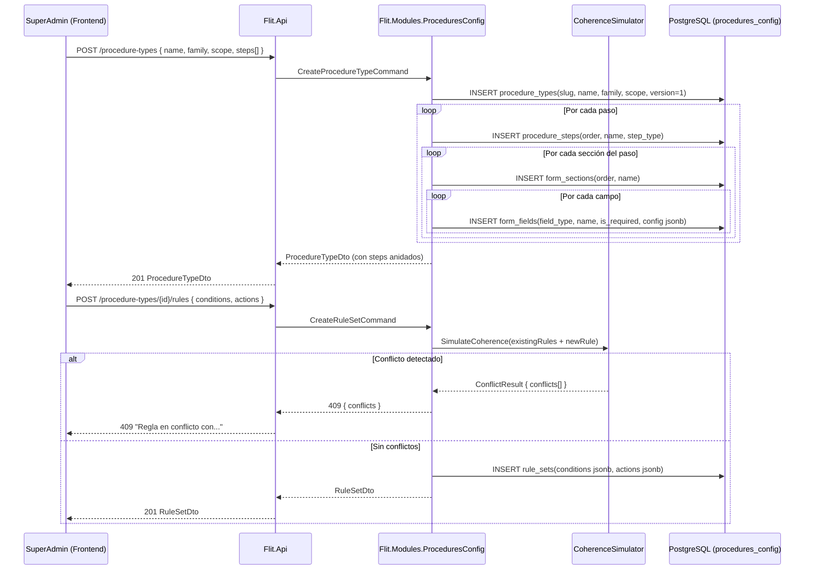

# Diseño: Feature #9568 — PARAMETRIZADOR-TRÁMITES (Motor Low-Code)

**Fecha:** 2026-06-10
**Autor:** Architecture Agent v2.0
**Estado:** Propuesto
**ADRs aplicables:** ADR-0009 (Híbrido JSONB), ADR-0010 (multi-tenant RLS)
**Módulo backend:** `Flit.Modules.ProceduresConfig`
**Feature frontend:** `features/procedures-config`
**Depende de:** Feature #9567 (IDENTIDAD), #9565 (ADMIN-COMPAÑÍAS)

---

## 1. Resumen y Alcance

### IN (incluido)
- CRUD de tipos de trámite clasificados en familias (Matrícula Inicial, Traspasos, Otros).
- Pipeline visual de pasos (mínimo 4 pasos por trámite).
- Secciones de formulario dinámicas con campos ordenables: Texto, Dropdown, Checkbox, Numérico, Adjuntos, Lista.
- Consumo declarativo de APIs REST externas: endpoint, verbo, parámetros enlazados a variables de pasos previos.
- Diccionario de equivalencia semántica para respuestas de APIs (solo lectura una vez guardado).
- Log de payloads JSON por tenant (referencia al módulo Integrations).
- Diseñador de reglas de negocio (condiciones AND/OR con operadores ==, !=, >, <, Contains; acciones UI: mostrar/ocultar/toast/modal).
- Simulador estático de coherencia que bloquea guardado ante conflictos de reglas.
- Alcance configurable: Global / Compañía / OT / Compañía+OT.
- Definición de actores por tipo de trámite: número, rol, naturaleza (natural/jurídica/ambas), min/max.
- Reglas de consulta parametrizables por actor: RUNT (datos, restricciones), SIMIT, RUES, liveness; bloqueantes o informativas.
- Consulta de vehículo parametrizable: clave de búsqueda configurable (placa para Traspasos, VIN para Matrícula Inicial).
- Versionamiento de tipos de trámite (incrementa con cada cambio; snapshot al radicar en Feature #9731).

### OUT (excluido)
- Runtime de ejecución de trámites (Feature #9731).
- Diseño de plantillas de documentos (Feature #9729).
- Administración de OTs (Feature #9566).

---

## 2. Diagrama de Secuencia — Flujo Principal

### 2a. Creación de tipo de trámite con pasos y reglas



### 2b. Definición de actor con reglas de consulta

```mermaid
sequenceDiagram
  participant SA as SuperAdmin (Frontend)
  participant API as Flit.Api
  participant PC as Flit.Modules.ProceduresConfig

  SA->>API: POST /procedure-types/{id}/actors
    { role: "vendedor", allowed_nature: "ambas", min: 1, max: 1 }
  API->>PC: CreateActorDefinitionCommand
  PC->>DB: INSERT actor_definitions(...)

  SA->>API: POST /procedure-types/{id}/actors/{actorId}/query-rules
    { subject_type: "persona_natural", entry_key: "document_number",
      is_blocking: true,
      verifications: [
        { type: "datos_persona", active: true, order: 1 },
        { type: "simit", active: true, order: 2 },
        { type: "restricciones", active: true, order: 3 }
      ] }
  API->>PC: CreateQueryRuleCommand
  PC->>DB: INSERT query_rules(actor_definition_id, subject_type, entry_key,
                               is_blocking, verifications jsonb)
  PC-->>API: QueryRuleDto

  SA->>API: POST /procedure-types/{id}/vehicle-query
    { query_key: "placa" }   # o "vin" para matrícula
  API->>PC: SetVehicleQueryKeyCommand
  PC->>DB: UPDATE procedure_types SET vehicle_query_key='placa', version=version+1
```

---

## 3. Contratos API

| Método | Ruta | Descripción | Permisos |
|---|---|---|---|
| GET | `/procedure-types` | Lista tipos de trámite (filtros: family, scope, tenant) | `superadmin` |
| POST | `/procedure-types` | Crea tipo de trámite | `superadmin` |
| GET | `/procedure-types/{id}` | Detalle completo (con steps, fields, rules, actors) | `superadmin` |
| PUT | `/procedure-types/{id}` | Actualiza metadatos del tipo (incrementa versión) | `superadmin` |
| DELETE | `/procedure-types/{id}` | Soft-delete (solo si no hay trámites activos) | `superadmin` |
| POST | `/procedure-types/{id}/steps` | Agrega paso al pipeline | `superadmin` |
| PUT | `/procedure-types/{id}/steps/{stepId}` | Actualiza paso | `superadmin` |
| DELETE | `/procedure-types/{id}/steps/{stepId}` | Elimina paso | `superadmin` |
| POST | `/procedure-types/{id}/steps/{stepId}/sections` | Agrega sección al paso | `superadmin` |
| PUT | `/procedure-types/{id}/steps/{stepId}/sections/{secId}` | Actualiza sección | `superadmin` |
| POST | `/procedure-types/{id}/steps/{stepId}/sections/{secId}/fields` | Agrega campo | `superadmin` |
| PUT | `/procedure-types/{id}/steps/{stepId}/sections/{secId}/fields/{fId}` | Actualiza campo | `superadmin` |
| POST | `/procedure-types/{id}/rules` | Crea regla (con validación de coherencia) | `superadmin` |
| PUT | `/procedure-types/{id}/rules/{ruleId}` | Actualiza regla | `superadmin` |
| DELETE | `/procedure-types/{id}/rules/{ruleId}` | Elimina regla | `superadmin` |
| GET | `/procedure-types/{id}/rules/simulate` | Simula coherencia del set de reglas actual | `superadmin` |
| POST | `/procedure-types/{id}/actors` | Define actor del trámite | `superadmin` |
| PUT | `/procedure-types/{id}/actors/{actorId}` | Actualiza actor | `superadmin` |
| POST | `/procedure-types/{id}/actors/{actorId}/query-rules` | Define reglas de consulta del actor | `superadmin` |
| PUT | `/procedure-types/{id}/vehicle-query` | Define clave de consulta del vehículo | `superadmin` |
| POST | `/procedure-types/{id}/api-connectors` | Agrega conector API declarativo | `superadmin` |
| PUT | `/procedure-types/{id}/api-connectors/{connId}` | Actualiza conector | `superadmin` |

```yaml
# POST /procedure-types
request:
  name: string
  family: "matricula_inicial"|"traspasos"|"otros"
  scope: "global"|"company"|"ot"|"company_ot"
  scope_tenant_id: uuid?        # si scope != global
  vehicle_query_key: "placa"|"vin"|"placa_vin"

# FormField config (JSONB — ejemplos por tipo):
# field_type: "dropdown"
config:
  options: [{ value: string, label: string }]
  allow_multiple: bool
# field_type: "text"
config:
  max_length: int
  regex_pattern: string?
  placeholder: string?
# field_type: "numeric"
config:
  min: number?
  max: number?
  decimal_places: int
# field_type: "attachment"
config:
  allowed_formats: ["pdf","jpg","png"]
  max_size_mb: int

# POST /procedure-types/{id}/rules
request:
  name: string
  conditions:              # árbol AND/OR (ADR-0009)
    operator: "AND"|"OR"
    nodes:
      - field: string      # "actor.nature" | "vehicle.restrictions" | "step_data.field_slug"
        op: "=="|"!="|">"|"<"|"Contains"
        value: string|number|bool
  actions:
    - type: "show"|"hide"
      target: string       # "section.{slug}" | "field.{slug}"
    - type: "toast"|"modal"
      message: string
      is_blocking: bool

# POST /procedure-types/{id}/actors/{actorId}/query-rules
request:
  subject_type: "persona_natural"|"persona_juridica"|"representante_legal"|"vehiculo"
  entry_key: "document_number"|"nit"|"placa"|"vin"
  is_blocking: bool       # si falla, ¿bloquea el avance?
  verifications:
    - type: "datos_persona"|"simit"|"rues"|"restricciones"|"liveness"
      is_active: bool
      order: int
```

---

## 4. Modelo de Datos

### Schema: `procedures_config` (híbrido — ADR-0009)

```sql
CREATE TABLE procedures_config.procedure_types (
  id              uuid DEFAULT gen_ulid() PRIMARY KEY,
  tenant_id       uuid NOT NULL REFERENCES identity.tenants(id),
  slug            text NOT NULL,
  name            text NOT NULL,
  family          text NOT NULL CHECK (family IN ('matricula_inicial','traspasos','otros')),
  scope           text NOT NULL CHECK (scope IN ('global','company','ot','company_ot')),
  scope_ref_id    uuid,               -- ID de company/OT si scope != global
  vehicle_query_key text NOT NULL DEFAULT 'placa'
                  CHECK (vehicle_query_key IN ('placa','vin','placa_vin')),
  version         int NOT NULL DEFAULT 1,
  is_active       bool NOT NULL DEFAULT true,
  created_at      timestamptz NOT NULL DEFAULT now(),
  updated_at      timestamptz NOT NULL DEFAULT now(),
  deleted_at      timestamptz,
  CONSTRAINT uq_procedure_type_slug_tenant UNIQUE (slug, tenant_id)
);
ALTER TABLE procedures_config.procedure_types ENABLE ROW LEVEL SECURITY;
CREATE POLICY tenant_isolation ON procedures_config.procedure_types
  USING (tenant_id = current_setting('app.tenant_id', true)::uuid);

CREATE TABLE procedures_config.procedure_steps (
  id                  uuid DEFAULT gen_ulid() PRIMARY KEY,
  procedure_type_id   uuid NOT NULL REFERENCES procedures_config.procedure_types(id),
  tenant_id           uuid NOT NULL,
  order_index         int NOT NULL,
  name                text NOT NULL,
  step_type           text NOT NULL CHECK (step_type IN ('form','api_call','signature','review','identity_validation')),
  is_required         bool NOT NULL DEFAULT true,
  created_at          timestamptz NOT NULL DEFAULT now()
);
ALTER TABLE procedures_config.procedure_steps ENABLE ROW LEVEL SECURITY;
CREATE POLICY tenant_isolation ON procedures_config.procedure_steps
  USING (tenant_id = current_setting('app.tenant_id', true)::uuid);

CREATE TABLE procedures_config.form_sections (
  id          uuid DEFAULT gen_ulid() PRIMARY KEY,
  step_id     uuid NOT NULL REFERENCES procedures_config.procedure_steps(id),
  tenant_id   uuid NOT NULL,
  order_index int NOT NULL,
  slug        text NOT NULL,
  name        text NOT NULL,
  is_collapsible bool NOT NULL DEFAULT false,
  created_at  timestamptz NOT NULL DEFAULT now()
);
ALTER TABLE procedures_config.form_sections ENABLE ROW LEVEL SECURITY;
CREATE POLICY tenant_isolation ON procedures_config.form_sections
  USING (tenant_id = current_setting('app.tenant_id', true)::uuid);

CREATE TABLE procedures_config.form_fields (
  id          uuid DEFAULT gen_ulid() PRIMARY KEY,
  section_id  uuid NOT NULL REFERENCES procedures_config.form_sections(id),
  tenant_id   uuid NOT NULL,
  order_index int NOT NULL,
  slug        text NOT NULL,
  name        text NOT NULL,
  field_type  text NOT NULL CHECK (field_type IN ('text','dropdown','checkbox','numeric','attachment','list')),
  is_required bool NOT NULL DEFAULT false,
  config      jsonb NOT NULL DEFAULT '{}',   -- opciones, validaciones, etc. (ADR-0009)
  created_at  timestamptz NOT NULL DEFAULT now(),
  deleted_at  timestamptz
);
ALTER TABLE procedures_config.form_fields ENABLE ROW LEVEL SECURITY;
CREATE POLICY tenant_isolation ON procedures_config.form_fields
  USING (tenant_id = current_setting('app.tenant_id', true)::uuid);
CREATE INDEX ix_form_fields_config_gin ON procedures_config.form_fields USING GIN (config);

CREATE TABLE procedures_config.api_connectors (
  id                  uuid DEFAULT gen_ulid() PRIMARY KEY,
  procedure_type_id   uuid NOT NULL REFERENCES procedures_config.procedure_types(id),
  tenant_id           uuid NOT NULL,
  name                text NOT NULL,
  endpoint            text NOT NULL,
  http_verb           text NOT NULL CHECK (http_verb IN ('GET','POST','PUT','PATCH')),
  step_order          int NOT NULL,   -- se ejecuta antes del paso N
  param_bindings      jsonb NOT NULL DEFAULT '{}',  -- { "param": "step_2.field_placa" }
  response_mappings   jsonb NOT NULL DEFAULT '{}',  -- diccionario semántico (read-only tras crear)
  is_active           bool NOT NULL DEFAULT true,
  created_at          timestamptz NOT NULL DEFAULT now()
);
ALTER TABLE procedures_config.api_connectors ENABLE ROW LEVEL SECURITY;
CREATE POLICY tenant_isolation ON procedures_config.api_connectors
  USING (tenant_id = current_setting('app.tenant_id', true)::uuid);

CREATE TABLE procedures_config.rule_sets (
  id                  uuid DEFAULT gen_ulid() PRIMARY KEY,
  procedure_type_id   uuid NOT NULL REFERENCES procedures_config.procedure_types(id),
  tenant_id           uuid NOT NULL,
  name                text NOT NULL,
  conditions          jsonb NOT NULL,   -- árbol AND/OR (ADR-0009)
  actions             jsonb NOT NULL,   -- lista de acciones UI
  is_active           bool NOT NULL DEFAULT true,
  created_at          timestamptz NOT NULL DEFAULT now()
);
ALTER TABLE procedures_config.rule_sets ENABLE ROW LEVEL SECURITY;
CREATE POLICY tenant_isolation ON procedures_config.rule_sets
  USING (tenant_id = current_setting('app.tenant_id', true)::uuid);
CREATE INDEX ix_rule_sets_conditions_gin ON procedures_config.rule_sets USING GIN (conditions);

CREATE TABLE procedures_config.actor_definitions (
  id                   uuid DEFAULT gen_ulid() PRIMARY KEY,
  procedure_type_id    uuid NOT NULL REFERENCES procedures_config.procedure_types(id),
  tenant_id            uuid NOT NULL,
  role                 text NOT NULL,       -- "vendedor", "comprador", "vehiculo"
  allowed_nature       text NOT NULL DEFAULT 'ambas'
                       CHECK (allowed_nature IN ('natural','juridica','ambas','vehiculo')),
  min_count            int NOT NULL DEFAULT 1,
  max_count            int NOT NULL DEFAULT 1,
  is_required          bool NOT NULL DEFAULT true,
  order_index          int NOT NULL DEFAULT 0,
  -- Para persona jurídica: sub-actor representante legal (FK a otro actor_definitions)
  legal_rep_actor_id   uuid REFERENCES procedures_config.actor_definitions(id),
  created_at           timestamptz NOT NULL DEFAULT now()
);
ALTER TABLE procedures_config.actor_definitions ENABLE ROW LEVEL SECURITY;
CREATE POLICY tenant_isolation ON procedures_config.actor_definitions
  USING (tenant_id = current_setting('app.tenant_id', true)::uuid);

CREATE TABLE procedures_config.query_rules (
  id                  uuid DEFAULT gen_ulid() PRIMARY KEY,
  actor_definition_id uuid NOT NULL REFERENCES procedures_config.actor_definitions(id),
  tenant_id           uuid NOT NULL,
  subject_type        text NOT NULL
                      CHECK (subject_type IN ('persona_natural','persona_juridica','representante_legal','vehiculo')),
  entry_key           text NOT NULL,
                      -- "document_number", "nit", "placa", "vin"
  is_blocking         bool NOT NULL DEFAULT true,
  verifications       jsonb NOT NULL DEFAULT '[]',
                      -- [{ type, is_active, order }]
  created_at          timestamptz NOT NULL DEFAULT now()
);
ALTER TABLE procedures_config.query_rules ENABLE ROW LEVEL SECURITY;
CREATE POLICY tenant_isolation ON procedures_config.query_rules
  USING (tenant_id = current_setting('app.tenant_id', true)::uuid);

-- Snapshot de configuración al radicar (ver Feature #9731)
CREATE TABLE procedures_config.procedure_type_snapshots (
  id                  uuid DEFAULT gen_ulid() PRIMARY KEY,
  procedure_type_id   uuid NOT NULL REFERENCES procedures_config.procedure_types(id),
  version             int NOT NULL,
  snapshot_json       jsonb NOT NULL,    -- copia completa de la config en ese momento
  created_at          timestamptz NOT NULL DEFAULT now(),
  CONSTRAINT uq_snapshot_type_version UNIQUE (procedure_type_id, version)
);
```

---

## 5. Componentes Backend

### `Flit.Modules.ProceduresConfig`

```
Domain/
  Entities/       ProcedureType, ProcedureStep, FormSection, FormField,
                  ApiConnector, RuleSet, ActorDefinition, QueryRule,
                  ProcedureTypeSnapshot
  Services/       CoherenceSimulator      ← valida conflictos entre reglas
  Events/         ProcedureTypeVersioned, RuleSetConflictDetected

Application/
  Commands/
    CreateProcedureTypeCommand + Handler
    AddProcedureStepCommand + Handler
    AddFormFieldCommand + Handler
    CreateRuleSetCommand + Handler         ← llama CoherenceSimulator antes de persistir
    CreateActorDefinitionCommand + Handler
    CreateQueryRuleCommand + Handler
    SetVehicleQueryKeyCommand + Handler
    AddApiConnectorCommand + Handler
    CreateSnapshotCommand + Handler        ← invocado por Feature #9731 al radicar
  Queries/
    GetFullProcedureTypeQuery + Handler    ← carga completa: steps→sections→fields, rules, actors
    ListProcedureTypesQuery + Handler
    SimulateCoherenceQuery + Handler       ← dry-run de coherencia

Infrastructure/
  Persistence/    ProcedureTypeRepository, StepRepository, RuleSetRepository
  ModuleExtensions.cs
```

**`CoherenceSimulator`** (domain service): dado el conjunto de reglas, detecta conflictos:
- Una regla que muestra un campo que otra oculta con las mismas condiciones.
- Condiciones circulares (A implica B que implica NOT A).
- Acciones sobre campos que no existen en los pasos del trámite.

---

## 6. Componentes Frontend

### `features/procedures-config`

```
features/procedures-config/
├── api/
│   ├── procedures-config.schemas.ts
│   └── procedures-config.api.ts   (useProcedureTypes, useProcedureTypeDetail,
│                                    useCreateRuleSet, useSimulateCoherence,
│                                    useActorDefinitions, useQueryRules)
├── components/
│   ├── ProcedureTypesTable.tsx           (lista con familia, scope, versión)
│   ├── PipelineBuilder/
│   │   ├── PipelineBuilder.tsx           (visual: pasos arrastrables, min 4)
│   │   ├── StepCard.tsx
│   │   ├── SectionEditor.tsx
│   │   └── FieldEditor.tsx               (modal: tipo, nombre, required, config)
│   ├── RulesBuilder/
│   │   ├── RuleSetList.tsx
│   │   ├── ConditionTreeEditor.tsx       (árbol AND/OR visual)
│   │   ├── ActionsList.tsx
│   │   └── CoherenceSimulatorPanel.tsx   (resultado del simulador: OK / conflictos)
│   ├── ActorsBuilder/
│   │   ├── ActorsDefinitionList.tsx
│   │   ├── ActorForm.tsx                 (rol, naturaleza, min/max)
│   │   └── QueryRulesEditor.tsx          (verificaciones toggleables por tipo)
│   └── ApiConnectorsPanel.tsx            (lista conectores declarativos + param bindings)
└── pages/
    ├── ProcedureTypesPage.tsx             (/admin/procedures-config)
    └── ProcedureTypeEditorPage.tsx        (/admin/procedures-config/:id/edit)
```

**Guardado bloqueado** cuando `CoherenceSimulator` retorna conflictos: el botón "Guardar" queda deshabilitado y se muestra el panel de conflictos.

---

## 7. Archivos a Crear / Modificar

### Backend
```
services/core-api/src/Flit.Modules.ProceduresConfig/      [CREAR todo el módulo]
  Flit.Modules.ProceduresConfig.csproj
  Domain/Entities/{ProcedureType, ProcedureStep, FormSection, FormField,
                   ApiConnector, RuleSet, ActorDefinition, QueryRule, ProcedureTypeSnapshot}.cs
  Domain/Services/CoherenceSimulator.cs
  Application/Commands/{CreateProcedureType, AddProcedureStep, AddFormField,
                        CreateRuleSet, CreateActorDefinition, CreateQueryRule,
                        SetVehicleQueryKey, AddApiConnector, CreateSnapshot}Command.cs + Handlers
  Application/Queries/{GetFullProcedureType, ListProcedureTypes, SimulateCoherence}Query.cs + Handlers
  Infrastructure/Persistence/{ProcedureTypeRepository, StepRepository, RuleSetRepository}.cs
  Infrastructure/ModuleExtensions.cs
services/core-api/src/Flit.Infrastructure/
  Persistence/FlitDbContext.cs             [MODIFICAR] (DbSets procedures_config)
```

### Frontend
```
frontend/src/features/procedures-config/  [CREAR todo]
  api/{procedures-config.schemas, procedures-config.api}.ts
  components/{ProcedureTypesTable, PipelineBuilder/*, RulesBuilder/*,
              ActorsBuilder/*, ApiConnectorsPanel}.tsx
  pages/{ProcedureTypesPage, ProcedureTypeEditorPage}.tsx
```

---

## 8. Notas Operativas

- **database-agent:** Schema `procedures_config`. Índices GIN en `form_fields.config` y `rule_sets.conditions`. Tabla `procedure_type_snapshots` con snapshot completo como JSONB. RLS en todas las tablas.
- **backend-agent:** `CoherenceSimulator` como domain service (sin dependencias de infraestructura). `CreateSnapshotCommand` serializa el árbol completo de la config (steps→sections→fields + rules + actors) a JSONB para la tabla de snapshots. Al crear reglas, siempre ejecutar `CoherenceSimulator` antes del INSERT.
- **frontend-agent:** Pipeline visual con `drag and drop` (PrimeReact `OrderList` o similar). Condiciones AND/OR: árbol recursivo en UI. El botón "Guardar regla" llama al endpoint `/simulate` primero; si retorna conflictos, muestra el panel y bloquea el guardado final.
- **qa-agent:** TC de coherencia: regla que oculta un campo que otra muestra → 409. TC de snapshot: radicar un trámite → verificar que snapshot se crea con la versión correcta. TC de consulta de vehículo: tipo de trámite con `vehicle_query_key=vin` → el stepper pide VIN, no placa.
- **security-agent:** Verificar que los `api_connectors.param_bindings` no exponen credenciales. El `response_mappings` es read-only una vez creado para evitar que un cambio rompa trámites activos.

---

## 9. Descomposición Preliminar en HUs

| # | Título | Tipo | Dependencias |
|---|---|---|---|
| HU-9568-01 | CRUD de tipos de trámite, pasos, secciones y campos (backend + modelo híbrido JSONB) | [BACKEND] | HU-9567-01, ADR-0009 |
| HU-9568-02 | Motor de reglas de negocio: CRUD + simulador de coherencia | [BACKEND] | HU-9568-01 |
| HU-9568-03 | Definición de actores, reglas de consulta y clave de vehículo parametrizable | [BACKEND] | HU-9568-01 |
| HU-9568-04 | Frontend: pipeline builder visual, editor de campos y conectores API | [FRONTEND] | HU-9568-01 |
| HU-9568-05 | Frontend: diseñador de reglas con árbol AND/OR y panel de coherencia | [FRONTEND] | HU-9568-02, HU-9568-03 |

---

*Diseño generado por: Architecture Agent v2.0 — 2026-06-10 | Estado: Propuesto*
