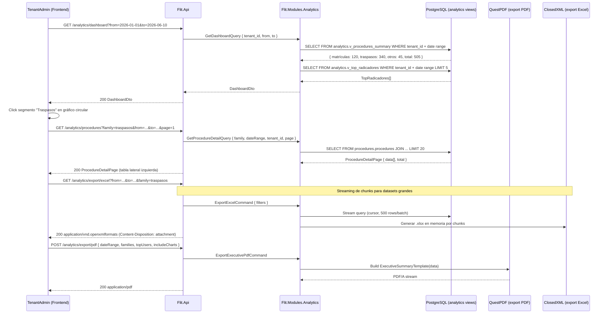

# Diseño: Feature #9728 — DASHBOARD-TRÁMITES (Analítica)

**Fecha:** 2026-06-10
**Autor:** Architecture Agent v2.0
**Estado:** Propuesto
**ADRs aplicables:** ADR-0010 (multi-tenant RLS), ADR-0005 (QuestPDF — exportación PDF)
**Módulo backend:** `Flit.Modules.Analytics`
**Feature frontend:** `features/dashboard`
**Depende de:** Feature #9731 (datos de trámites para analítica)

---

## 1. Resumen y Alcance

### IN (incluido)
- Dashboard analítico con acceso diferenciado: TenantAdmin (su compañía) vs SuperAdmin (multi-tenant).
- Filtro global por rango de fechas reactivo (se aplica a todos los gráficos y tablas simultáneamente).
- Gráficos circulares (pie/donut) por familia: Matrículas / Traspasos / Otros — con conteos y porcentajes.
- Al clic en segmento del gráfico: tabla de detalle lateral izquierda (sin modales) con columnas: ID, fecha radicación, estado, placa, propietario, fecha aprobación, fecha actualización.
- Export Excel `.xlsx` por chunks (para datasets grandes).
- Cards Top 5 usuarios radicadores (por volumen de trámites en el período).
- Selector de usuarios (multiselección) para filtrar por radicador.
- Card vacía: "Este usuario no ha radicado ningún trámite".
- Export Resumen Ejecutivo PDF con gráficos y tablas de la sesión actual.

### OUT (excluido)
- Análisis financiero/de recaudo (otro módulo).
- Comparación histórica entre períodos (primera versión).
- Drill-down a nivel de paso del trámite.
- Alertas/umbrales configurables.

---

## 2. Diagrama de Secuencia — Flujo Principal



---

## 3. Contratos API

| Método | Ruta | Descripción | Permisos |
|---|---|---|---|
| GET | `/analytics/dashboard` | KPIs y conteos por familia | `analytics.read` |
| GET | `/analytics/procedures` | Detalle de trámites filtrado (paginado) | `analytics.read` |
| GET | `/analytics/top-users` | Top radicadores con filtro multiselección | `analytics.read` |
| GET | `/analytics/export/excel` | Descarga Excel streaming | `analytics.export` |
| POST | `/analytics/export/pdf` | Genera Resumen Ejecutivo PDF | `analytics.export` |

```yaml
# GET /analytics/dashboard (query params)
params:
  from: date        # ISO 8601
  to: date
  tenant_id: uuid?  # solo SuperAdmin puede especificar otro tenant
response:
  period: { from: date, to: date }
  summary:
    total: int
    by_family:
      - family: "matricula_inicial"|"traspasos"|"otros"
        count: int
        pct: number   # porcentaje del total
        by_status:    # desglose por estado
          draft: int
          submitted: int
          approved: int
          rejected: int
  top_users:
    - user_id: uuid
      full_name: string
      count: int
      pct_of_total: number

# GET /analytics/procedures (query params)
params:
  family: "matricula_inicial"|"traspasos"|"otros"?
  status: string?
  from: date
  to: date
  user_ids: uuid[]?   # filtro multiselección de radicadores
  page: int
  page_size: int (max 50)
response:
  data:
    - id: string           # composite_id: "TRASP-02_EVE-8841"
      submitted_at: datetime
      status: string
      plate: string?
      owner_name: string?
      approved_at: datetime?
      updated_at: datetime
  total: int
  page: int

# POST /analytics/export/pdf
request:
  from: date
  to: date
  families: string[]?         # vacío = todas
  user_ids: uuid[]?
  include_charts: bool         # si incluir imágenes de los gráficos
  include_detail_table: bool
response: PDF/A binary (Content-Disposition: attachment; filename=resumen-ejecutivo-{date}.pdf)
```

---

## 4. Modelo de Datos

### Schema: `analytics` (vistas materializadas sobre `procedures`)

```sql
-- Vista materializada: resumen de trámites por familia y estado
CREATE MATERIALIZED VIEW analytics.v_procedures_summary AS
SELECT
  p.tenant_id,
  p.company_id,
  DATE_TRUNC('day', p.submitted_at)  AS day,
  pt.family,
  p.status,
  COUNT(*)                            AS procedure_count
FROM procedures.procedures p
JOIN procedures_config.procedure_types pt ON p.procedure_type_id = pt.id
WHERE p.deleted_at IS NULL
GROUP BY p.tenant_id, p.company_id, DATE_TRUNC('day', p.submitted_at), pt.family, p.status;

CREATE UNIQUE INDEX ix_v_procedures_summary
  ON analytics.v_procedures_summary(tenant_id, company_id, day, family, status);

-- Actualización: se llama en background tras cada trámite submitido/aprobado/rechazado
-- (Wolverine consumer: RefreshAnalyticsMaterializedViewsCommand)

-- Vista materializada: top radicadores
CREATE MATERIALIZED VIEW analytics.v_top_radicadores AS
SELECT
  p.tenant_id,
  p.assigned_user_id AS user_id,
  u.full_name,
  DATE_TRUNC('month', p.submitted_at) AS month,
  COUNT(*) AS procedure_count
FROM procedures.procedures p
JOIN identity.users u ON p.assigned_user_id = u.id
WHERE p.deleted_at IS NULL AND p.submitted_at IS NOT NULL
GROUP BY p.tenant_id, p.assigned_user_id, u.full_name, DATE_TRUNC('month', p.submitted_at);

CREATE UNIQUE INDEX ix_v_top_radicadores
  ON analytics.v_top_radicadores(tenant_id, user_id, month);
```

> **Nota:** Las vistas materializadas NO tienen RLS directamente. El módulo Analytics aplica el filtro de tenant en la query: `WHERE tenant_id = current_tenant_id`. El `database-agent` puede aplicar RLS en las vistas con `security_barrier`.

---

## 5. Componentes Backend

### `Flit.Modules.Analytics`

```
Domain/
  DTOs/         DashboardDto, ProcedureDetailDto, TopUserDto

Application/
  Queries/
    GetDashboardQuery + Handler         ← consulta vistas materializadas
    GetProcedureDetailQuery + Handler   ← paginación server-side
    GetTopUsersQuery + Handler
  Commands/
    ExportExcelCommand + Handler        ← ClosedXML streaming (ADR-0002)
    ExportExecutivePdfCommand + Handler ← QuestPDF ExecutiveSummaryTemplate
    RefreshAnalyticsMaterializedViewsCommand + Handler  ← Wolverine consumer

Infrastructure/
  Pdf/
    ExecutiveSummaryTemplate.cs     ← QuestPDF template: charts (estáticos) + tabla detalle
  Excel/
    ProceduresExcelExporter.cs      ← ClosedXML chunks por 500 rows
  Persistence/
    AnalyticsRepository.cs
  ModuleExtensions.cs
```

---

## 6. Componentes Frontend

### `features/dashboard`

```
features/dashboard/
├── api/
│   ├── dashboard.schemas.ts    (Zod: DashboardSummary, ProcedureDetail, TopUser)
│   └── dashboard.api.ts        (useDashboard, useProcedureDetail, useTopUsers,
│                                 useExportExcel, useExportPdf)
├── components/
│   ├── DateRangeFilter.tsx          (filtro global, reactivo, afecta todos los widgets)
│   ├── FamilyPieChart.tsx           (PrimeReact Chart.js — 3 segmentos: matrícula/traspaso/otros)
│   ├── ProcedureDetailTable.tsx     (panel lateral izquierdo, visible al clic en segmento)
│   │   └── columnas: ID, fecha rad., estado, placa, propietario, fecha aprobación, actualización
│   ├── TopUsersCard.tsx             (top 5 + selector multiselección filtrar)
│   ├── EmptyUserCard.tsx            ("Este usuario no ha radicado ningún trámite")
│   ├── ExportExcelButton.tsx        (trigger descarga streaming)
│   └── ExportPdfButton.tsx          (trigger generación PDF ejecutivo)
└── pages/
    └── DashboardPage.tsx            (/dashboard)
```

### Estados UI

| Componente | Vacío | Cargando | Error | Con datos |
|---|---|---|---|---|
| FamilyPieChart | "Sin trámites en el período" | Skeleton circular | ErrorState | Donut chart interactivo |
| ProcedureDetailTable | "Sin trámites en esta categoría" | Skeleton rows | ErrorState | Tabla paginada lateral |
| TopUsersCard | `EmptyUserCard` por cada usuario sin trámites | Skeleton | ErrorState | Top 5 con progress bar |

---

## 7. Archivos a Crear / Modificar

### Backend
```
services/core-api/src/Flit.Modules.Analytics/      [CREAR todo el módulo]
  Flit.Modules.Analytics.csproj
  Application/Queries/{GetDashboard, GetProcedureDetail, GetTopUsers}Query.cs + Handlers
  Application/Commands/{ExportExcel, ExportExecutivePdf,
                        RefreshAnalyticsMaterializedViews}Command.cs + Handlers
  Infrastructure/Pdf/ExecutiveSummaryTemplate.cs
  Infrastructure/Excel/ProceduresExcelExporter.cs
  Infrastructure/Persistence/AnalyticsRepository.cs
  Infrastructure/ModuleExtensions.cs
services/core-api/src/Flit.Infrastructure/
  Persistence/FlitDbContext.cs                      [MODIFICAR]
```

### Frontend
```
frontend/src/features/dashboard/                   [CREAR todo]
```

---

## 8. Notas Operativas

- **database-agent:** Schema `analytics`. Crear las dos vistas materializadas con sus índices. Trigger o Wolverine consumer para `REFRESH MATERIALIZED VIEW CONCURRENTLY` tras cada trámite submitido. Aplicar `security_barrier` en las vistas para RLS efectivo.
- **backend-agent:** `ExportExcelCommand` usa cursor/streaming para no cargar todos los registros en memoria. `ExportExecutivePdfCommand` genera gráficos como imágenes SVG/PNG (server-side) para incluirlos en el PDF QuestPDF. Los gráficos en server-side pueden ser generados con una librería de rendering SVG ligera (ej. `Svg.Net`).
- **frontend-agent:** `DateRangeFilter` usa contexto React para propagar los valores a todos los widgets sin prop drilling. `FamilyPieChart` usa PrimeReact `Chart` (Chart.js integrado). Al click en segmento: actualizar estado de `selectedFamily` → `ProcedureDetailTable` reactiva al valor.
- **security-agent:** Verificar que SuperAdmin solo puede ver datos de tenants que existen. El export Excel/PDF no debe incluir datos PII más allá de lo visible en pantalla (propietario y placa son datos de tránsito, no biométricos).
- **qa-agent:** TC: filtrar por rango de fechas → verificar que los 3 widgets (pie, tabla, top users) se actualizan. TC: export Excel → verificar que el archivo contiene las columnas esperadas y no datos de otros tenants.

---

## 9. Descomposición Preliminar en HUs

| # | Título | Tipo | Dependencias |
|---|---|---|---|
| HU-9728-01 | Vistas materializadas y endpoints de KPIs del dashboard (backend) | [BACKEND] | HU-9731-01 |
| HU-9728-02 | Export Excel streaming y Export PDF Resumen Ejecutivo | [BACKEND] | HU-9728-01 |
| HU-9728-03 | Frontend: gráfico circular por familia, filtro de fechas y tabla de detalle lateral | [FRONTEND] | HU-9728-01 |
| HU-9728-04 | Frontend: cards Top 5 radicadores, selector multiselección y exports | [FRONTEND] | HU-9728-02, HU-9728-03 |

---

*Diseño generado por: Architecture Agent v2.0 — 2026-06-10 | Estado: Propuesto*
