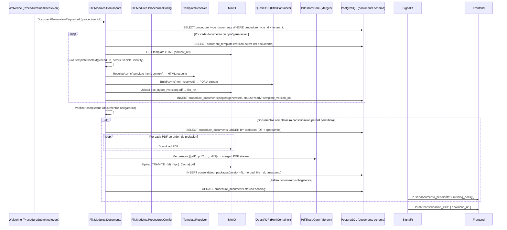

# Diseño: Feature #9729 — CONSOLIDACIÓN-DOCUMENTAL

**Fecha:** 2026-06-10
**Autor:** Architecture Agent v2.0
**Estado:** Propuesto
**ADRs aplicables:** ADR-0009 (Híbrido JSONB), ADR-0010 (RLS), ADR-0012 (QuestPDF + plantillas MinIO)
**Módulo backend:** `Flit.Modules.Documents`
**Feature frontend:** `features/documents`
**Depende de:** Feature #9731 (CREACIÓN-TRÁMITES), #9568 (PARAMETRIZADOR)

---

## 1. Resumen y Alcance

### IN (incluido)
- Maestro documental por tipo de trámite: nombre, obligatoriedad, fuente (carga/generación), orden, modo.
- Clasificación por origen: `carga` (usuario adjunta) vs `generacion` (sistema genera desde plantilla).
- Validación de existencia y completitud de documentos (regla parametrizable para consolidación parcial).
- Generación automática de documentos desde plantillas HTML+marcadores almacenadas en MinIO.
- `TemplateContext`: resolución de marcadores con datos del trámite, actores, consultas externas, identidad validada.
- Versionamiento de plantillas: trámite radicado conserva la versión con la que inició.
- Merge de N documentos en un único PDF consolidado con timestamp.
- Ordenamiento de prelación parametrizable por OT + tipo de trámite (respeta configuración del Feature #9566).
- Descarga con nombre `TRAMITE_{id}_{tipo}_{fecha}.pdf`.
- Regeneración versionada ante cambios (nueva versión del paquete consolidado).
- Visualización de estado documental: pendiente, generado, cargado, vencido.
- Auditoría: origen, versión de plantilla, fuentes de datos usadas.

### OUT (excluido)
- Edición del PDF generado.
- OCR de documentos cargados.
- Reordenamiento manual del PDF por usuario final (se hace en admin OT — Feature #9566).
- Firma digital del PDF (roadmap futuro).
- Diseño visual de plantillas (Feature #9568 define los marcadores; el HTML lo crea el admin).

---

## 2. Diagrama de Secuencia — Flujo Principal



---

## 3. Contratos API

| Método | Ruta | Descripción | Permisos |
|---|---|---|---|
| GET | `/procedure-types/{id}/document-config` | Maestro documental del tipo de trámite | `superadmin` |
| POST | `/procedure-types/{id}/document-config` | Asocia documento al tipo de trámite | `superadmin` |
| PUT | `/procedure-types/{id}/document-config/{docConfigId}` | Actualiza asociación (orden, obligatorio) | `superadmin` |
| DELETE | `/procedure-types/{id}/document-config/{docConfigId}` | Desasocia documento | `superadmin` |
| GET | `/document-types` | Catálogo de tipos de documento | `superadmin`, `tramites.read` |
| POST | `/document-types` | Crea tipo de documento | `superadmin` |
| GET | `/document-types/{id}/templates` | Lista versiones de plantilla | `superadmin` |
| POST | `/document-types/{id}/templates` | Crea nueva versión de plantilla (HTML upload) | `superadmin` |
| GET | `/document-types/{id}/templates/{versionId}` | Obtiene contenido de plantilla | `superadmin` |
| GET | `/procedures/{id}/documents` | Estado documental del trámite | `tramites.read` |
| GET | `/procedures/{id}/documents/{docId}/download` | Descarga documento individual | `tramites.read` |
| POST | `/procedures/{id}/documents/consolidate` | Fuerza re-consolidación | `tramites.admin.maestro` |
| GET | `/procedures/{id}/consolidated` | Descarga PDF consolidado (última versión) | `tramites.read` |
| GET | `/procedures/{id}/consolidated/history` | Historial de versiones consolidadas | `tramites.read` |

```yaml
# GET /procedures/{id}/documents
response:
  procedure_id: uuid
  documents:
    - id: uuid
      document_type: { id, name, load_type: "carga"|"generacion" }
      origin: "generated"|"uploaded"
      status: "pending"|"ready"|"failed"|"expired"
      template_version: int?     # solo si generado
      file_ref: string?
      generated_at: datetime?
      uploaded_by: uuid?
      is_required: bool
      order_index: int
  consolidated_packages:
    - version: int
      merged_file_ref: string
      created_at: datetime
      download_filename: string   # TRAMITE_{id}_{tipo}_{fecha}.pdf

# POST /document-types/{id}/templates (multipart)
request:
  html_content: file    # archivo HTML con marcadores {{campo.origen.ruta}}
  notes: string?
response:
  template_id: uuid
  version: int
  status: "active"
  markers_detected: string[]   # marcadores encontrados en el HTML

# Marcadores soportados en plantillas:
# {{procedure.composite_id}}  {{procedure.submitted_at}}
# {{actor[vendedor].full_name}}  {{actor[vendedor].document_number}}
# {{actor[comprador].cuota_pct}}
# {{vehicle.plate}}  {{vehicle.runt.propietario}}
# {{vehicle.simit.multas_count}}
# {{identity.verdict}}  {{identity.validated_at}}
# {{ot.name}}  {{ot.code}}
```

---

## 4. Modelo de Datos

### Schema: `documents`

```sql
-- Tipos de documento (catálogo reutilizable)
CREATE TABLE documents.document_types (
  id              uuid DEFAULT gen_ulid() PRIMARY KEY,
  tenant_id       uuid NOT NULL REFERENCES identity.tenants(id),
  name            text NOT NULL,
  load_type       text NOT NULL CHECK (load_type IN ('carga','generacion')),
  allowed_formats jsonb NOT NULL DEFAULT '["pdf"]',
  max_size_mb     int NOT NULL DEFAULT 10,
  is_reusable     bool NOT NULL DEFAULT true,
  created_at      timestamptz NOT NULL DEFAULT now(),
  deleted_at      timestamptz
);
ALTER TABLE documents.document_types ENABLE ROW LEVEL SECURITY;
CREATE POLICY tenant_isolation ON documents.document_types
  USING (tenant_id = current_setting('app.tenant_id', true)::uuid);

-- Asociación tipo_trámite → documentos
CREATE TABLE documents.procedure_type_documents (
  id                  uuid DEFAULT gen_ulid() PRIMARY KEY,
  procedure_type_id   uuid NOT NULL REFERENCES procedures_config.procedure_types(id),
  document_type_id    uuid NOT NULL REFERENCES documents.document_types(id),
  tenant_id           uuid NOT NULL,
  is_required         bool NOT NULL DEFAULT true,
  order_index         int NOT NULL DEFAULT 0,
  actor_definition_id uuid REFERENCES procedures_config.actor_definitions(id),
  allow_partial_consolidation bool NOT NULL DEFAULT false,
  created_at          timestamptz NOT NULL DEFAULT now(),
  deleted_at          timestamptz,
  CONSTRAINT uq_proc_type_doc UNIQUE (procedure_type_id, document_type_id)
);
ALTER TABLE documents.procedure_type_documents ENABLE ROW LEVEL SECURITY;
CREATE POLICY tenant_isolation ON documents.procedure_type_documents
  USING (tenant_id = current_setting('app.tenant_id', true)::uuid);

-- Plantillas versionadas (HTML con marcadores, almacenadas en MinIO)
CREATE TABLE documents.document_templates (
  id              uuid DEFAULT gen_ulid() PRIMARY KEY,
  document_type_id uuid NOT NULL REFERENCES documents.document_types(id),
  tenant_id       uuid NOT NULL,
  version         int NOT NULL,
  content_ref     text NOT NULL,   -- MinIO key: templates/{tenant}/{doc_type}/{version}.html
  status          text NOT NULL DEFAULT 'active'
                  CHECK (status IN ('active','deprecated','archived')),
  notes           text,
  created_by      uuid,
  created_at      timestamptz NOT NULL DEFAULT now(),
  CONSTRAINT uq_template_version UNIQUE (document_type_id, version)
);
ALTER TABLE documents.document_templates ENABLE ROW LEVEL SECURITY;
CREATE POLICY tenant_isolation ON documents.document_templates
  USING (tenant_id = current_setting('app.tenant_id', true)::uuid);
-- Regla: solo una versión 'active' por document_type (parcial unique)
CREATE UNIQUE INDEX ix_template_one_active
  ON documents.document_templates(document_type_id)
  WHERE status = 'active';

-- Campos/marcadores de la plantilla (metadatos, no el HTML)
CREATE TABLE documents.template_fields (
  id              uuid DEFAULT gen_ulid() PRIMARY KEY,
  template_id     uuid NOT NULL REFERENCES documents.document_templates(id),
  marker          text NOT NULL,    -- "actor[vendedor].full_name"
  data_source     text NOT NULL,    -- "actor"|"vehicle"|"procedure"|"identity"|"ot"
  data_path       text NOT NULL,    -- JSONPath en el contexto de resolución
  is_required     bool NOT NULL DEFAULT false,
  created_at      timestamptz NOT NULL DEFAULT now()
);

-- Documentos del trámite (generados o cargados)
CREATE TABLE documents.procedure_documents (
  id                  uuid DEFAULT gen_ulid() PRIMARY KEY,
  procedure_id        uuid NOT NULL REFERENCES procedures.procedures(id),
  document_type_id    uuid NOT NULL REFERENCES documents.document_types(id),
  tenant_id           uuid NOT NULL,
  template_version_id uuid REFERENCES documents.document_templates(id),
  origin              text NOT NULL CHECK (origin IN ('generated','uploaded')),
  status              text NOT NULL DEFAULT 'pending'
    CHECK (status IN ('pending','ready','failed','expired')),
  file_ref            text,         -- MinIO key
  file_name           text,
  generation_metadata jsonb,        -- fuentes de datos usadas
  uploaded_by         uuid REFERENCES identity.users(id),
  generated_at        timestamptz,
  created_at          timestamptz NOT NULL DEFAULT now()
);
ALTER TABLE documents.procedure_documents ENABLE ROW LEVEL SECURITY;
CREATE POLICY tenant_isolation ON documents.procedure_documents
  USING (tenant_id = current_setting('app.tenant_id', true)::uuid);
CREATE INDEX ix_proc_docs_procedure_id ON documents.procedure_documents(procedure_id, status);

-- Paquetes consolidados (PDF merge)
CREATE TABLE documents.consolidated_packages (
  id              uuid DEFAULT gen_ulid() PRIMARY KEY,
  procedure_id    uuid NOT NULL REFERENCES procedures.procedures(id),
  tenant_id       uuid NOT NULL,
  version         int NOT NULL,
  merged_file_ref text NOT NULL,
  download_filename text NOT NULL,  -- "TRAMITE_{id}_{tipo}_{fecha}.pdf"
  doc_count       int NOT NULL,
  created_at      timestamptz NOT NULL DEFAULT now(),
  CONSTRAINT uq_consolidation_version UNIQUE (procedure_id, version)
);
ALTER TABLE documents.consolidated_packages ENABLE ROW LEVEL SECURITY;
CREATE POLICY tenant_isolation ON documents.consolidated_packages
  USING (tenant_id = current_setting('app.tenant_id', true)::uuid);
```

---

## 5. Componentes Backend

### `Flit.Modules.Documents`

```
Domain/
  Entities/     DocumentType, DocumentTemplate, TemplateField,
                ProcedureDocument, ConsolidatedPackage, ProcedureTypeDocument
  Services/
    TemplateResolver          ← HTML + marcadores → HTML resuelto
    TemplateContextBuilder    ← construye TemplateContext desde datos del trámite
    DocumentCompletionChecker ← verifica documentos obligatorios
  Events/       DocumentGenerationRequested, ConsolidationCompleted

Application/
  Commands/
    GenerateProcedureDocumentsCommand + Handler   ← Wolverine consumer
    ConsolidateDocumentsCommand + Handler          ← merge PDF via PdfSharpMerger
    CreateDocumentTypeCommand + Handler
    CreateDocumentTemplateCommand + Handler        ← upload HTML a MinIO
    ForceReconsolidationCommand + Handler          (tramites.admin.maestro)
  Queries/
    GetProcedureDocumentsQuery + Handler
    GetConsolidatedPackageQuery + Handler
    ListDocumentTemplatesQuery + Handler

Infrastructure/
  Pdf/
    QuestPdfDocumentRenderer    ← HTML → PDF/A stream (ADR-0012)
    PdfSharpMerger              ← N PDFs → 1 PDF consolidado
  Templates/
    TemplateResolver.cs
    TemplateContextBuilder.cs
  Persistence/
    DocumentRepository, TemplateRepository, ConsolidatedPackageRepository
  ModuleExtensions.cs
```

---

## 6. Componentes Frontend

### `features/documents`

```
features/documents/
├── api/
│   ├── documents.schemas.ts
│   └── documents.api.ts    (useProcedureDocuments, useConsolidatedPackage,
│                             useDocumentTypes, useDocumentTemplates, useUploadTemplate)
├── components/
│   ├── DocumentStatusPanel.tsx     (lista documentos con estado visual: ✓ listo, ⏳ pendiente)
│   ├── DocumentItem.tsx            (icono, nombre, origen, botón descargar/subir)
│   ├── ConsolidatedPackageCard.tsx (versión, fecha, botón descarga PDF)
│   ├── DocumentHistoryDrawer.tsx   (historial de versiones consolidadas)
│   ├── TemplateUploadModal.tsx     (upload HTML + preview marcadores detectados)
│   └── TemplateVersionsList.tsx    (admin: versiones por tipo de documento)
└── pages/
    ├── DocumentsPage.tsx           (/procedures/:id/documents)
    └── DocumentAdminPage.tsx       (/admin/documents)
```

### Estados UI

| Componente | Vacío | Cargando | Error | Con datos |
|---|---|---|---|---|
| DocumentStatusPanel | "Sin documentos configurados" | Skeleton | ErrorState | Lista con estados y acciones |
| ConsolidatedPackageCard | "Consolidación pendiente" | Procesando... | "Error al consolidar" | Botón descarga activo |

---

## 7. Archivos a Crear / Modificar

### Backend
```
services/core-api/src/Flit.Modules.Documents/      [CREAR todo el módulo]
  Flit.Modules.Documents.csproj
  Domain/Entities/*.cs
  Domain/Services/{TemplateResolver, TemplateContextBuilder, DocumentCompletionChecker}.cs
  Application/Commands/{GenerateProcedureDocuments, ConsolidateDocuments,
                        CreateDocumentType, CreateDocumentTemplate,
                        ForceReconsolidation}Command.cs + Handlers
  Application/Queries/*.cs + Handlers
  Infrastructure/Pdf/{QuestPdfDocumentRenderer, PdfSharpMerger}.cs
  Infrastructure/Templates/{TemplateResolver, TemplateContextBuilder}.cs
  Infrastructure/Persistence/*.cs
  Infrastructure/ModuleExtensions.cs
services/core-api/src/Flit.SharedKernel.Pdf/       [MODIFICAR]
  → Extender IPdfBuilder<T> con HtmlContainer support
  → Agregar PdfSharpMerger integration
services/core-api/src/Flit.Infrastructure/
  Persistence/FlitDbContext.cs                      [MODIFICAR]
```

### Frontend
```
frontend/src/features/documents/                   [CREAR todo]
```

---

## 8. Notas Operativas

- **database-agent:** Schema `documents`. Índice único parcial `ix_template_one_active` (una sola versión activa por document_type). Foreign key cross-schema `procedure_type_documents → procedures_config.procedure_types`.
- **backend-agent:** `TemplateContextBuilder` construye el contexto desde datos del trámite, actores, vehicle_queries e identity_validations. `TemplateResolver` usa regex para reemplazar `{{marker}}` — si un marcador no resuelve, inserta `[marker:NO_DATA]` (visible en el PDF para auditoría). `PdfSharpMerger` usa `PdfSharpCore` (MIT, ~3MB) — agregar a `Directory.Packages.props`.
- **frontend-agent:** `DocumentStatusPanel` se actualiza via SignalR cuando el estado de un documento cambia. `TemplateUploadModal` envía multipart/form-data con el HTML y muestra los marcadores detectados (response del backend).
- **security-agent:** Los HTML de plantillas se sanitizan antes de almacenar en MinIO (prevenir XSS en el visor). Los PDFs contienen PII — acceso restringido via presigned URLs de MinIO con TTL 5 min.
- **qa-agent:** TC golden-file: verificar que el PDF consolidado contiene los datos del trámite correctos. TC de versionamiento: cambiar plantilla → verificar que trámites radicados usan la versión anterior.

---

## 9. Descomposición Preliminar en HUs

| # | Título | Tipo | Dependencias |
|---|---|---|---|
| HU-9729-01 | Maestro documental: CRUD tipos de documento y asociación a tipos de trámite | [BACKEND] | HU-9568-01 |
| HU-9729-02 | Plantillas HTML versionadas: upload, resolución de marcadores y generación PDF/A | [BACKEND] | HU-9729-01, ADR-0012 |
| HU-9729-03 | Pipeline de consolidación: merge PDF por prelación, descarga y versionamiento | [BACKEND] | HU-9729-02, HU-9731-03 |
| HU-9729-04 | Frontend: panel de estado documental, descarga y visor del paquete consolidado | [FRONTEND] | HU-9729-02, HU-9729-03 |
| HU-9729-05 | Frontend: admin de plantillas (upload HTML, preview marcadores, versiones) | [FRONTEND] | HU-9729-01, HU-9729-02 |

---

*Diseño generado por: Architecture Agent v2.0 — 2026-06-10 | Estado: Propuesto*
