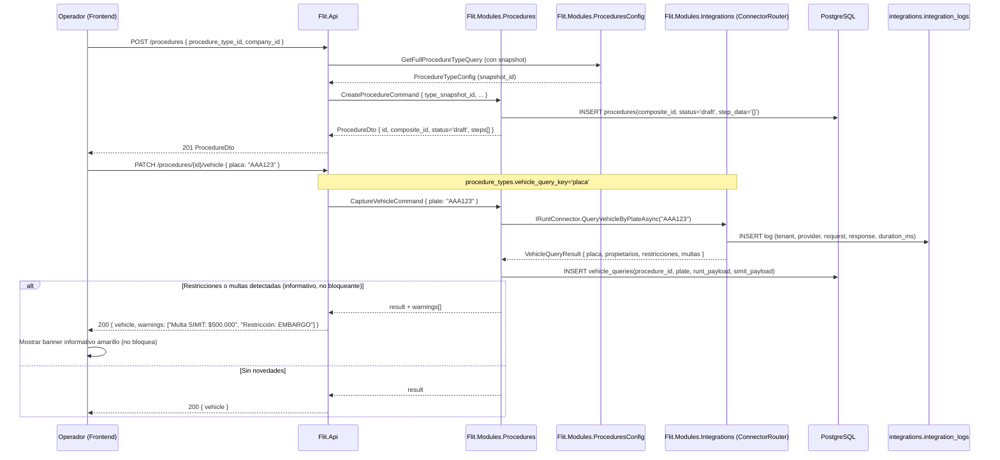
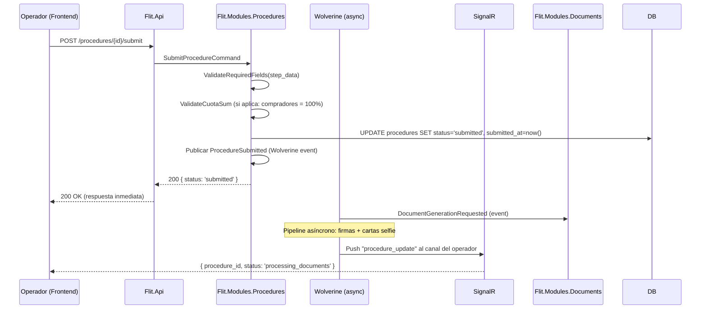

# Diseño: Feature #9731 — CREACIÓN-TRÁMITES (Runtime de Ejecución)

**Fecha:** 2026-06-10
**Autor:** Architecture Agent v2.0
**Estado:** Propuesto
**ADRs aplicables:** ADR-0009 (Híbrido JSONB), ADR-0010 (RLS), ADR-0011 (Strategy failover)
**Módulo backend:** `Flit.Modules.Procedures`
**Feature frontend:** `features/procedures`
**Depende de:** Feature #9568 (PARAMETRIZADOR), #9567 (IDENTIDAD), #9565 (ADMIN-COMPAÑÍAS)

---

## 1. Resumen y Alcance

### IN (incluido)
- Grilla central de trámites con IDs compuestos (ej. `TRASP-02_EVE-8841`).
- Visibilidad por slugs de permiso: SuperAdmin ve todo, Operador ve su tenant, Usuario OT ve trámites transversales de su secretaría.
- Comandos administrativos restringidos al slug `tramites.admin.maestro`: anulación, cambio de estado, limpiar/cargar consolidado.
- Stepper dinámico que interpreta la metadata del parametrizador (pasos, secciones, campos).
- El vehículo es siempre un actor del trámite (Actor tipo "vehiculo").
- Clave de consulta del vehículo parametrizable (placa para Traspaso, VIN para Matrícula — según `procedure_types.vehicle_query_key`).
- Consultas background Verifik/RUNT tras capturar placa/VIN: comparendos, licencias, RUES, medidas con payloads en logs por tenant.
- Banners informativos NO bloqueantes ante hallazgos (trámite queda en Borrador).
- Actores persona natural y persona jurídica: la jurídica incorpora sub-actor representante legal.
- Copropiedades: hasta 4 compradores con sumatoria de cuotas = exactamente 100%.
- Acordeón de vendedores secundarios RUNT para auditar biometría/firmas/cartas selfie.
- Clasificación de adjuntos por etiquetas dinámicas.
- Al cerrar el Stepper: persistir step_data, crear snapshot de config, disparar pipeline asíncrono de firmas y cartas selfie (Wolverine).

### OUT (excluido)
- Generación y consolidación de documentos (Feature #9729).
- Dashboard de trámites (Feature #9728).
- Módulo de firmas biométricas (alcance del stepper: sólo dispara el pipeline; el pipeline es de `Flit.Modules.Procedures`).

---

## 2. Diagrama de Secuencia — Flujo Principal

### 2a. Inicio de trámite y captura de vehículo



### 2b. Actor jurídico con representante legal + copropietarios

```mermaid
sequenceDiagram
  participant OP as Operador (Frontend)
  participant API as Flit.Api
  participant PR as Flit.Modules.Procedures
  participant INT as Flit.Modules.Integrations

  OP->>API: POST /procedures/{id}/actors
    { actor_def_id, nature: "juridica", nit: "900123456" }
  API->>INT: IRuesConnector.QueryLegalEntityAsync("900123456")
  INT-->>API: LegalEntityResult { name, representative }
  API->>PR: AddActorCommand { nature='juridica', legal_entity_data }
  PR->>DB: INSERT procedure_actors(procedure_id, actor_def_id, nature='juridica')
  PR->>DB: INSERT procedure_actors(... nature='representante_legal', parent_actor_id)

  Note over OP,PR: Copropietarios (hasta 4 compradores)
  OP->>API: POST /procedures/{id}/actors
    { actor_def_id (comprador), nature: "natural", document_number, cuota_pct: 25 }
  PR->>PR: ValidateCuotaSum(procedure_id) -- suma cuotas <= 100%
  PR->>DB: INSERT procedure_actors(cuota_pct=25)
  Note over OP: Al agregar 4to comprador con cuota, sistema valida que suma = 100%
```

### 2c. Cierre de Stepper y pipeline asíncrono



---

## 3. Contratos API

| Método | Ruta | Descripción | Permisos |
|---|---|---|---|
| GET | `/procedures` | Lista trámites (filtros: estado, tipo, fechas, placa; paginado) | `tramites.read` |
| POST | `/procedures` | Crea trámite (draft) | `tramites.create` |
| GET | `/procedures/{id}` | Detalle del trámite con paso actual | `tramites.read` |
| PATCH | `/procedures/{id}/vehicle` | Captura placa/VIN y ejecuta consulta RUNT background | `tramites.create` |
| GET | `/procedures/{id}/vehicle` | Resultado de consultas de vehículo (RUNT, SIMIT) | `tramites.read` |
| POST | `/procedures/{id}/actors` | Agrega actor (natural/jurídica) al trámite | `tramites.create` |
| PATCH | `/procedures/{id}/actors/{actorId}` | Actualiza datos del actor | `tramites.create` |
| DELETE | `/procedures/{id}/actors/{actorId}` | Elimina actor del trámite | `tramites.create` |
| GET | `/procedures/{id}/actors/{actorId}/query-results` | Resultados de consultas externas del actor | `tramites.read` |
| PATCH | `/procedures/{id}/steps/{stepId}` | Guarda progreso de un paso (step_data parcial) | `tramites.create` |
| POST | `/procedures/{id}/submit` | Cierra stepper, cambia a 'submitted', dispara pipeline | `tramites.create` |
| PATCH | `/procedures/{id}/status` | Cambio manual de estado | `tramites.admin.maestro` |
| DELETE | `/procedures/{id}` | Anulación (soft-delete) | `tramites.admin.maestro` |
| POST | `/procedures/{id}/attachments` | Sube adjunto con etiqueta | `tramites.create` |
| GET | `/procedures/{id}/attachments` | Lista adjuntos con etiquetas | `tramites.read` |
| GET | `/procedures/{id}/secondary-sellers` | Vendedores secundarios RUNT (acordeón auditoría) | `tramites.read` |

```yaml
# POST /procedures
request:
  procedure_type_id: uuid
  company_id: uuid

# GET /procedures (query params)
params:
  page: int
  page_size: int
  status: "draft"|"submitted"|"processing"|"approved"|"rejected"|"cancelled"?
  procedure_type_id: uuid?
  plate: string?
  date_from: date?
  date_to: date?
response:
  data: ProcedureListItem[]   # con composite_id: "TRASP-02_EVE-8841"
  total: int

# PATCH /procedures/{id}/steps/{stepId}
request:
  field_values: { [field_slug: string]: any }   # datos del paso
response:
  step_id: uuid
  is_complete: bool
  next_step_id: uuid?

# POST /procedures/{id}/actors
request:
  actor_definition_id: uuid
  nature: "natural"|"juridica"
  # Si natural:
  document_type: "CC"|"CE"|"PP"?
  document_number: string
  # Si juridica:
  nit: string
  # Si comprador (copropietario):
  cuota_pct: number?   # porcentaje de participación (0-100)
response:
  actor_id: uuid
  nature: string
  query_results: { ... }   # resultado inmediato de RUNT/RUES
  warnings: string[]       # hallazgos no bloqueantes (multas, restricciones)
```

---

## 4. Modelo de Datos

### Schema: `procedures`

```sql
CREATE TABLE procedures.procedures (
  id                        uuid DEFAULT gen_ulid() PRIMARY KEY,
  tenant_id                 uuid NOT NULL REFERENCES identity.tenants(id),
  company_id                uuid NOT NULL REFERENCES companies.companies(id),
  ot_id                     uuid REFERENCES ot.ot_organisms(id),
  procedure_type_id         uuid NOT NULL REFERENCES procedures_config.procedure_types(id),
  procedure_type_snapshot_id uuid NOT NULL
    REFERENCES procedures_config.procedure_type_snapshots(id),
  composite_id              text NOT NULL UNIQUE,  -- "TRASP-02_EVE-8841"
  status                    text NOT NULL DEFAULT 'draft'
    CHECK (status IN ('draft','submitted','processing_documents',
                      'pending_signatures','approved','rejected','cancelled')),
  current_step_order        int NOT NULL DEFAULT 1,
  step_data                 jsonb NOT NULL DEFAULT '{}',  -- datos capturados por paso
  assigned_user_id          uuid REFERENCES identity.users(id),
  submitted_at              timestamptz,
  approved_at               timestamptz,
  created_at                timestamptz NOT NULL DEFAULT now(),
  updated_at                timestamptz NOT NULL DEFAULT now(),
  deleted_at                timestamptz
);
ALTER TABLE procedures.procedures ENABLE ROW LEVEL SECURITY;
CREATE POLICY tenant_isolation ON procedures.procedures
  USING (tenant_id = current_setting('app.tenant_id', true)::uuid);
CREATE INDEX ix_procedures_tenant_status ON procedures.procedures(tenant_id, status)
  WHERE deleted_at IS NULL;
CREATE INDEX ix_procedures_composite_id  ON procedures.procedures(composite_id);

-- Actores del trámite (persona natural, jurídica, representante legal, vehículo)
CREATE TABLE procedures.procedure_actors (
  id                  uuid DEFAULT gen_ulid() PRIMARY KEY,
  procedure_id        uuid NOT NULL REFERENCES procedures.procedures(id),
  tenant_id           uuid NOT NULL,
  actor_definition_id uuid NOT NULL REFERENCES procedures_config.actor_definitions(id),
  nature              text NOT NULL
    CHECK (nature IN ('natural','juridica','representante_legal','vehiculo')),
  parent_actor_id     uuid REFERENCES procedures.procedure_actors(id),
    -- representante_legal.parent = actor_juridico; copropietarios: null (independientes)
  document_type       text,
  document_number     text,
  nit                 text,   -- para jurídica
  full_name           text,
  cuota_pct           numeric(5,2),   -- copropietarios: suma de todos = 100
  query_results       jsonb NOT NULL DEFAULT '{}',  -- resultados RUNT, SIMIT, RUES
  identity_validated  bool NOT NULL DEFAULT false,
  created_at          timestamptz NOT NULL DEFAULT now(),
  updated_at          timestamptz NOT NULL DEFAULT now()
);
ALTER TABLE procedures.procedure_actors ENABLE ROW LEVEL SECURITY;
CREATE POLICY tenant_isolation ON procedures.procedure_actors
  USING (tenant_id = current_setting('app.tenant_id', true)::uuid);
CREATE INDEX ix_proc_actors_procedure_id ON procedures.procedure_actors(procedure_id);

-- Consultas de vehículo (RUNT, SIMIT — payloads completos)
CREATE TABLE procedures.vehicle_queries (
  id              uuid DEFAULT gen_ulid() PRIMARY KEY,
  procedure_id    uuid NOT NULL REFERENCES procedures.procedures(id),
  tenant_id       uuid NOT NULL,
  query_key       text NOT NULL,   -- "placa" | "vin"
  query_value     text NOT NULL,
  runt_payload    jsonb,
  simit_payload   jsonb,
  rues_payload    jsonb,
  warnings        jsonb NOT NULL DEFAULT '[]',  -- hallazgos no bloqueantes
  queried_at      timestamptz NOT NULL DEFAULT now()
);
ALTER TABLE procedures.vehicle_queries ENABLE ROW LEVEL SECURITY;
CREATE POLICY tenant_isolation ON procedures.vehicle_queries
  USING (tenant_id = current_setting('app.tenant_id', true)::uuid);

-- Firmas del trámite
CREATE TABLE procedures.procedure_signatures (
  id              uuid DEFAULT gen_ulid() PRIMARY KEY,
  procedure_id    uuid NOT NULL REFERENCES procedures.procedures(id),
  actor_id        uuid NOT NULL REFERENCES procedures.procedure_actors(id),
  tenant_id       uuid NOT NULL,
  signature_type  text NOT NULL
    CHECK (signature_type IN ('identidad_digital','firma_pantalla','preasignada')),
  status          text NOT NULL DEFAULT 'pending'
    CHECK (status IN ('pending','signed','rejected','expired')),
  file_ref        text,   -- referencia a MinIO
  signed_at       timestamptz,
  created_at      timestamptz NOT NULL DEFAULT now()
);
ALTER TABLE procedures.procedure_signatures ENABLE ROW LEVEL SECURITY;
CREATE POLICY tenant_isolation ON procedures.procedure_signatures
  USING (tenant_id = current_setting('app.tenant_id', true)::uuid);

-- Adjuntos del trámite
CREATE TABLE procedures.procedure_attachments (
  id            uuid DEFAULT gen_ulid() PRIMARY KEY,
  procedure_id  uuid NOT NULL REFERENCES procedures.procedures(id),
  tenant_id     uuid NOT NULL,
  label_slug    text NOT NULL,     -- etiqueta dinámica del OT
  file_name     text NOT NULL,
  file_ref      text NOT NULL,     -- MinIO
  content_type  text NOT NULL,
  size_bytes    bigint NOT NULL,
  uploaded_by   uuid NOT NULL REFERENCES identity.users(id),
  uploaded_at   timestamptz NOT NULL DEFAULT now()
);
ALTER TABLE procedures.procedure_attachments ENABLE ROW LEVEL SECURITY;
CREATE POLICY tenant_isolation ON procedures.procedure_attachments
  USING (tenant_id = current_setting('app.tenant_id', true)::uuid);
```

---

## 5. Componentes Backend

### `Flit.Modules.Procedures`

```
Domain/
  Entities/       Procedure, ProcedureActor, VehicleQuery, ProcedureSignature,
                  ProcedureAttachment
  Services/       CuotaValidator        ← valida suma de cuotas = 100%
                  CompositIdGenerator   ← genera "TRASP-02_EVE-8841"
  Events/         ProcedureSubmitted, VehicleCaptured, ActorAdded

Application/
  Commands/
    CreateProcedureCommand + Handler
    CaptureVehicleCommand + Handler     ← llama IRuntConnector + ISimittConnector
    AddActorCommand + Handler           ← llama IRuesConnector si jurídica
    UpdateStepDataCommand + Handler
    SubmitProcedureCommand + Handler    ← valida + snapshot + publica ProcedureSubmitted
    ChangeProcedureStatusCommand + Handler  (tramites.admin.maestro)
    CancelProcedureCommand + Handler        (tramites.admin.maestro)
    UploadAttachmentCommand + Handler
  Queries/
    ListProceduresQuery + Handler       ← server-side filtros + paginación
    GetProcedureDetailQuery + Handler   ← carga step_data + actores + queries + firmas
    GetVehicleQueryResultsQuery + Handler
    GetSecondarySellerQuery + Handler   ← vendedores secundarios RUNT

Infrastructure/
  Persistence/    ProcedureRepository, ActorRepository, VehicleQueryRepository
  ModuleExtensions.cs
```

---

## 6. Componentes Frontend

### `features/procedures`

```
features/procedures/
├── api/
│   ├── procedures.schemas.ts
│   └── procedures.api.ts   (useProcedures, useProcedureDetail, useCreateProcedure,
│                             useCaptureVehicle, useAddActor, useSubmitProcedure,
│                             useUploadAttachment)
├── components/
│   ├── ProceduresGrid.tsx           (grilla central: composite_id, estado, placa, propietario)
│   ├── ProcedureStepper/
│   │   ├── DynamicStepper.tsx       (data-driven: pasos desde config snapshot)
│   │   ├── StepRenderer.tsx         (renderiza sección/campos según field_type)
│   │   ├── VehicleCaptureStep.tsx   (input placa/VIN según vehicle_query_key)
│   │   ├── ActorStep.tsx            (formulario actor natural/jurídica)
│   │   │   ├── NaturalPersonForm.tsx
│   │   │   ├── LegalEntityForm.tsx  ← incluye sub-form representante legal
│   │   │   └── CopropietariosManager.tsx  (hasta 4, con cuota % y validación suma=100)
│   │   ├── SignatureStep.tsx
│   │   └── ReviewStep.tsx
│   ├── VehicleWarningBanner.tsx     (banner amarillo NO bloqueante)
│   ├── SecondarySellerAccordion.tsx (vendedores secundarios RUNT, auditoría)
│   └── AttachmentsPanel.tsx         (upload + lista por etiqueta dinámica)
└── pages/
    ├── ProceduresPage.tsx            (/procedures)
    └── ProcedureDetailPage.tsx       (/procedures/:id)
```

### Estados UI

| Componente | Vacío | Cargando | Error | Con datos |
|---|---|---|---|---|
| ProceduresGrid | "No hay trámites en este rango" | Skeleton rows | ErrorState | Grilla con filtros |
| DynamicStepper | — | Cargando config... | "No se pudo cargar el trámite" | Stepper multi-paso |
| VehicleCaptureStep | Input placa vacío | Consultando RUNT... | "Error de consulta" + retry | Datos del vehículo |
| CopropietariosManager | Agregar primer comprador | — | Cuotas no suman 100% (inline error) | Lista compradores con cuotas |

---

## 7. Archivos a Crear / Modificar

### Backend
```
services/core-api/src/Flit.Modules.Procedures/      [CREAR todo el módulo]
  Flit.Modules.Procedures.csproj
  Domain/Entities/{Procedure, ProcedureActor, VehicleQuery,
                   ProcedureSignature, ProcedureAttachment}.cs
  Domain/Services/{CuotaValidator, CompositeIdGenerator}.cs
  Application/Commands/{CreateProcedure, CaptureVehicle, AddActor,
                        UpdateStepData, SubmitProcedure, CancelProcedure,
                        UploadAttachment}Command.cs + Handlers
  Application/Queries/{ListProcedures, GetProcedureDetail,
                       GetVehicleQueryResults, GetSecondarySellers}Query.cs + Handlers
  Infrastructure/Persistence/{ProcedureRepository, ActorRepository}.cs
  Infrastructure/ModuleExtensions.cs
services/core-api/src/Flit.Infrastructure/
  Persistence/FlitDbContext.cs                       [MODIFICAR] (DbSets procedures)
```

### Frontend
```
frontend/src/features/procedures/                    [CREAR todo]
  api/{procedures.schemas, procedures.api}.ts
  components/{ProceduresGrid, ProcedureStepper/*, VehicleWarningBanner,
              SecondarySellerAccordion, AttachmentsPanel}.tsx
  pages/{ProceduresPage, ProcedureDetailPage}.tsx
```

---

## 8. Notas Operativas

- **database-agent:** Schema `procedures`. RLS en todas las tablas. `procedures.step_data` es JSONB — no indexar con GIN (datos de usuario, no de config). `vehicle_queries.runt_payload` y `simit_payload` como JSONB sin índices GIN (solo auditoría). Constraint en `procedure_actors.cuota_pct`: suma por `procedure_id` <= 100.
- **backend-agent:** `CaptureVehicleCommand` ejecuta la consulta RUNT en el handler HTTP (síncrono, timeout 4s via ConnectorRouter). El resultado se persiste en `vehicle_queries`. `SubmitProcedureCommand` primero crea snapshot en `ProceduresConfig`, luego actualiza status, luego publica evento Wolverine. El composite_id se genera como `{FAMILY_CODE}-{SECUENCIA}_{OT_CODE}-{TIMESTAMP}`.
- **frontend-agent:** `DynamicStepper` lee la config del snapshot (no del procedureType directamente) para garantizar que usa la misma config con la que se creó el trámite. `VehicleCaptureStep` detecta `vehicle_query_key` del tipo de trámite y renderiza "Placa" o "VIN" como label del input. `CopropietariosManager` valida en tiempo real que la suma de cuotas sea exactamente 100% antes de permitir el submit.
- **security-agent:** `vehicle_queries.runt_payload` y `simit_payload` contienen datos personales (nombre, documento, multas) — PII etiquetada en schema. Auditar que estos campos no se exponen en responses públicas sin permiso `tramites.read`.
- **qa-agent:** TC de vehículo con restricción (informativo, no bloquea). TC de copropietario (suma != 100% → error de validación). TC de actor jurídico (fuerza sub-actor representante legal). TC de submit → status='submitted' + evento Wolverine disparado.

---

## 9. Descomposición Preliminar en HUs

| # | Título | Tipo | Dependencias |
|---|---|---|---|
| HU-9731-01 | Grilla de trámites y creación de trámite (draft) con consulta de vehículo | [BACKEND] | HU-9568-01 (snapshot) |
| HU-9731-02 | Gestión de actores: natural, jurídica + representante legal, copropietarios con validación 100% | [BACKEND] | HU-9731-01 |
| HU-9731-03 | Submit del trámite: snapshot de config, pipeline Wolverine, firmas y adjuntos | [BACKEND] | HU-9731-01, HU-9731-02 |
| HU-9731-04 | Frontend: stepper dinámico data-driven, captura de vehículo y actores | [FRONTEND] | HU-9731-01, HU-9731-02 |
| HU-9731-05 | Frontend: grilla central, banners informativos, vendedores secundarios y gestión de adjuntos | [FRONTEND] | HU-9731-03, HU-9731-04 |

---

*Diseño generado por: Architecture Agent v2.0 — 2026-06-10 | Estado: Propuesto*
