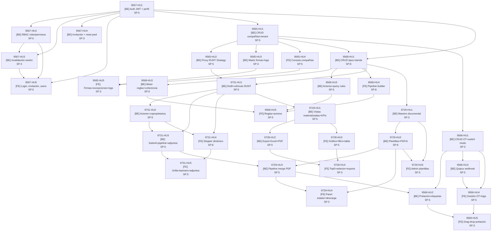

# Backlog de Historias de Usuario — FLIT Trámites Digitales

<!-- Generado por: tech-lead-agent Modo B — 2026-06-10 -->
<!-- Estado: **APROBADO — 34 HUs creadas en ADO (#9769–#9802) el 2026-06-11. Ver ado-hu-ids.json** -->
<!-- Orden global de implementación: 9567 → 9565 → 9568 → 9731 → 9729 → 9728 → 9566 -->
<!-- Schema DB ya materializado en Flit.Infrastructure/Migrations — las HUs backend consumen el schema existente, NO lo recrean -->

---

## Índice de Features

| Feature | HUs | SP |
|---|---|---|
| [#9567 IDENTIDAD](#feature-9567--identidad) | 5 | 21 |
| [#9565 ADMIN-COMPAÑÍAS](#feature-9565--admin-compañías) | 5 | 21 |
| [#9568 PARAMETRIZADOR-TRÁMITES](#feature-9568--parametrizador-trámites) | 5 | 31 |
| [#9731 CREACIÓN-TRÁMITES](#feature-9731--creación-trámites) | 5 | 28 |
| [#9729 CONSOLIDACIÓN-DOCUMENTAL](#feature-9729--consolidación-documental) | 5 | 22 |
| [#9728 DASHBOARD-TRÁMITES](#feature-9728--dashboard-trámites) | 4 | 18 |
| [#9566 ADMIN-OT](#feature-9566--admin-ot) | 5 | 21 |
| **Total** | **34** | **162** |

---

## Feature #9567 — IDENTIDAD

**ADRs:** ADR-0010 (multi-tenant RLS), ADR-0013 (invalidación sesión IMemoryCache)
**Módulo backend:** `Flit.Modules.Identity`
**Feature frontend:** `features/auth`, `features/users-roles`
**Depende de:** — (fundación del stack)

---

### 9567-HU1 · [BACKEND] – Identidad – Autenticación JWT y perfil de usuario

**Descripción**
Como sistema FLIT,
quiero emitir tokens JWT RS256 con claims de tenant, roles y permisos al autenticar usuario con email y password,
para que los clientes puedan acceder a recursos protegidos con identidad verificada y sesión rastreable.

**Acceptance Criteria**

**AC1 — Login exitoso emite JWT y registra sesión**
```gherkin
Given un usuario con status="active" en el tenant "empresa-abc"
  And el password coincide con el hash BCrypt almacenado
When se envía POST /auth/login { email, password, tenant_slug: "empresa-abc" }
Then la respuesta es HTTP 200
  And el body contiene { access_token (JWT RS256), expires_in: 900, user.roles[], user.permissions[] }
  And el JWT incluye claim jti único y tenant_id
  And se inserta una fila en identity.sessions con is_revoked=false
```

**AC2 — Credenciales incorrectas no crean sesión**
```gherkin
Given un usuario válido en el tenant
When se envía POST /auth/login con password incorrecto
Then la respuesta es HTTP 401 con { error: "INVALID_CREDENTIALS" }
  And no se inserta ninguna fila en identity.sessions
  And no se emite ningún JWT
```

**AC3 — Perfil del usuario autenticado**
```gherkin
Given un JWT válido y no revocado del usuario "usuario@empresa.com"
When se envía GET /auth/me con Authorization: Bearer {token}
Then la respuesta es HTTP 200
  And el body contiene { id, name, email, roles[], permissions[], tenant_id, tenant_name }
  And todos los slugs de permissions pertenecen al tenant del JWT
```

**Story Points:** 5
**Dependencias:** — (primera HU del stack)
**Agente:** backend-agent
**Referencias:** Diseño 9567 §2a, §3, §5 | ADR-0010, ADR-0013 | Tablas: `identity.users`, `identity.sessions`, `identity.tenants`, `identity.roles`, `identity.permissions`, `identity.user_roles`, `identity.role_permissions`

---

### 9567-HU2 · [BACKEND] – Identidad – CRUD de roles, permisos y asignación multi-tenant

**Descripción**
Como administrador del tenant,
quiero gestionar roles con conjuntos de permisos y asignarlos a usuarios,
para que el sistema aplique RBAC con aislamiento estricto entre tenants.

**Acceptance Criteria**

**AC1 — Crear rol con permisos y asignar a usuario**
```gherkin
Given un SuperAdmin autenticado en el tenant "empresa-abc"
When se envía POST /roles { slug: "operador", name: "Operador", permissions: [uuid1, uuid2] }
  And se envía PATCH /users/{userId}/roles { roles: [rolId] }
Then el rol existe en identity.roles con tenant_id correcto
  And el usuario tiene el rol asignado en identity.user_roles
  And el JWT renovado del usuario incluye los nuevos permisos en claims
```

**AC2 — Aislamiento de tenant en roles y permisos**
```gherkin
Given un usuario autenticado en el tenant "empresa-abc"
When se envía GET /roles sin especificar tenant
Then la respuesta solo contiene roles donde tenant_id = tenant del JWT
  And ningún rol de "empresa-xyz" aparece en la lista
```

**AC3 — Eliminar rol de sistema rechazado**
```gherkin
Given un rol con is_system=true en el tenant
When se envía DELETE /roles/{rolId}
Then la respuesta es HTTP 409 con { error: "SYSTEM_ROLE_CANNOT_BE_DELETED" }
  And el rol permanece en identity.roles sin modificación
```

**Story Points:** 5
**Dependencias:** 9567-HU1
**Agente:** backend-agent
**Referencias:** Diseño 9567 §3, §5 | ADR-0010 | Tablas: `identity.roles`, `identity.permissions`, `identity.role_permissions`, `identity.user_roles`

---

### 9567-HU3 · [BACKEND] – Identidad – Invalidación de sesión en tiempo real

**Descripción**
Como sistema FLIT,
quiero invalidar inmediatamente todas las sesiones activas de un usuario al cambiarle los roles,
para que los permisos revocados no puedan usarse en requests posteriores aunque el JWT no haya expirado.

**Acceptance Criteria**

**AC1 — PATCH roles invalida sesiones activas vía blacklist**
```gherkin
Given el usuario "afectado@empresa.com" tiene una sesión activa con JTI="jti-abc"
When se envía PATCH /users/{userId}/roles { roles: [...nuevos_roles] }
Then todas las sesiones del usuario quedan con is_revoked=true en identity.sessions
  And el JTI "jti-abc" se agrega al ISessionBlacklist (IMemoryCache)
  And el próximo request con el JWT anterior recibe HTTP 403
```

**AC2 — SignalR notifica SessionRevoked al usuario afectado**
```gherkin
Given el usuario "afectado@empresa.com" está conectado al SignalR hub
When se invalidan sus sesiones tras PATCH roles
Then el hub envía el evento "SessionRevoked" { reason: "roles_changed" } al canal del usuario
  And el frontend redirige a /login?reason=session_revoked
```

**AC3 — BlacklistRehydrationService carga JTIs al arrancar**
```gherkin
Given existen sesiones con is_revoked=true y expires_at > now() en identity.sessions
When la API inicia (IHostedService.StartAsync)
Then el BlacklistRehydrationService carga todos los JTIs vigentes a IMemoryCache
  And un request posterior con un JTI revocado recibe HTTP 403
```

**Story Points:** 3
**Dependencias:** 9567-HU1, 9567-HU2
**Agente:** backend-agent
**Referencias:** Diseño 9567 §2b, §5 | ADR-0013 | Tablas: `identity.sessions` | Componentes: `InMemorySessionBlacklist`, `BlacklistRehydrationService`

---

### 9567-HU4 · [BACKEND] – Identidad – Onboarding por invitación y reset de contraseña

**Descripción**
Como administrador del tenant,
quiero invitar usuarios por email con token temporal y permitirles recuperar su contraseña de forma segura,
para que el onboarding no requiera credenciales iniciales compartidas en texto plano.

**Acceptance Criteria**

**AC1 — Flujo de invitación completo**
```gherkin
Given un SuperAdmin con permiso "users.invite"
When se envía POST /invitations { email: "nuevo@empresa.com", roles: [rolId], tenant_id }
  And el usuario accede al link /invite/{token} antes de 72 horas
  And se envía POST /invitations/{token}/accept { full_name, password, password_confirm }
Then se crea el usuario en identity.users con status="active"
  And se asignan los roles especificados en identity.user_roles
  And la invitación queda con status="accepted" en identity.invitations
  And la respuesta incluye { access_token } para login inmediato
```

**AC2 — Token de invitación expirado**
```gherkin
Given una invitación con expires_at en el pasado (más de 72 horas)
When se envía GET /invitations/{token}/validate
Then la respuesta es HTTP 400 con { error: "INVITATION_EXPIRED" }
  And no se crea ningún usuario
```

**AC3 — Flujo de reset de contraseña**
```gherkin
Given un usuario activo con email registrado
When se envía POST /auth/forgot-password { email }
  And se accede al link de reset con el token generado
  And se envía POST /auth/reset-password { token, new_password }
Then el password_hash del usuario se actualiza en identity.users
  And el token queda con used_at != null en identity.password_reset_tokens
  And intentar usar el mismo token una segunda vez devuelve HTTP 400
```

**Story Points:** 3
**Dependencias:** 9567-HU1
**Agente:** backend-agent
**Referencias:** Diseño 9567 §2c, §3 | Tablas: `identity.invitations`, `identity.password_reset_tokens`, `identity.users`

---

### 9567-HU5 · [FRONTEND] – Identidad – Pantallas de login, invitación, reset y gestión de usuarios/roles

**Descripción**
Como usuario final del sistema FLIT,
quiero pantallas de login, aceptación de invitación, recuperación de contraseña y gestión de usuarios/roles con 4 estados de UI,
para que pueda autenticarme, gestionar mi acceso y administrar el equipo de forma clara y guiada.

**Acceptance Criteria**

**AC1 — Login exitoso redirige al dashboard**
```gherkin
Given el usuario está en /login
When ingresa credenciales válidas y hace submit
Then el access_token se almacena en el cliente (httpOnly cookie o memory store)
  And el router redirige a /dashboard
  And el interceptor de API client envía el JWT en cada request subsiguiente
```

**AC2 — Página de invitación maneja token inválido o expirado**
```gherkin
Given el usuario accede a /invite/{token_expirado}
When la API responde 400 "INVITATION_EXPIRED"
Then se muestra el mensaje "Invitación expirada o inválida" (no un error genérico)
  And el formulario de registro no se renderiza
```

**AC3 — UsersTable exhibe los 4 estados UI obligatorios**
```gherkin
Given el usuario navega a /admin/users con permiso users.read
When la API está cargando
Then se muestran skeleton rows (estado cargando)
When la API responde con lista vacía
Then se muestra "No hay usuarios en este tenant" (estado vacío)
When la API responde con error
Then se muestra ErrorState con botón "Reintentar" (estado error)
When la API responde con datos
Then se muestra tabla paginada de usuarios (estado con datos)
```

**Story Points:** 5
**Dependencias:** 9567-HU1, 9567-HU2, 9567-HU3
**Agente:** frontend-agent
**Referencias:** Diseño 9567 §6 | Componentes: `features/auth`, `features/users-roles`, `shared/api/client.ts`, `shared/hooks/useSignalR.ts`

---

## Feature #9565 — ADMIN-COMPAÑÍAS

**ADRs:** ADR-0010 (RLS), ADR-0011 (Strategy + failover RUNT)
**Módulo backend:** `Flit.Modules.Companies`
**Feature frontend:** `features/companies`
**Depende de:** Feature #9567 (IDENTIDAD)

---

### 9565-HU1 · [BACKEND] – Compañías – CRUD de compañías con creación de tenant y configuración multi-pestaña

**Descripción**
Como SuperAdmin del sistema FLIT,
quiero crear y gestionar compañías con sus configuraciones multi-pestaña (matrícula, traspasos, empresa, contingencia),
para que cada tenant quede completamente aprovisionado y operable desde el momento de su creación.

**Acceptance Criteria**

**AC1 — Creación de compañía crea tenant asociado**
```gherkin
Given un SuperAdmin autenticado con permiso "superadmin"
When se envía POST /companies { nit: "900123456", name: "Empresa ABC", config_tabs: {...} }
Then se crea un tenant en identity.tenants via CreateTenantCommand
  And se inserta una fila en companies.companies con tenant_id del nuevo tenant
  And se inserta una fila en companies.company_configs con valores por defecto
  And la respuesta es HTTP 201 con CompanyDto completo
```

**AC2 — Listado de compañías con filtros y paginación server-side**
```gherkin
Given existen 50 compañías en el sistema
When se envía GET /companies?nit=900&page=1&page_size=20
Then la respuesta contiene máximo 20 items filtrados por NIT que empiece con "900"
  And el body incluye { data[], total, page, page_size }
  And el total refleja el conteo real de matches (no solo la página)
```

**AC3 — NIT duplicado rechazado**
```gherkin
Given ya existe una compañía con nit="900123456"
When se envía POST /companies con el mismo NIT
Then la respuesta es HTTP 409 con { error: "NIT_ALREADY_EXISTS" }
  And no se crea ningún tenant ni compañía adicional
```

**Story Points:** 5
**Dependencias:** 9567-HU1 (necesario para crear tenant via IIdentityService)
**Agente:** backend-agent
**Referencias:** Diseño 9565 §2a, §3, §5 | ADR-0010 | Tablas: `companies.companies`, `companies.company_configs`, `identity.tenants`

---

### 9565-HU2 · [BACKEND] – Compañías – Proxy RUNT con patrón Strategy y failover automático

**Descripción**
Como sistema FLIT,
quiero enrutar las consultas al RUNT por tenant usando un patrón Strategy con failover automático entre Verifik e Intempo,
para que los trámites no se interrumpan ante fallos del proveedor primario y quede trazabilidad de cada intento.

**Acceptance Criteria**

**AC1 — Consulta RUNT exitosa con proveedor primario**
```gherkin
Given el tenant "empresa-abc" tiene configurado provider="verifik" como primario
When se llama IRuntConnector.QueryVehicleByPlateAsync("AAA123")
  And Verifik responde en < 4 segundos con HTTP 200
Then se retorna VehicleQueryResult sin failover
  And se inserta un log en integrations.integration_logs con status=200 y provider="verifik"
```

**AC2 — Timeout en primario activa failover automático a secundario**
```gherkin
Given el proveedor primario Verifik tarda más de 4 segundos o responde 5xx
When ConnectorRouter intenta la consulta
Then se registra el intento fallido en integrations.integration_logs con status=timeout
  And se reintenta con IntempoRuntConnector
  And si Intempo responde OK, se retorna su resultado
  And se registra el éxito en un segundo log con provider="intempo"
```

**AC3 — Configuración RUNT por tenant persiste y se recupera**
```gherkin
Given un SuperAdmin configura PUT /companies/{id}/config/connector { provider: "intempo", is_primary: true, timeout_ms: 3000 }
Then la configuración se persiste en integrations.connector_configs
  And en la próxima consulta RUNT del tenant, Intempo es el proveedor primario
```

**Story Points:** 5
**Dependencias:** 9565-HU1
**Agente:** backend-agent
**Referencias:** Diseño 9565 §2b, §3 | ADR-0011 | Tablas: `integrations.connector_configs`, `integrations.integration_logs`

---

### 9565-HU3 · [BACKEND] – Compañías – Matriz de firmas, excepciones de usuario y OTs habilitadas

**Descripción**
Como SuperAdmin del sistema FLIT,
quiero configurar la matriz de firmas por actor, la lista blanca de excepciones y las OTs habilitadas por compañía,
para que cada tenant tenga su operación de firmas y organismos correctamente acotada.

**Acceptance Criteria**

**AC1 — Actualización de matriz de firmas por actor**
```gherkin
Given una compañía existente con company_id válido
When se envía PUT /companies/{id}/config/signature-matrix { entries: [{ actor_role: "vendedor", signature_type: "identidad_digital" }] }
Then se upserta una fila en companies.company_signature_matrix para el actor_role "vendedor"
  And UNIQUE constraint (company_id, actor_role) garantiza una sola entrada por actor
  And la respuesta es HTTP 200 con la matriz actualizada
```

**AC2 — Agregar y eliminar usuario de lista blanca (only_own_vehicles bypass)**
```gherkin
Given la compañía tiene only_own_vehicles=true
When se envía POST /companies/{id}/user-exceptions { user_id: userId }
Then se inserta en companies.tenant_user_exceptions
  And el usuario puede consultar vehículos fuera del tenant en el runtime de trámites
When se envía DELETE /companies/{id}/user-exceptions/{userId}
Then se elimina la excepción y el usuario vuelve a estar sujeto al interceptor
```

**AC3 — Registro y consulta de logs de integración paginados**
```gherkin
Given existen 200 logs en integrations.integration_logs para el tenant
When se envía GET /integration-logs?page=1&page_size=20&provider=verifik
Then la respuesta contiene máximo 20 logs filtrados por provider
  And cada log incluye { provider, status, duration_ms, request_payload (truncado si >1KB) }
```

**Story Points:** 3
**Dependencias:** 9565-HU1
**Agente:** backend-agent
**Referencias:** Diseño 9565 §3, §5 | ADR-0010 | Tablas: `companies.company_signature_matrix`, `companies.tenant_user_exceptions`, `companies.company_ot_enabled`, `integrations.integration_logs`

---

### 9565-HU4 · [FRONTEND] – Compañías – Consola de compañías con filtros, paginación y formulario multi-pestaña

**Descripción**
Como SuperAdmin del sistema FLIT,
quiero una consola de compañías con filtros reactivos, paginación server-side y formulario multi-pestaña para crear y editar,
para que la gestión B2B sea eficiente y organizada.

**Acceptance Criteria**

**AC1 — CompaniesTable con filtros reactivos y paginación**
```gherkin
Given el SuperAdmin accede a /admin/companies
When escribe "900" en el filtro de NIT
Then la tabla se actualiza enviando GET /companies?nit=900&page=1 al backend
  And los resultados aparecen sin recargar la página
  And la paginación refleja el total server-side
```

**AC2 — Formulario multi-pestaña guarda cada pestaña de forma independiente**
```gherkin
Given el SuperAdmin está editando la compañía "Empresa ABC"
When modifica la pestaña "Configuración Empresa" (only_own_vehicles=true, smtp_mode="api_cliente")
  And hace clic en "Guardar"
Then se envía PUT /companies/{id}/config solo con los campos de esa pestaña
  And un toast de confirmación aparece
  And las otras pestañas conservan sus valores previos
```

**AC3 — CompaniesTable muestra los 4 estados UI obligatorios**
```gherkin
Given el SuperAdmin navega a /admin/companies
When la API está cargando → skeleton grid
When la API retorna lista vacía → "No hay compañías registradas"
When la API retorna error → ErrorState con botón "Reintentar"
When la API retorna datos → grid con filtros activos y paginación
```

**Story Points:** 5
**Dependencias:** 9565-HU1
**Agente:** frontend-agent
**Referencias:** Diseño 9565 §6 | Componentes: `features/companies`, `CompaniesTable`, `CompanyFormTabs`

---

### 9565-HU5 · [FRONTEND] – Compañías – Matriz de firmas, excepciones de usuario y visor de logs

**Descripción**
Como SuperAdmin del sistema FLIT,
quiero interfaces para editar la matriz de firmas por actor, gestionar la lista blanca de usuarios y visualizar los logs de integración RUNT,
para que la configuración avanzada del tenant sea accesible y auditable.

**Acceptance Criteria**

**AC1 — SignatureMatrixEditor persiste cambios al guardar**
```gherkin
Given el SuperAdmin está en la pestaña de firma de la compañía
When cambia el signature_type de "vendedor" a "firma_pantalla" y guarda
Then se envía PUT /companies/{id}/config/signature-matrix con el nuevo tipo
  And la tabla muestra el valor actualizado sin recargar la página
```

**AC2 — IntegrationLogsTable muestra JSON colapsable por log**
```gherkin
Given existen logs de integración para el tenant
When el SuperAdmin hace clic en un log de la tabla
Then se expande el panel con el request_payload y response_payload en formato JSON formateado
  And se muestran: provider, status, duration_ms, timestamp
```

**AC3 — UserExceptionsManager agrega y elimina usuarios de lista blanca**
```gherkin
Given el SuperAdmin está en la sección de excepciones de la compañía
When agrega a "usuario@empresa.com" a la lista blanca
  And la API retorna 201
Then el usuario aparece en la lista sin recargar
When elimina al usuario de la lista blanca
  And la API retorna 204
Then el usuario desaparece de la lista con feedback inmediato
```

**Story Points:** 3
**Dependencias:** 9565-HU3, 9565-HU4
**Agente:** frontend-agent
**Referencias:** Diseño 9565 §6 | Componentes: `SignatureMatrixEditor`, `UserExceptionsManager`, `IntegrationLogsTable`, `OtEnabledMatrix`

---

## Feature #9568 — PARAMETRIZADOR-TRÁMITES

**ADRs:** ADR-0009 (Híbrido JSONB), ADR-0010 (RLS)
**Módulo backend:** `Flit.Modules.ProceduresConfig`
**Feature frontend:** `features/procedures-config`
**Depende de:** Feature #9567 (IDENTIDAD), #9565 (ADMIN-COMPAÑÍAS)

---

### 9568-HU1 · [BACKEND] – Parametrizador – CRUD de tipos de trámite, pasos, secciones y campos

**Descripción**
Como SuperAdmin del sistema FLIT,
quiero crear y gestionar tipos de trámite con su pipeline de pasos, secciones de formulario y campos con configuración JSONB,
para que el motor low-code pueda ejecutar trámites sin hardcodear su estructura.

**Acceptance Criteria**

**AC1 — Creación de tipo de trámite con estructura anidada**
```gherkin
Given un SuperAdmin autenticado
When se envía POST /procedure-types { name: "Traspaso Simple", family: "traspasos", scope: "global", vehicle_query_key: "placa" }
  And luego POST /procedure-types/{id}/steps { name: "Datos del vehículo", step_type: "form", order_index: 1 }
  And luego POST /procedure-types/{id}/steps/{stepId}/sections { slug: "vehiculo", name: "Vehículo" }
  And luego POST /...sections/{secId}/fields { field_type: "text", slug: "placa", is_required: true }
Then cada entidad se persiste con tenant_id y RLS activo
  And GET /procedure-types/{id} retorna la estructura completa con steps→sections→fields anidados
```

**AC2 — Campo tipo "dropdown" persiste config JSONB con opciones**
```gherkin
Given un paso de tipo "form" existente en el tipo de trámite
When se agrega un campo { field_type: "dropdown", config: { options: [{value:"A", label:"Opción A"}], allow_multiple: false } }
Then el campo se persiste en procedures_config.form_fields con config como JSONB válido
  And GET del campo retorna la config parseada con las opciones
```

**AC3 — Soft-delete bloqueado si hay trámites activos**
```gherkin
Given un tipo de trámite tiene trámites en estado "draft" o "submitted"
When se envía DELETE /procedure-types/{id}
Then la respuesta es HTTP 409 con { error: "PROCEDURE_TYPE_HAS_ACTIVE_PROCEDURES" }
  And el campo deleted_at permanece null en la tabla
```

**Story Points:** 8
**Dependencias:** 9567-HU1 (autenticación), 9565-HU1 (tenant context)
**Agente:** backend-agent
**Referencias:** Diseño 9568 §2a, §3, §4, §5 | ADR-0009, ADR-0010 | Tablas: `procedures_config.procedure_types`, `procedures_config.procedure_steps`, `procedures_config.form_sections`, `procedures_config.form_fields`, `procedures_config.api_connectors`

---

### 9568-HU2 · [BACKEND] – Parametrizador – Motor de reglas de negocio con simulador de coherencia

**Descripción**
Como SuperAdmin del sistema FLIT,
quiero definir reglas AND/OR sobre los campos del formulario con acciones de UI y que el sistema valide automáticamente la coherencia antes de persistirlas,
para que el motor de trámites no entre en estados contradictorios en tiempo de ejecución.

**Acceptance Criteria**

**AC1 — Regla coherente se persiste correctamente**
```gherkin
Given un tipo de trámite con pasos y campos definidos
When se envía POST /procedure-types/{id}/rules { name: "Ocultar adjunto", conditions: { operator: "AND", nodes: [{field: "actor.nature", op: "==", value: "juridica"}] }, actions: [{type: "hide", target: "field.documento_natural"}] }
  And CoherenceSimulator no detecta conflictos
Then la regla se persiste en procedures_config.rule_sets como JSONB
  And la versión del tipo de trámite se incrementa en 1
  And la respuesta es HTTP 201 con RuleSetDto
```

**AC2 — Regla conflictiva rechazada con 409 y detalle**
```gherkin
Given una regla existente que muestra el campo "field.documento_natural" cuando actor.nature == "juridica"
When se envía POST /procedure-types/{id}/rules con una nueva regla que oculta "field.documento_natural" con las mismas condiciones
  And CoherenceSimulator detecta el conflicto
Then la respuesta es HTTP 409 con { conflicts: [{ rule1, rule2, description: "Regla A muestra field.documento_natural; Regla B lo oculta con igual condición" }] }
  And no se inserta ninguna fila en rule_sets
```

**AC3 — Endpoint de simulación dry-run no persiste**
```gherkin
Given un set de reglas actual en el tipo de trámite
When se envía GET /procedure-types/{id}/rules/simulate con un body de regla candidata
Then CoherenceSimulator evalúa sin realizar INSERT
  And la respuesta incluye { is_coherent: bool, conflicts: [] }
  And la tabla rule_sets no tiene cambios
```

**Story Points:** 5
**Dependencias:** 9568-HU1
**Agente:** backend-agent
**Referencias:** Diseño 9568 §2a, §3, §5 | ADR-0009 | Tablas: `procedures_config.rule_sets` | Componente: `CoherenceSimulator` (domain service)

---

### 9568-HU3 · [BACKEND] – Parametrizador – Definición de actores, reglas de consulta y clave de vehículo

**Descripción**
Como SuperAdmin del sistema FLIT,
quiero definir los actores de un tipo de trámite con sus reglas de consulta (RUNT, SIMIT, RUES, liveness) y la clave de búsqueda del vehículo,
para que el runtime del trámite sepa exactamente qué verificar por cada actor y cómo identificar el vehículo.

**Acceptance Criteria**

**AC1 — Crear actor con naturaleza jurídica y FK a representante legal**
```gherkin
Given un tipo de trámite existente
When se envía POST /procedure-types/{id}/actors { role: "comprador", allowed_nature: "juridica", min_count: 1, max_count: 1 }
  And se envía otro POST para el representante legal { role: "representante_legal", legal_rep_actor_id: compradorId }
Then ambos actores se persisten en procedures_config.actor_definitions
  And el representante_legal.legal_rep_actor_id referencia al actor jurídico
```

**AC2 — Regla de consulta JSONB con verificaciones ordenadas**
```gherkin
Given un actor "vendedor" en el tipo de trámite
When se envía POST /actors/{actorId}/query-rules { subject_type: "persona_natural", entry_key: "document_number", is_blocking: true, verifications: [{ type: "datos_persona", is_active: true, order: 1 }, { type: "simit", is_active: true, order: 2 }] }
Then la fila en procedures_config.query_rules tiene verifications como JSONB con los 2 items en orden
  And is_blocking=true persiste correctamente
```

**AC3 — SetVehicleQueryKey incrementa versión del tipo de trámite**
```gherkin
Given un tipo de trámite con vehicle_query_key="placa" y version=3
When se envía PUT /procedure-types/{id}/vehicle-query { query_key: "vin" }
Then procedures_config.procedure_types.vehicle_query_key="vin"
  And la versión pasa a 4
  And GET /procedure-types/{id} retorna vehicle_query_key="vin"
```

**Story Points:** 5
**Dependencias:** 9568-HU1
**Agente:** backend-agent
**Referencias:** Diseño 9568 §2b, §3, §4 | ADR-0009 | Tablas: `procedures_config.actor_definitions`, `procedures_config.query_rules`, `procedures_config.procedure_type_snapshots`

---

### 9568-HU4 · [FRONTEND] – Parametrizador – Pipeline builder visual, editor de campos y conectores API

**Descripción**
Como SuperAdmin del sistema FLIT,
quiero un editor visual de pipelines de trámite con pasos arrastrables, editor de campos por tipo y gestión de conectores API declarativos,
para que la parametrización sea intuitiva sin necesidad de codificación.

**Acceptance Criteria**

**AC1 — PipelineBuilder muestra y reordena pasos por drag-and-drop**
```gherkin
Given un tipo de trámite con 4 pasos creados
When el SuperAdmin accede al editor del tipo de trámite
Then PipelineBuilder renderiza los 4 pasos como tarjetas arrastrables
When arrastra el Paso 3 a la posición 1
  And suelta el elemento
Then se envía PUT /procedure-types/{id}/steps/{stepId} con el nuevo order_index
  And el orden visual se actualiza sin recargar la página
```

**AC2 — FieldEditor con tipo "dropdown" permite gestionar opciones**
```gherkin
Given el SuperAdmin abre el modal FieldEditor para un campo existente
When selecciona field_type="dropdown"
Then aparece un panel para agregar/eliminar opciones { value, label }
When guarda el campo
  And la API retorna 200
Then el campo en la sección muestra el ícono correcto para tipo dropdown
```

**AC3 — ApiConnectorsPanel muestra param_bindings editables**
```gherkin
Given un tipo de trámite con un api_connector existente
When el SuperAdmin abre ApiConnectorsPanel
Then se listan los conectores con: nombre, endpoint, http_verb, step_order
When edita los param_bindings de un conector { "placa": "step_1.field_placa" }
  And guarda
Then se envía PUT /api-connectors/{connId} con los bindings actualizados
```

**Story Points:** 8
**Dependencias:** 9568-HU1
**Agente:** frontend-agent
**Referencias:** Diseño 9568 §6 | Componentes: `PipelineBuilder`, `StepCard`, `SectionEditor`, `FieldEditor`, `ApiConnectorsPanel`

---

### 9568-HU5 · [FRONTEND] – Parametrizador – Diseñador de reglas AND/OR, coherencia y definición de actores

**Descripción**
Como SuperAdmin del sistema FLIT,
quiero un diseñador visual de reglas con árbol AND/OR, panel de coherencia que bloquee el guardado ante conflictos y editor de actores con sus verificaciones,
para que las reglas del trámite sean configurables sin errores silenciosos.

**Acceptance Criteria**

**AC1 — ConditionTreeEditor permite construir árbol AND/OR visual**
```gherkin
Given el SuperAdmin está en el diseñador de reglas de un tipo de trámite
When agrega un nodo "actor.nature == juridica"
  And agrega otro nodo con operador OR "vehicle.restrictions Contains EMBARGO"
Then la UI muestra el árbol anidado con los operadores correctos
  And el JSON generado tiene { operator: "OR", nodes: [...] }
```

**AC2 — CoherenceSimulatorPanel bloquea guardado ante conflictos**
```gherkin
Given existe una regla que muestra "field.firma_natural"
When el SuperAdmin define una nueva regla que oculta "field.firma_natural" con condición idéntica
  And hace clic en "Verificar coherencia"
  And la API /simulate retorna { is_coherent: false, conflicts: [{ description: "..." }] }
Then el botón "Guardar regla" queda deshabilitado
  And CoherenceSimulatorPanel muestra la lista de conflictos con descripción
```

**AC3 — QueryRulesEditor muestra verificaciones togglables por tipo**
```gherkin
Given el SuperAdmin está editando un actor "vendedor"
When abre QueryRulesEditor
Then se muestran todos los tipos de verificación disponibles: datos_persona, simit, rues, restricciones, liveness
  And cada uno tiene un toggle activo/inactivo
When activa "liveness" y guarda
  And la API retorna 200
Then la verificación "liveness" queda is_active=true en el JSONB persistido
```

**Story Points:** 5
**Dependencias:** 9568-HU2, 9568-HU3, 9568-HU4
**Agente:** frontend-agent
**Referencias:** Diseño 9568 §6 | Componentes: `RulesBuilder`, `ConditionTreeEditor`, `CoherenceSimulatorPanel`, `ActorsBuilder`, `QueryRulesEditor`

---

## Feature #9731 — CREACIÓN-TRÁMITES

**ADRs:** ADR-0009 (JSONB), ADR-0010 (RLS), ADR-0011 (Strategy failover)
**Módulo backend:** `Flit.Modules.Procedures`
**Feature frontend:** `features/procedures`
**Depende de:** Feature #9568 (PARAMETRIZADOR), #9567 (IDENTIDAD), #9565 (ADMIN-COMPAÑÍAS)

---

### 9731-HU1 · [BACKEND] – Trámites – Creación de trámite en draft y consulta de vehículo RUNT

**Descripción**
Como operador del sistema FLIT,
quiero crear un trámite en estado draft con composite_id único y consultar los datos del vehículo (placa o VIN) vía RUNT con registro de hallazgos,
para que el trámite quede abierto y listo para captura de actores y datos.

**Acceptance Criteria**

**AC1 — Crear trámite draft genera composite_id único**
```gherkin
Given un operador autenticado con permiso "tramites.create"
  And existe el tipo de trámite "Traspaso Simple" con snapshot vigente
When se envía POST /procedures { procedure_type_id, company_id }
Then se inserta en procedures.procedures con status="draft" y composite_id="TRASP-{SEQ}_{OT}-{TS}"
  And procedure_type_snapshot_id referencia el snapshot activo del tipo
  And la respuesta es HTTP 201 con { id, composite_id, status: "draft", steps[] }
```

**AC2 — Consulta de vehículo registra hallazgos como warnings no bloqueantes**
```gherkin
Given un trámite en status="draft" con vehicle_query_key="placa"
When se envía PATCH /procedures/{id}/vehicle { placa: "AAA123" }
  And RUNT retorna restricciones o multas SIMIT para esa placa
Then se inserta en procedures.vehicle_queries con runt_payload y simit_payload
  And la respuesta es HTTP 200 con { vehicle: {...}, warnings: ["Multa SIMIT: $500.000"] }
  And el status del trámite permanece en "draft" (no bloqueado)
```

**AC3 — Listado de trámites con aislamiento de tenant**
```gherkin
Given existen trámites del Tenant A y del Tenant B
When un operador del Tenant A envía GET /procedures
Then solo se retornan trámites donde tenant_id = tenant del JWT (RLS efectivo)
  And ningún trámite del Tenant B aparece en la respuesta
```

**Story Points:** 5
**Dependencias:** 9568-HU1 (snapshot de config), 9565-HU2 (ConnectorRouter RUNT)
**Agente:** backend-agent
**Referencias:** Diseño 9731 §2a, §3, §5 | ADR-0009, ADR-0010, ADR-0011 | Tablas: `procedures.procedures`, `procedures.vehicle_queries` | Componentes: `CompositeIdGenerator`, `CreateProcedureCommand`, `CaptureVehicleCommand`

---

### 9731-HU2 · [BACKEND] – Trámites – Gestión de actores: natural, jurídica, representante legal y copropietarios

**Descripción**
Como sistema FLIT,
quiero agregar actores de tipo natural, jurídica (con representante legal auto-creado) y copropietarios con validación de suma de cuotas,
para que cada parte del trámite quede identificada y verificada según las reglas del tipo de trámite.

**Acceptance Criteria**

**AC1 — Actor persona natural ejecuta consulta RUNT y guarda resultados**
```gherkin
Given un trámite en draft con actor_definition "vendedor"
When se envía POST /procedures/{id}/actors { actor_definition_id, nature: "natural", document_number: "12345678" }
Then se inserta en procedures.procedure_actors con query_results = payload RUNT en JSONB
  And la respuesta incluye { actor_id, warnings: [] } si no hay hallazgos bloqueantes
```

**AC2 — Actor jurídica genera sub-actor representante legal automáticamente**
```gherkin
Given la actor_definition "comprador" permite naturaleza "juridica"
When se envía POST /procedures/{id}/actors { nature: "juridica", nit: "900123456" }
  And IRuesConnector retorna { representative: { name: "Juan Pérez", document: "11111111" } }
Then se inserta el actor jurídico en procedure_actors
  And se inserta automáticamente un actor hijo con nature="representante_legal" y parent_actor_id apuntando al jurídico
```

**AC3 — Suma de cuotas de copropietarios validada al llegar al 4to**
```gherkin
Given un trámite con 3 copropietarios con cuotas de 25%, 25%, 25%
When se envía POST con un 4to copropietario { cuota_pct: 26 }
Then la validación CuotaValidator detecta que la suma sería 101%
  And la respuesta es HTTP 422 con { error: "CUOTA_SUM_EXCEEDS_100", current_sum: 75, proposed: 26 }
  And no se inserta el 4to actor
When se envía con cuota_pct=25
Then la suma exacta=100% se acepta y el actor se inserta correctamente
```

**Story Points:** 5
**Dependencias:** 9731-HU1
**Agente:** backend-agent
**Referencias:** Diseño 9731 §2b, §3, §5 | ADR-0011 | Tablas: `procedures.procedure_actors` | Componentes: `AddActorCommand`, `CuotaValidator`

---

### 9731-HU3 · [BACKEND] – Trámites – Submit: snapshot, pipeline Wolverine, firmas y adjuntos

**Descripción**
Como operador del sistema FLIT,
quiero someter el trámite completo para que el sistema genere el snapshot de configuración, dispare el pipeline asíncrono de documentos/firmas y registre los adjuntos con etiquetas dinámicas,
para que el trámite quede en proceso de generación documental sin bloquear la interfaz del operador.

**Acceptance Criteria**

**AC1 — Submit válida campos obligatorios y dispara evento Wolverine**
```gherkin
Given un trámite en draft con todos los campos requeridos del snapshot completados
  And al menos un actor por cada actor_definition obligatoria
When se envía POST /procedures/{id}/submit
Then se invoca CreateSnapshotCommand para crear snapshot en procedures_config.procedure_type_snapshots
  And procedures.procedures.status pasa a "submitted"
  And se publica el evento ProcedureSubmitted en Wolverine
  And la respuesta HTTP 200 llega inmediatamente (no bloquea el pipeline)
```

**AC2 — Submit rechazado si faltan campos requeridos**
```gherkin
Given un trámite con un campo is_required=true sin valor en step_data
When se envía POST /procedures/{id}/submit
Then la respuesta es HTTP 422 con { errors: [{ field_slug: "placa", step: "Datos del vehículo", error: "REQUIRED_FIELD_MISSING" }] }
  And el status del trámite permanece "draft"
```

**AC3 — Upload de adjunto con etiqueta dinámica y referencia MinIO**
```gherkin
Given un trámite en estado "draft" o "submitted"
When se envía POST /procedures/{id}/attachments con multipart { file, label_slug: "licencia_transito" }
Then el archivo se sube a MinIO con key procedures/{tenantId}/{procedureId}/{label_slug}/{filename}
  And se inserta en procedures.procedure_attachments con file_ref, label_slug y uploaded_by
  And la respuesta es HTTP 201 con { attachment_id, file_name, label_slug }
```

**Story Points:** 5
**Dependencias:** 9731-HU1, 9731-HU2
**Agente:** backend-agent
**Referencias:** Diseño 9731 §2c, §3, §5 | ADR-0009 | Tablas: `procedures.procedures`, `procedures.procedure_signatures`, `procedures.procedure_attachments`, `procedures_config.procedure_type_snapshots`

---

### 9731-HU4 · [FRONTEND] – Trámites – Stepper dinámico data-driven, captura de vehículo y actores

**Descripción**
Como operador del sistema FLIT,
quiero un stepper dinámico que interprete los pasos y campos del snapshot de configuración, con captura de vehículo que detecta el tipo de clave y formularios de actor natural/jurídica con validación de copropietarios,
para que el operador sea guiado automáticamente según el tipo de trámite parametrizado.

**Acceptance Criteria**

**AC1 — DynamicStepper renderiza desde el snapshot, no desde el tipo directo**
```gherkin
Given un trámite cuyo snapshot tiene 5 pasos con secciones y campos
When el operador abre el detalle del trámite
Then DynamicStepper lee la config del procedure_type_snapshot_id (no de procedure_type_id)
  And renderiza exactamente los 5 pasos en el orden del snapshot
  And los labels y tipos de campo coinciden con los almacenados en el snapshot
```

**AC2 — VehicleCaptureStep adapta label según vehicle_query_key**
```gherkin
Given un trámite de familia "traspasos" con vehicle_query_key="placa"
When el operador llega al paso de captura de vehículo
Then el input muestra el label "Placa" y el placeholder "ej. AAA123"
Given un trámite de familia "matricula_inicial" con vehicle_query_key="vin"
Then el input muestra el label "VIN / Número de chasis"
```

**AC3 — CopropietariosManager muestra error inline si cuotas no suman 100%**
```gherkin
Given el operador ha ingresado 2 copropietarios con cuotas 40% y 40%
When intenta agregar un 3er copropietario con cuota 30%
  And la API retorna 422 por suma > 100%
Then se muestra inline error "La suma de cuotas (110%) excede el 100%"
  And el botón "Continuar" del paso queda deshabilitado
  And no se navega al paso siguiente
```

**Story Points:** 8
**Dependencias:** 9731-HU1, 9731-HU2
**Agente:** frontend-agent
**Referencias:** Diseño 9731 §6 | Componentes: `DynamicStepper`, `StepRenderer`, `VehicleCaptureStep`, `ActorStep`, `NaturalPersonForm`, `LegalEntityForm`, `CopropietariosManager`

---

### 9731-HU5 · [FRONTEND] – Trámites – Grilla central, banners de hallazgos, vendedores secundarios y adjuntos

**Descripción**
Como operador del sistema FLIT,
quiero una grilla central de trámites con filtros, banners informativos no bloqueantes para hallazgos del vehículo, acordeón de vendedores secundarios RUNT y panel de adjuntos con etiquetas dinámicas,
para que el seguimiento y la gestión documental del trámite sea completa y auditable.

**Acceptance Criteria**

**AC1 — ProceduresGrid filtra y pagina trámites del tenant**
```gherkin
Given el operador navega a /procedures
When aplica filtros status="submitted" y fecha_from="2026-01-01"
Then la grilla muestra solo trámites del tenant con ese estado y en ese rango
  And el composite_id se muestra en formato "TRASP-02_EVE-8841"
  And la paginación server-side funciona con el total real
```

**AC2 — VehicleWarningBanner muestra hallazgos sin bloquear el stepper**
```gherkin
Given el sistema retorna warnings: ["Multa SIMIT: $500.000", "Restricción: PRENDA"]
Cuando el operador captura el vehículo
Then el banner amarillo VehicleWarningBanner aparece debajo del campo de placa
  And lista los hallazgos en texto legible
  And el botón "Siguiente" del paso permanece habilitado (no bloqueante)
```

**AC3 — AttachmentsPanel permite subir y listar adjuntos por etiqueta**
```gherkin
Given el trámite está en estado "submitted"
When el operador sube un archivo "licencia.pdf" con etiqueta "licencia_transito"
  And la API retorna 201
Then el archivo aparece listado bajo la etiqueta "licencia_transito" en AttachmentsPanel
  And muestra nombre, tamaño y fecha de subida
  And los adjuntos de otras etiquetas se muestran en secciones separadas
```

**Story Points:** 5
**Dependencias:** 9731-HU3, 9731-HU4
**Agente:** frontend-agent
**Referencias:** Diseño 9731 §6 | Componentes: `ProceduresGrid`, `VehicleWarningBanner`, `SecondarySellerAccordion`, `AttachmentsPanel`

---

## Feature #9729 — CONSOLIDACIÓN-DOCUMENTAL

**ADRs:** ADR-0009 (JSONB), ADR-0010 (RLS), ADR-0012 (QuestPDF + plantillas MinIO)
**Módulo backend:** `Flit.Modules.Documents`
**Feature frontend:** `features/documents`
**Depende de:** Feature #9731 (CREACIÓN-TRÁMITES), #9568 (PARAMETRIZADOR)

---

### 9729-HU1 · [BACKEND] – Documentos – Maestro documental y asociación a tipos de trámite

**Descripción**
Como SuperAdmin del sistema FLIT,
quiero crear tipos de documento (carga o generación) y asociarlos con orden e indicador de obligatoriedad a los tipos de trámite,
para que el sistema sepa exactamente qué documentos recopilar o generar por cada familia de trámite.

**Acceptance Criteria**

**AC1 — Crear tipo de documento y asociar a tipo de trámite**
```gherkin
Given un tipo de trámite existente y un SuperAdmin autenticado
When se envía POST /document-types { name: "Licencia de Tránsito", load_type: "carga" }
  And luego POST /procedure-types/{id}/document-config { document_type_id, is_required: true, order_index: 1 }
Then se inserta en documents.document_types con tenant_id
  And se inserta en documents.procedure_type_documents con la asociación correcta
  And la respuesta es HTTP 201 con la asociación creada
```

**AC2 — Unicidad de asociación tipo_trámite + tipo_documento**
```gherkin
Given ya existe la asociación (procedure_type_id, document_type_id) en procedure_type_documents
When se envía POST /document-config con la misma combinación
Then la respuesta es HTTP 409 con { error: "DOCUMENT_ALREADY_ASSOCIATED" }
  And no se inserta una segunda asociación
```

**AC3 — Listado del maestro documental con orden e indicador de obligatoriedad**
```gherkin
Given un tipo de trámite con 3 documentos asociados en orden 1, 2, 3
When se envía GET /procedure-types/{id}/document-config
Then la respuesta incluye los 3 documentos con { name, load_type, is_required, order_index, allow_partial_consolidation }
  And los documentos vienen ordenados por order_index ascendente
```

**Story Points:** 3
**Dependencias:** 9568-HU1 (procedure_types existentes)
**Agente:** backend-agent
**Referencias:** Diseño 9729 §3, §4 | ADR-0010 | Tablas: `documents.document_types`, `documents.procedure_type_documents`

---

### 9729-HU2 · [BACKEND] – Documentos – Plantillas HTML versionadas, resolución de marcadores y generación PDF/A

**Descripción**
Como sistema FLIT,
quiero almacenar plantillas HTML con marcadores en MinIO, resolverlos con datos del trámite en tiempo de generación y producir PDFs/A conformes,
para que cada documento generado refleje fielmente los datos del trámite con marcadores auditables.

**Acceptance Criteria**

**AC1 — Upload de plantilla HTML detecta marcadores y crea versión activa**
```gherkin
Given un tipo de documento existente con load_type="generacion"
When se envía POST /document-types/{id}/templates con HTML que contiene "{{actor[vendedor].full_name}}" y "{{vehicle.plate}}"
Then el HTML se sube a MinIO con key templates/{tenantId}/{docTypeId}/{version}.html
  And se inserta en documents.document_templates con version=1 y status="active"
  And la respuesta incluye { template_id, version: 1, markers_detected: ["actor[vendedor].full_name", "vehicle.plate"] }
```

**AC2 — Solo una versión activa por tipo de documento (ix_template_one_active)**
```gherkin
Given el tipo de documento ya tiene una versión activa v1
When se sube una nueva plantilla HTML (v2)
Then documents.document_templates v1 pasa a status="deprecated"
  And v2 tiene status="active"
  And la restricción unique parcial ix_template_one_active solo permite una fila active por document_type_id
```

**AC3 — TemplateResolver sustituye marcadores o inserta [marker:NO_DATA] auditables**
```gherkin
Given una plantilla con "{{vehicle.plate}}" y "{{actor[comprador].nit}}"
  And el trámite tiene vehicle.plate="AAA123" pero no tiene actor comprador jurídico
When TemplateResolver procesa la plantilla con el TemplateContext del trámite
Then el HTML resultante tiene "AAA123" donde era "{{vehicle.plate}}"
  And tiene "[actor[comprador].nit:NO_DATA]" donde era el marcador de NIT
  And el PDF generado por QuestPDF incluye ambas sustituciones visible en el documento
```

**Story Points:** 8
**Dependencias:** 9729-HU1
**Agente:** backend-agent
**Referencias:** Diseño 9729 §2, §3, §4, §5 | ADR-0012 | Tablas: `documents.document_templates`, `documents.template_fields` | Componentes: `TemplateResolver`, `TemplateContextBuilder`, `QuestPdfDocumentRenderer`

---

### 9729-HU3 · [BACKEND] – Documentos – Pipeline de consolidación: merge PDF, prelación, descarga y versionamiento

**Descripción**
Como sistema FLIT,
quiero que al recibir el evento ProcedureSubmitted se generen los documentos, se verifique la completitud según la prelación del OT y se produzca un PDF consolidado versionado descargable,
para que el trámite quede con su expediente documental completo y rastreable.

**Acceptance Criteria**

**AC1 — Pipeline Wolverine genera documentos y consolida PDF al recibir ProcedureSubmitted**
```gherkin
Given el trámite fue submitido y todos sus documentos obligatorios están listos (o allow_partial_consolidation=true)
When el consumer Wolverine recibe el evento DocumentGenerationRequested
Then se generan los PDFs de documentos tipo "generacion" via QuestPDF
  And se ordenan por prelación OT (ot_document_order.ordered_document_type_ids)
  And PdfSharpMerger produce el PDF consolidado
  And se inserta en documents.consolidated_packages con version=1 y download_filename="TRAMITE_{id}_{tipo}_{fecha}.pdf"
  And SignalR envía "consolidacion_lista" con download_url al operador
```

**AC2 — Documentos obligatorios faltantes bloquean consolidación y notifican**
```gherkin
Given el trámite tiene 2 documentos obligatorios pero uno no fue generado ni cargado
When el pipeline ejecuta DocumentCompletionChecker
Then no se produce el PDF consolidado
  And los documentos pendientes quedan con status="pending"
  And SignalR envía "documento_pendiente" { missing_docs: ["Licencia de Tránsito"] } al operador
```

**AC3 — Re-consolidación genera nueva versión sin eliminar la anterior**
```gherkin
Given el paquete consolidado v1 existe para el trámite
When se envía POST /procedures/{id}/documents/consolidate (tramites.admin.maestro)
  And todos los documentos están presentes
Then se genera v2 del paquete consolidado
  And v1 permanece en documents.consolidated_packages (no se elimina)
  And GET /procedures/{id}/consolidated/history retorna ambas versiones
```

**Story Points:** 5
**Dependencias:** 9729-HU2, 9731-HU3
**Agente:** backend-agent
**Referencias:** Diseño 9729 §2, §3, §4, §5 | ADR-0009, ADR-0012 | Tablas: `documents.procedure_documents`, `documents.consolidated_packages` | Componentes: `PdfSharpMerger`, `DocumentCompletionChecker`, `ConsolidateDocumentsCommand`

---

### 9729-HU4 · [FRONTEND] – Documentos – Panel de estado documental, descarga y visor de paquete consolidado

**Descripción**
Como operador del sistema FLIT,
quiero ver el estado de cada documento del trámite en tiempo real, descargar documentos individuales y el paquete consolidado con historial de versiones,
para que el seguimiento documental sea transparente y sin necesidad de recargar la página.

**Acceptance Criteria**

**AC1 — DocumentStatusPanel se actualiza en tiempo real via SignalR**
```gherkin
Given el operador tiene abierta la página /procedures/{id}/documents
  And el pipeline de consolidación está en ejecución
When Wolverine termina de generar un documento y envía "consolidacion_lista"
Then DocumentStatusPanel actualiza el icono del documento de ⏳ a ✓ sin recargar
  And ConsolidatedPackageCard habilita el botón de descarga
```

**AC2 — Descarga de documento individual con nombre correcto**
```gherkin
Given el trámite tiene un documento tipo "Contrato" con status="ready"
When el operador hace clic en "Descargar" del DocumentItem
Then el navegador descarga el archivo desde MinIO vía la API (presigned URL o proxy)
  And el nombre del archivo descargado corresponde al file_name registrado
```

**AC3 — DocumentHistoryDrawer lista versiones consolidadas con descarga**
```gherkin
Given el trámite tiene 3 versiones de paquete consolidado
When el operador hace clic en "Ver historial" del paquete
Then DocumentHistoryDrawer muestra las 3 versiones con: versión, fecha, doc_count, botón descarga
  And el botón de cada versión descarga ese PDF específico
```

**Story Points:** 3
**Dependencias:** 9729-HU2, 9729-HU3
**Agente:** frontend-agent
**Referencias:** Diseño 9729 §6 | Componentes: `DocumentStatusPanel`, `DocumentItem`, `ConsolidatedPackageCard`, `DocumentHistoryDrawer`

---

### 9729-HU5 · [FRONTEND] – Documentos – Admin de plantillas: upload, preview de marcadores y versiones

**Descripción**
Como SuperAdmin del sistema FLIT,
quiero una interfaz administrativa para subir plantillas HTML, previsualizar los marcadores detectados antes de guardar y consultar el historial de versiones por tipo de documento,
para que la gestión de plantillas sea segura y auditable.

**Acceptance Criteria**

**AC1 — TemplateUploadModal detecta y muestra marcadores antes de confirmar**
```gherkin
Given el SuperAdmin está en /admin/documents y selecciona un tipo de documento
When hace clic en "Subir nueva plantilla" y selecciona un archivo HTML
  And la API responde con markers_detected: ["actor[vendedor].full_name", "vehicle.plate"]
Then TemplateUploadModal muestra la lista de marcadores detectados antes del botón "Confirmar"
  And el SuperAdmin puede revisar y confirmar o cancelar la subida
```

**AC2 — TemplateVersionsList muestra versiones con estado activa/deprecada**
```gherkin
Given el tipo de documento tiene 3 versiones: v1 deprecated, v2 deprecated, v3 active
When el SuperAdmin abre la lista de versiones del tipo de documento
Then TemplateVersionsList muestra las 3 filas con: versión, estado (badge), fecha, notas
  And la versión activa (v3) tiene el badge "Activa" destacado
  And las deprecadas tienen el badge "Deprecada" en gris
```

**AC3 — HTML sin marcadores genera warning pero permite guardar**
```gherkin
Given el SuperAdmin sube un HTML sin ningún marcador {{...}}
  And la API retorna markers_detected: []
Then TemplateUploadModal muestra advertencia "La plantilla no contiene marcadores. Los documentos generados no incluirán datos del trámite."
  And el botón "Confirmar" permanece habilitado (no se bloquea el guardado)
```

**Story Points:** 3
**Dependencias:** 9729-HU1, 9729-HU2
**Agente:** frontend-agent
**Referencias:** Diseño 9729 §6 | Componentes: `TemplateUploadModal`, `TemplateVersionsList`, `DocumentAdminPage`

---

## Feature #9728 — DASHBOARD-TRÁMITES

**ADRs:** ADR-0010 (RLS), ADR-0005 (QuestPDF exportación)
**Módulo backend:** `Flit.Modules.Analytics`
**Feature frontend:** `features/dashboard`
**Depende de:** Feature #9731 (datos de trámites para analítica)

---

### 9728-HU1 · [BACKEND] – Dashboard – Vistas materializadas y endpoints de KPIs

**Descripción**
Como sistema FLIT,
quiero vistas materializadas sobre los datos de trámites que se refresque asíncronamente y endpoints de KPIs diferenciados por tenant,
para que el dashboard sea performante y con aislamiento correcto entre TenantAdmin y SuperAdmin.

**Acceptance Criteria**

**AC1 — GET /analytics/dashboard retorna KPIs por familia y estado**
```gherkin
Given un TenantAdmin autenticado con 120 trámites en el periodo 2026-01-01/2026-06-10
When se envía GET /analytics/dashboard?from=2026-01-01&to=2026-06-10
Then la respuesta incluye { summary: { total: 120, by_family: [{ family: "traspasos", count, pct, by_status: {...} }, ...] } }
  And todos los conteos corresponden solo al tenant del JWT
  And los porcentajes (pct) suman 100%
```

**AC2 — SuperAdmin puede especificar tenant_id; TenantAdmin no puede**
```gherkin
Given un TenantAdmin intenta enviar GET /analytics/dashboard?tenant_id={otroTenantId}
Then la respuesta ignora el parámetro y retorna solo datos del propio tenant
Given un SuperAdmin envía GET /analytics/dashboard?tenant_id={tenantId}
Then la respuesta retorna datos del tenant especificado
```

**AC3 — Wolverine consumer refresca vistas materializadas tras ProcedureSubmitted**
```gherkin
Given el trámite "TRASP-01_EVE-001" pasa a status="submitted"
When Wolverine consumer RefreshAnalyticsMaterializedViewsCommand ejecuta REFRESH MATERIALIZED VIEW CONCURRENTLY
Then la vista analytics.v_procedures_summary incluye el nuevo trámite sin bloquear lecturas concurrentes
  And el total del dashboard se actualiza en la próxima consulta
```

**Story Points:** 5
**Dependencias:** 9731-HU1 (datos de trámites existentes)
**Agente:** backend-agent
**Referencias:** Diseño 9728 §2, §3, §4, §5 | ADR-0010 | Vistas: `analytics.v_procedures_summary`, `analytics.v_top_radicadores` | Tablas consultadas: `procedures.procedures`, `procedures_config.procedure_types`

---

### 9728-HU2 · [BACKEND] – Dashboard – Export Excel streaming y Export PDF Resumen Ejecutivo

**Descripción**
Como TenantAdmin del sistema FLIT,
quiero exportar los datos del dashboard en Excel (streaming para grandes volúmenes) y en un PDF ejecutivo con gráficos estáticos,
para que pueda compartir reportes fuera del sistema sin limitaciones de tamaño.

**Acceptance Criteria**

**AC1 — Export Excel en streaming por chunks de 500 filas sin agotar memoria**
```gherkin
Given existen 15.000 trámites en el rango de fechas del tenant
When se envía GET /analytics/export/excel?from=...&to=...
Then la API usa cursor/streaming para cargar 500 filas por batch
  And el archivo .xlsx se descarga progresivamente con Content-Type: application/vnd.openxmlformats
  And la memoria del proceso no supera el umbral configurado (no carga todos los registros a la vez)
  And las columnas del Excel son: ID, fecha_radicación, estado, placa, propietario, fecha_aprobación, actualización
```

**AC2 — Export PDF Resumen Ejecutivo incluye datos y gráficos estáticos**
```gherkin
Given el TenantAdmin envía POST /analytics/export/pdf { from, to, families: ["traspasos"], include_charts: true }
Then la API genera el PDF con QuestPDF incluyendo: título del reporte, período, tabla de KPIs por familia
  And si include_charts=true, se incluyen imágenes PNG de los gráficos (generados server-side)
  And el Content-Disposition es "attachment; filename=resumen-ejecutivo-{date}.pdf"
```

**AC3 — Exports no exponen datos de otros tenants**
```gherkin
Given el TenantAdmin A descarga el Excel
  And existen trámites del Tenant B en la misma BD
Then el archivo .xlsx solo contiene filas donde tenant_id = tenant del JWT
  And no aparece ningún composite_id perteneciente al Tenant B
```

**Story Points:** 5
**Dependencias:** 9728-HU1
**Agente:** backend-agent
**Referencias:** Diseño 9728 §2, §3, §5 | Componentes: `ExportExcelCommand`, `ExportExecutivePdfCommand`, `ProceduresExcelExporter`, `ExecutiveSummaryTemplate`

---

### 9728-HU3 · [FRONTEND] – Dashboard – Gráfico circular, filtro de fechas reactivo y tabla de detalle lateral

**Descripción**
Como TenantAdmin del sistema FLIT,
quiero un gráfico circular interactivo con los trámites por familia, un filtro de fechas global reactivo y una tabla de detalle lateral que aparece al hacer clic en un segmento,
para que pueda analizar la distribución de trámites de forma visual e interactiva.

**Acceptance Criteria**

**AC1 — FamilyPieChart muestra 3 segmentos con conteos y porcentajes**
```gherkin
Given el TenantAdmin accede a /dashboard con datos en el período
When la API retorna by_family con matrículas=120, traspasos=340, otros=45
Then FamilyPieChart (donut chart) muestra 3 segmentos con: nombre, conteo y porcentaje
  And los colores son distintos por familia
  And el tooltip al pasar el mouse muestra los valores exactos
```

**AC2 — Clic en segmento muestra tabla de detalle lateral**
```gherkin
Given el FamilyPieChart está visible con datos
When el TenantAdmin hace clic en el segmento "Traspasos"
Then ProcedureDetailTable aparece en el panel lateral izquierdo
  And se envía GET /analytics/procedures?family=traspasos&from=...&to=... con la fecha actual del filtro
  And las columnas mostradas son: ID, fecha rad., estado, placa, propietario, fecha aprobación, actualización
```

**AC3 — DateRangeFilter reactivo actualiza todos los widgets simultáneamente**
```gherkin
Given el TenantAdmin cambia el rango de fechas en DateRangeFilter a "Enero 2026"
Then FamilyPieChart, ProcedureDetailTable y TopUsersCard realizan nuevas peticiones con el rango actualizado
  And los 3 widgets muestran su estado "cargando" (skeleton) durante la petición
  And los resultados reflejan solo los trámites del mes de enero
```

**Story Points:** 5
**Dependencias:** 9728-HU1
**Agente:** frontend-agent
**Referencias:** Diseño 9728 §6 | Componentes: `DateRangeFilter`, `FamilyPieChart`, `ProcedureDetailTable`, `DashboardPage`

---

### 9728-HU4 · [FRONTEND] – Dashboard – Cards Top 5 radicadores, selector multiselección y exports

**Descripción**
Como TenantAdmin del sistema FLIT,
quiero ver los 5 usuarios que más trámites han radicado, poder filtrar por usuario con multiselección y descargar el reporte en Excel o PDF,
para que la analítica por usuario sea accionable y compartible.

**Acceptance Criteria**

**AC1 — TopUsersCard muestra top 5 con progress bar de porcentaje**
```gherkin
Given existen datos de radicación en el período seleccionado
When el dashboard carga
Then TopUsersCard muestra hasta 5 usuarios con: nombre, conteo de trámites, progress bar (pct_of_total)
  And el primer usuario tiene la barra más larga
When un usuario no tiene trámites en el período
Then se muestra EmptyUserCard con "Este usuario no ha radicado ningún trámite"
```

**AC2 — Selector multiselección de radicadores filtra todos los widgets**
```gherkin
Given el TenantAdmin selecciona los usuarios "María Pérez" y "Carlos López" en el selector
Then se envía GET /analytics/procedures?user_ids=[id1,id2]&from=...&to=...
  And FamilyPieChart, ProcedureDetailTable y TopUsersCard se actualizan con el filtro aplicado
  And el badge de filtro activo muestra "2 radicadores seleccionados"
```

**AC3 — ExportExcelButton y ExportPdfButton disparan descarga con estado de carga**
```gherkin
Given el TenantAdmin hace clic en "Exportar Excel"
Then ExportExcelButton muestra spinner y queda deshabilitado durante la descarga
  And el navegador inicia la descarga del .xlsx al completarse
  And si ocurre un error HTTP 500, se muestra toast "Error al exportar. Intenta nuevamente."
```

**Story Points:** 3
**Dependencias:** 9728-HU2, 9728-HU3
**Agente:** frontend-agent
**Referencias:** Diseño 9728 §6 | Componentes: `TopUsersCard`, `EmptyUserCard`, `ExportExcelButton`, `ExportPdfButton`

---

## Feature #9566 — ADMIN-OT

**ADRs:** ADR-0009 (Híbrido JSONB), ADR-0010 (RLS), ADR-0011 (Strategy — Quipux connector)
**Módulo backend:** `Flit.Modules.OT`
**Feature frontend:** `features/ot-admin`
**Depende de:** Feature #9565 (ADMIN-COMPAÑÍAS), #9729 (CONSOLIDACIÓN-DOCUMENTAL)

---

### 9566-HU1 · [BACKEND] – OT – CRUD de Organismos de Tránsito y switch Modo Dashboard/QX

**Descripción**
Como TenantAdmin del sistema FLIT,
quiero crear y gestionar los Organismos de Tránsito de mi compañía y alternar entre Modo Dashboard (nativo FLIT) y Modo QX (solo lectura + integración Quipux),
para que cada OT opere con el flujo correcto según su integración con Quipux.

**Acceptance Criteria**

**AC1 — Crear OT con slug único por tenant**
```gherkin
Given un TenantAdmin con permiso "ot.manage"
When se envía POST /ot { slug: "secretaria-bogota", name: "Secretaría de Bogotá" }
Then se inserta en ot.ot_organisms con mode="dashboard", quipux_enabled=false, tenant_id del JWT
  And la respuesta es HTTP 201 con el OT creado
When se envía POST /ot con el mismo slug
Then la respuesta es HTTP 409 (UNIQUE uq_ot_slug_tenant violado)
```

**AC2 — Switch a Modo QX persiste y es reversible**
```gherkin
Given un OT existente en mode="dashboard"
When se envía PUT /ot/{id}/mode { mode: "qx" }
Then ot.ot_organisms.mode="qx" y quipux_enabled=true
  And la respuesta es HTTP 200
When se envía PUT /ot/{id}/mode { mode: "dashboard" }
Then mode="dashboard" y quipux_enabled=false
```

**AC3 — RLS garantiza aislamiento de OTs entre tenants**
```gherkin
Given un usuario del Tenant A consulta GET /ot
  And existen OTs del Tenant B en la misma BD
Then la respuesta solo incluye OTs donde tenant_id = tenant del JWT
  And ningún OT del Tenant B es retornado
```

**Story Points:** 3
**Dependencias:** 9565-HU1 (tenant creado por admin compañías)
**Agente:** backend-agent
**Referencias:** Diseño 9566 §3, §4, §5 | ADR-0010 | Tablas: `ot.ot_organisms`

---

### 9566-HU2 · [BACKEND] – OT – Prelación documental < 500ms y CRUD de etiquetas con validación de impacto

**Descripción**
Como TenantAdmin del sistema FLIT,
quiero configurar el orden de prelación de documentos por tipo de trámite en el OT con respuesta < 500ms y gestionar etiquetas personalizadas con validación del impacto antes de eliminar,
para que el PDF consolidado adopte el orden actualizado de inmediato y las eliminaciones no generen datos huérfanos sin aviso.

**Acceptance Criteria**

**AC1 — Actualización de prelación se completa en menos de 500ms**
```gherkin
Given un OT con 5 documentos configurados para el tipo de trámite "traspasos"
When se envía PUT /ot/{id}/document-order/{procedureTypeId} { ordered_document_type_ids: [id3, id1, id2, id4, id5] }
Then se ejecuta UPSERT en ot.ot_document_order con el nuevo array JSONB
  And la respuesta HTTP 200 llega en menos de 500ms (medible via X-Response-Time header)
  And el próximo PDF consolidado del OT usa el nuevo orden
```

**AC2 — Delete de etiqueta con adjuntos requiere confirm=true**
```gherkin
Given una etiqueta "licencia_transito" que tiene 15 adjuntos asociados
When se envía DELETE /ot/{id}/labels/{labelId} sin body (o confirm=false)
Then la respuesta es HTTP 409 con { error: "LABEL_IN_USE", impact_count: 15 }
  And la etiqueta no se elimina
When se envía DELETE con { confirm: true }
Then la etiqueta se elimina de ot.ot_document_labels
  And la respuesta es HTTP 200 con { deleted: true, affected_attachments: 15 }
```

**AC3 — Crear etiqueta con slug único por OT**
```gherkin
Given el OT "secretaria-bogota" no tiene la etiqueta "paz_y_salvo"
When se envía POST /ot/{id}/labels { slug: "paz_y_salvo", display_name: "Paz y Salvo Municipal" }
Then se inserta en ot.ot_document_labels con is_active=true
  And un segundo POST con el mismo slug retorna HTTP 409 (UNIQUE uq_ot_label_slug)
```

**Story Points:** 5
**Dependencias:** 9566-HU1, 9729-HU3 (prelación alimenta el merge de PDF)
**Agente:** backend-agent
**Referencias:** Diseño 9566 §2b, §3, §4, §5 | ADR-0009 | Tablas: `ot.ot_document_order`, `ot.ot_document_labels` | Componente: `UpdateDocumentOrderCommand` (target < 500ms)

---

### 9566-HU3 · [BACKEND] – OT – Integración Quipux: webhook hot-update de estados y logs de integración

**Descripción**
Como sistema FLIT,
quiero recibir webhooks de Quipux con validación HMAC y actualizar el estado del trámite de forma asíncrona con registro de logs,
para que el Modo QX sincronice los estados aprobados por el organismo externo sin intervención manual.

**Acceptance Criteria**

**AC1 — Webhook Quipux con HMAC válido actualiza estado del trámite**
```gherkin
Given el OT "secretaria-bogota" tiene mode="qx" y webhook_token_hash configurado
When Quipux envía POST /webhooks/quipux/secretaria-bogota { event: "status_changed", procedure_ref: "TRASP-02_EVE-8841", new_status: "approved" }
  And el HMAC del payload coincide con el hash almacenado en quipux_config
Then se ejecuta UpdateProcedureStatusCommand para el trámite con composite_id="TRASP-02_EVE-8841"
  And procedures.procedures.status="approved"
  And se inserta en ot.ot_integration_logs con event_type="status_changed", http_status=200, duration_ms
  And SignalR envía "procedure_status_update" al canal del operador
```

**AC2 — HMAC inválido rechazado sin procesar payload**
```gherkin
Given el webhook recibe una firma HMAC incorrecta (posible ataque replay o tampering)
When POST /webhooks/quipux/{ot_slug} llega con signature inválida
Then la respuesta es HTTP 401 sin revelar el motivo exacto del error
  And NO se ejecuta ningún UpdateProcedureStatusCommand
  And se registra un log con event_type="invalid_hmac_attempt" en ot.ot_integration_logs
```

**AC3 — Logs de integración Quipux son inmutables y paginables**
```gherkin
Given existen 500 logs de integración para el OT en el último mes
When se envía GET /ot/{id}/integration-logs?page=1&page_size=20&event_type=status_changed
Then la respuesta contiene máximo 20 logs filtrados por event_type
  And cada log incluye { event_type, procedure_ref, http_status, duration_ms, logged_at }
  And no es posible modificar ni eliminar logs (endpoint de solo lectura)
```

**Story Points:** 5
**Dependencias:** 9566-HU1
**Agente:** backend-agent
**Referencias:** Diseño 9566 §2a, §3, §4, §5 | ADR-0011 | Tablas: `ot.ot_organisms`, `ot.ot_integration_logs` | Componentes: `QuipuxWebhookCommand`, `QuipuxWebhookValidator`

---

### 9566-HU4 · [FRONTEND] – OT – Gestión de OT, switch de modo, reglas dinámicas y logs Quipux

**Descripción**
Como TenantAdmin del sistema FLIT,
quiero gestionar los Organismos de Tránsito, alternar entre modos con feedback visual, administrar reglas dinámicas con efecto inmediato y consultar los logs de Quipux,
para que la configuración operativa del OT sea controlable desde la interfaz sin deploys.

**Acceptance Criteria**

**AC1 — OtModeSwitch en Modo QX oculta botones de acción en cola de trámites**
```gherkin
Given el OT está en mode="qx"
Cuando el TenantAdmin navega a la cola de trámites del OT
Then no se renderizan los botones "Aprobar" y "Rechazar" en la vista de trámites
  And el header de la sección muestra el badge "Modo QX" en color de advertencia
  And OtModeSwitch muestra el toggle en posición "QX"
```

**AC2 — OtRuleSetManager CRUD con hot-swap sin reload**
```gherkin
Given el TenantAdmin está en la sección de reglas del OT
When crea una nueva regla con condiciones y acciones
  And la API retorna 201 con { rule_id }
Then la regla aparece en la lista OtRuleSetManager sin recargar la página
  And una actualización (edit) de la regla muestra el efecto inmediato (hot-swap confirmado con toast)
```

**AC3 — OtIntegrationLogsTable muestra payloads JSON expandibles con filtro**
```gherkin
Given existen logs de integración Quipux para el OT
When el TenantAdmin accede a la sección de logs
Then OtIntegrationLogsTable muestra los 4 estados UI (loading/empty/error/data)
  And al hacer clic en una fila, expande el panel con request_payload y response_payload en JSON formateado
  And el filtro por event_type actualiza la tabla con server-side filtering
```

**Story Points:** 5
**Dependencias:** 9566-HU1, 9566-HU3
**Agente:** frontend-agent
**Referencias:** Diseño 9566 §6 | Componentes: `OtList`, `OtModeSwitch`, `OtRuleSetManager`, `OtIntegrationLogsTable`, `QuipuxConfigForm`

---

### 9566-HU5 · [FRONTEND] – OT – Editor drag-and-drop de prelación documental y CRUD de etiquetas

**Descripción**
Como TenantAdmin del sistema FLIT,
quiero un editor drag-and-drop de prelación documental por tipo de trámite con respuesta visual < 500ms y un gestor de etiquetas personalizadas con confirmación de impacto al eliminar,
para que el orden del PDF consolidado y las etiquetas de adjuntos se gestionen con seguridad y agilidad.

**Acceptance Criteria**

**AC1 — DocumentOrderEditor drag-and-drop actualiza prelación en < 500ms visual**
```gherkin
Given el OT tiene 4 documentos configurados para el tipo "Traspaso Simple"
When el TenantAdmin arrastra el 3er documento a la 1ra posición
  And suelta el elemento
Then se envía PUT /ot/{id}/document-order/{procedureTypeId} con el nuevo orden
  And la actualización visual se refleja antes de que el usuario perciba latencia (< 500ms)
  And un toast confirma "Prelación actualizada"
```

**AC2 — DeleteLabelModal muestra conteo de impacto y fuerza confirmación**
```gherkin
Given la etiqueta "paz_y_salvo" tiene 23 adjuntos en trámites existentes
Cuando el TenantAdmin hace clic en "Eliminar" en la etiqueta
Then la UI primero llama GET /ot/{id}/labels/{labelId}/impact
  And DeleteLabelModal se abre mostrando "Esta etiqueta está en uso en 23 adjuntos. ¿Confirmas la eliminación?"
  And el botón "Eliminar" solo queda habilitado si el usuario activa el checkbox de confirmación
```

**AC3 — OtLabelsManager exhibe los 4 estados UI obligatorios**
```gherkin
Given el TenantAdmin navega a la sección de etiquetas del OT
When la API está cargando → skeleton list
When la API retorna lista vacía → "Sin etiquetas personalizadas"
When la API retorna error → ErrorState con botón "Reintentar"
When la API retorna etiquetas → lista con acciones (editar, eliminar)
```

**Story Points:** 3
**Dependencias:** 9566-HU2, 9566-HU4
**Agente:** frontend-agent
**Referencias:** Diseño 9566 §6 | Componentes: `DocumentOrderEditor`, `DocumentOrderDragItem`, `OtLabelsManager`, `DeleteLabelModal`

---

## Grafo de dependencias (Mermaid)



---

## Tabla resumen por Feature

### Feature #9567 — IDENTIDAD (SP total: 21)

| ID | Título | SP | Dependencias |
|---|---|---|---|
| 9567-HU1 | [BACKEND] – Identidad – Autenticación JWT y perfil de usuario | 5 | — |
| 9567-HU2 | [BACKEND] – Identidad – CRUD de roles, permisos y asignación multi-tenant | 5 | 9567-HU1 |
| 9567-HU3 | [BACKEND] – Identidad – Invalidación de sesión en tiempo real | 3 | 9567-HU1, 9567-HU2 |
| 9567-HU4 | [BACKEND] – Identidad – Onboarding por invitación y reset de contraseña | 3 | 9567-HU1 |
| 9567-HU5 | [FRONTEND] – Identidad – Pantallas de login, invitación, reset y gestión de usuarios/roles | 5 | 9567-HU1, HU2, HU3 |

### Feature #9565 — ADMIN-COMPAÑÍAS (SP total: 21)

| ID | Título | SP | Dependencias |
|---|---|---|---|
| 9565-HU1 | [BACKEND] – Compañías – CRUD de compañías con creación de tenant y configuración multi-pestaña | 5 | 9567-HU1 |
| 9565-HU2 | [BACKEND] – Compañías – Proxy RUNT con patrón Strategy y failover automático | 5 | 9565-HU1 |
| 9565-HU3 | [BACKEND] – Compañías – Matriz de firmas, excepciones de usuario y OTs habilitadas | 3 | 9565-HU1 |
| 9565-HU4 | [FRONTEND] – Compañías – Consola de compañías con filtros, paginación y formulario multi-pestaña | 5 | 9565-HU1 |
| 9565-HU5 | [FRONTEND] – Compañías – Matriz de firmas, excepciones de usuario y visor de logs | 3 | 9565-HU3, 9565-HU4 |

### Feature #9568 — PARAMETRIZADOR-TRÁMITES (SP total: 31)

| ID | Título | SP | Dependencias |
|---|---|---|---|
| 9568-HU1 | [BACKEND] – Parametrizador – CRUD de tipos de trámite, pasos, secciones y campos | 8 | 9567-HU1, 9565-HU1 |
| 9568-HU2 | [BACKEND] – Parametrizador – Motor de reglas de negocio con simulador de coherencia | 5 | 9568-HU1 |
| 9568-HU3 | [BACKEND] – Parametrizador – Definición de actores, reglas de consulta y clave de vehículo | 5 | 9568-HU1 |
| 9568-HU4 | [FRONTEND] – Parametrizador – Pipeline builder visual, editor de campos y conectores API | 8 | 9568-HU1 |
| 9568-HU5 | [FRONTEND] – Parametrizador – Diseñador de reglas AND/OR, coherencia y definición de actores | 5 | 9568-HU2, HU3, HU4 |

### Feature #9731 — CREACIÓN-TRÁMITES (SP total: 28)

| ID | Título | SP | Dependencias |
|---|---|---|---|
| 9731-HU1 | [BACKEND] – Trámites – Creación de trámite en draft y consulta de vehículo RUNT | 5 | 9568-HU1, 9565-HU2 |
| 9731-HU2 | [BACKEND] – Trámites – Gestión de actores: natural, jurídica, representante legal y copropietarios | 5 | 9731-HU1 |
| 9731-HU3 | [BACKEND] – Trámites – Submit: snapshot, pipeline Wolverine, firmas y adjuntos | 5 | 9731-HU1, 9731-HU2 |
| 9731-HU4 | [FRONTEND] – Trámites – Stepper dinámico data-driven, captura de vehículo y actores | 8 | 9731-HU1, 9731-HU2 |
| 9731-HU5 | [FRONTEND] – Trámites – Grilla central, banners de hallazgos, vendedores secundarios y adjuntos | 5 | 9731-HU3, 9731-HU4 |

### Feature #9729 — CONSOLIDACIÓN-DOCUMENTAL (SP total: 22)

| ID | Título | SP | Dependencias |
|---|---|---|---|
| 9729-HU1 | [BACKEND] – Documentos – Maestro documental y asociación a tipos de trámite | 3 | 9568-HU1 |
| 9729-HU2 | [BACKEND] – Documentos – Plantillas HTML versionadas, resolución de marcadores y generación PDF/A | 8 | 9729-HU1 |
| 9729-HU3 | [BACKEND] – Documentos – Pipeline de consolidación: merge PDF, prelación, descarga y versionamiento | 5 | 9729-HU2, 9731-HU3 |
| 9729-HU4 | [FRONTEND] – Documentos – Panel de estado documental, descarga y visor de paquete consolidado | 3 | 9729-HU2, 9729-HU3 |
| 9729-HU5 | [FRONTEND] – Documentos – Admin de plantillas: upload, preview de marcadores y versiones | 3 | 9729-HU1, 9729-HU2 |

### Feature #9728 — DASHBOARD-TRÁMITES (SP total: 18)

| ID | Título | SP | Dependencias |
|---|---|---|---|
| 9728-HU1 | [BACKEND] – Dashboard – Vistas materializadas y endpoints de KPIs | 5 | 9731-HU1 |
| 9728-HU2 | [BACKEND] – Dashboard – Export Excel streaming y Export PDF Resumen Ejecutivo | 5 | 9728-HU1 |
| 9728-HU3 | [FRONTEND] – Dashboard – Gráfico circular, filtro de fechas reactivo y tabla de detalle lateral | 5 | 9728-HU1 |
| 9728-HU4 | [FRONTEND] – Dashboard – Cards Top 5 radicadores, selector multiselección y exports | 3 | 9728-HU2, 9728-HU3 |

### Feature #9566 — ADMIN-OT (SP total: 21)

| ID | Título | SP | Dependencias |
|---|---|---|---|
| 9566-HU1 | [BACKEND] – OT – CRUD de Organismos de Tránsito y switch Modo Dashboard/QX | 3 | 9565-HU1 |
| 9566-HU2 | [BACKEND] – OT – Prelación documental < 500ms y CRUD de etiquetas con validación de impacto | 5 | 9566-HU1, 9729-HU3 |
| 9566-HU3 | [BACKEND] – OT – Integración Quipux: webhook hot-update de estados y logs | 5 | 9566-HU1 |
| 9566-HU4 | [FRONTEND] – OT – Gestión de OT, switch de modo, reglas dinámicas y logs Quipux | 5 | 9566-HU1, 9566-HU3 |
| 9566-HU5 | [FRONTEND] – OT – Editor drag-and-drop de prelación documental y CRUD de etiquetas | 3 | 9566-HU2, 9566-HU4 |

---

## Resumen global

| Métrica | Valor |
|---|---|
| Total Features | 7 |
| Total HUs | 34 |
| Total Story Points | **162** |
| HUs [BACKEND] | 21 |
| HUs [FRONTEND] | 13 |
| SP promedio por HU | 4.8 |
| HU con mayor SP | 9568-HU1 y 9568-HU4 / 9731-HU4 (SP=8) |
| HU con menor SP | 9729-HU1, HU4, HU5 / 9566-HU1, HU5 / 9728-HU4 (SP=3) |

---

*Generado por: tech-lead-agent Modo B — 2026-06-10*
*Requiere aprobación humana antes de creación en Azure DevOps*
