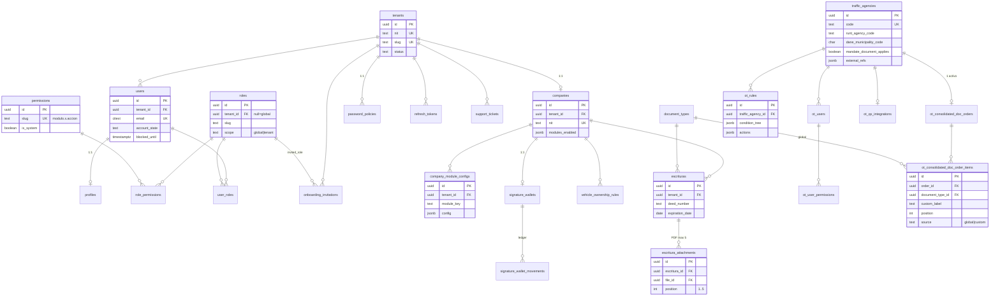
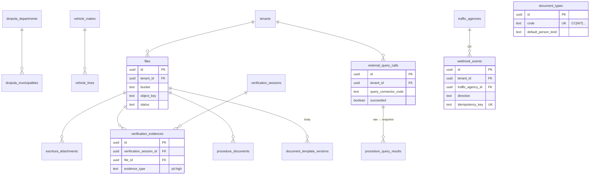
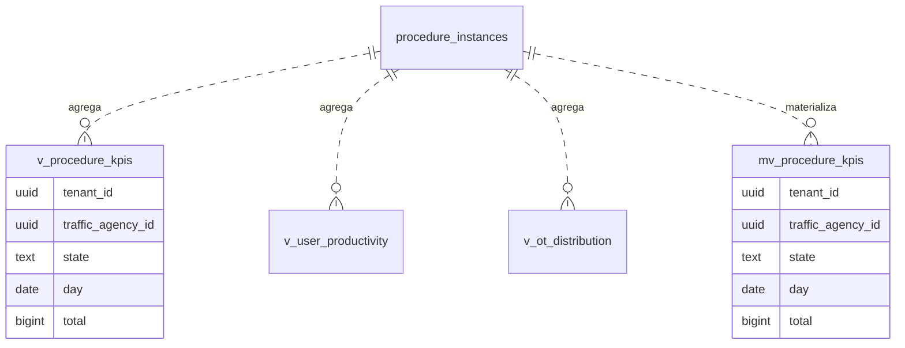

# Diagrama ER — Trámites de Tránsito FLIT 2.0

> Resumen de relaciones de los 11 schemas. Las columnas estándar (`id`, `tenant_id`,
> `created/updated/deleted_*`, `row_version`) se omiten en los bloques de atributos por brevedad;
> se muestran solo las columnas distintivas. Cardinalidad: `||--o{` = uno a muchos, `||--o|` = uno a
> cero/uno, `}o--||` = muchos a uno.

## 1. Núcleo de parametrización + runtime (corazón del diseño)

```mermaid
erDiagram
  procedure_families ||--o{ procedure_types : "1:N"
  procedure_types ||--o{ procedure_type_edges : "matriz"
  edges ||--o{ procedure_type_edges : "matriz"
  procedure_types ||--o{ procedure_type_activations : "override tenant/OT"
  procedure_types ||--o{ form_sections : ""
  procedure_type_edges ||--o{ form_sections : "override arista"
  form_sections ||--o{ form_fields : ""
  procedure_types ||--o{ procedure_type_query_configs : ""
  procedure_type_edges ||--o{ procedure_type_query_configs : "override arista"
  query_connectors ||--o{ procedure_type_query_configs : ""
  procedure_types ||--o{ required_documents : ""
  procedure_type_edges ||--o{ required_documents : "override arista"
  document_templates ||--o{ document_template_versions : "versiones"
  required_documents }o--o| document_templates : "auto_generated"
  procedure_types ||--o{ rules : "no-code"
  procedure_types ||--o{ procedure_instances : "instancias"
  traffic_agencies ||--o{ procedure_instances : "radicado en"
  tenants ||--o{ procedure_instances : "RLS"
  procedure_instances ||--o{ procedure_field_values : ""
  procedure_instances ||--o{ procedure_actors : ""
  procedure_actors ||--o| procedure_actor_representatives : "rep. legal"
  procedure_instances ||--o| procedure_vehicles : ""
  procedure_instances ||--o{ procedure_query_results : "snapshot"
  procedure_instances ||--o{ procedure_documents : ""
  procedure_instances ||--o{ procedure_state_history : ""
  procedure_instances ||--o{ procedure_identity_validations : ""
  verification_sessions ||--o{ procedure_identity_validations : "reusada"

  procedure_families {
    uuid id PK
    text code UK
    text name
    boolean is_active
  }
  procedure_types {
    uuid id PK
    uuid family_id FK
    text code UK
    text slug UK
    int max_steps
    boolean is_active
  }
  edges {
    uuid id PK
    text code UK
    text edge_kind "vehicle|person"
  }
  procedure_type_edges {
    uuid id PK
    uuid procedure_type_id FK
    uuid edge_id FK
    boolean is_active
    boolean is_required
    int display_order
    text role_label
  }
  procedure_type_activations {
    uuid id PK
    uuid tenant_id FK
    uuid procedure_type_id FK
    uuid traffic_agency_id FK
    boolean is_active
    jsonb overrides
  }
  form_sections {
    uuid id PK
    uuid procedure_type_id FK
    uuid edge_id FK "nullable"
    text section_key
    text ui_mode
  }
  form_fields {
    uuid id PK
    uuid section_id FK
    text field_key
    text data_type
    boolean is_required
    boolean is_trigger
    text ui_state
  }
  query_connectors {
    uuid id PK
    text code UK "RUNT|SIMIT|RNMC|RESOLUCIONES|RUES|FASECOLDA"
  }
  procedure_type_query_configs {
    uuid id PK
    uuid procedure_type_id FK
    uuid edge_id FK "nullable"
    uuid query_connector_id FK
    boolean is_mandatory
    boolean is_omitible
    text person_kind_filter
  }
  required_documents {
    uuid id PK
    uuid procedure_type_id FK
    uuid edge_id FK "nullable"
    uuid document_type_id FK
    text kind "upload|auto_generated"
    uuid template_id FK "nullable"
  }
  document_templates {
    uuid id PK
    text code UK
    text scope "global|tenant"
    int current_version
  }
  document_template_versions {
    uuid id PK
    uuid template_id FK
    int version
    uuid body_file_id FK
    jsonb marker_map
    boolean is_current
  }
  rules {
    uuid id PK
    uuid tenant_id FK
    uuid procedure_type_id FK
    jsonb condition_tree
    jsonb actions
    int priority
    boolean is_active
  }
  procedure_instances {
    uuid id PK
    uuid tenant_id FK
    uuid procedure_type_id FK
    uuid traffic_agency_id FK
    text reference_number
    text state
    jsonb config_snapshot "inmutable"
    uuid assigned_to_user_id FK
    numeric total_amount
  }
  procedure_field_values {
    uuid id PK
    uuid procedure_instance_id FK
    text edge_role
    text field_key
    jsonb value
  }
  procedure_actors {
    uuid id PK
    uuid procedure_instance_id FK
    text edge_role
    text person_kind "natural|juridica"
    uuid document_type_id FK
    text document_number "pii:high"
  }
  procedure_actor_representatives {
    uuid id PK
    uuid procedure_actor_id FK
    uuid document_type_id FK
    text document_number "pii:high"
  }
  procedure_vehicles {
    uuid id PK
    uuid procedure_instance_id FK
    text vehicle_subkind
    text license_plate "nullable"
    text vin "nullable"
    jsonb runt_snapshot
  }
  procedure_query_results {
    uuid id PK
    uuid procedure_instance_id FK
    text query_connector_code
    text status "ok|failed|partial"
    jsonb result
  }
  procedure_documents {
    uuid id PK
    uuid procedure_instance_id FK
    text kind "upload|auto_generated"
    uuid document_type_id FK
    uuid file_id FK
    uuid template_version_id FK
  }
  procedure_state_history {
    uuid id PK
    uuid procedure_instance_id FK
    text from_state
    text to_state
    uuid changed_by FK
  }
  procedure_identity_validations {
    uuid id PK
    uuid procedure_instance_id FK
    uuid verification_session_id FK
    uuid actor_id FK
    text verdict
  }
  verification_sessions {
    uuid id PK
    uuid tenant_id FK
    text subject_document_number "pii:high"
    text status
    text verdict
  }
```

## 2. Identidad, compañías y OT

## 3. Catálogos, archivos e integraciones (referencias transversales)

## 4. Dashboard (read model)

> **Resolución de config y snapshot:** un *resolver* aplica precedencia **OT > tenant > global**
> sobre `procedure_type_edges` (matriz) + overrides (`procedure_type_activations.overrides`) +
> `form_*` + `required_documents` + `procedure_type_query_configs` + `rules`, y congela el resultado
> en `procedure_instances.config_snapshot` al radicar (ADR-0010). Por eso el runtime referencia el
> tipo (linaje) pero **no** depende de FKs vivas hacia cada fila de config.
