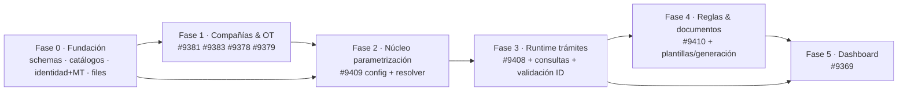

# Plan de implementación — Trámites de Tránsito FLIT 2.0

**Fecha**: 2026-06-02 · **Origen**: tech-lead-agent (Mode B) sobre el diseño `00-diseno-arquitectonico.md`
**Features**: #9369 #9370 #9378 #9379 #9381 #9383 #9408 #9409 #9410

> Descomposición de los 9 Features en Historias de Usuario `[BACKEND]`/`[FRONTEND]` con AC, Story
> Points (Fibonacci 1-2-3-5-8), dependencias y agente recomendado. Guardrails de proceso al final.
> **No se crea nada en Azure DevOps sin confirmación humana** (regla del tech-lead-agent). Las HUs se
> asignan al **sprint siguiente**, requieren `Refinement=true` + SP antes de pasar a `Active`, y las
> de schema/migración van **antes** que las que consumen esos datos.

---

## 1. Fases y secuencia (orientada por dependencias)



| Fase | Foco | Features | Bloquea a |
|---|---|---|---|
| **0** | Fundación de datos y plataforma (DDL 00/10/20/25 + infra multi-tenant) | base de #9370 | todo |
| **1** | Compañías B2B, escrituras, OT y orden del consolidado (DDL 30/40) | #9381 #9383 #9378 #9379 | F2 (activaciones por OT) |
| **2** | Núcleo de parametrización + API de config + resolver (DDL 50) | #9409 | F3, F4 |
| **3** | Runtime de trámites, consultas externas, validación de identidad (DDL 70/75/80) | #9408 #9409 | F4, F5 |
| **4** | Motor de reglas no-code + plantillas/generación documental | #9410 #9379(runtime) | F5 |
| **5** | Dashboard, KPIs y exportación (DDL 90) | #9369 | — |

**Recomendaciones de split (regla ≤8 HU / ≤40 SP por Feature):**
- **#9370** → 8 HU / ~43 SP: partir en **#9370-A** (identidad+multi-tenant+login+bloqueos) y **#9370-B** (RBAC slugs+onboarding+perfil+consolas).
- **#9409** → 6 HU / ~40 SP (en el límite): aceptable, pero vigilar; si crece, separar "config+API" de "motor de consultas".

---

## 2. Fase 0 — Fundación

| HU | Capa | Título | AC (resumen) | SP | Depende | Agente |
|---|---|---|---|---|---|---|
| F0-01 | BACKEND | Extensiones, schemas y auditoría base | Aplica `ddl/00`: `uuidv7()`/fallback, 11 schemas, `audit.audit_log`, triggers genéricos, validadores de reglas | 3 | — | database-agent |
| F0-02 | BACKEND | Catálogos + seeds colombianos | Aplica `ddl/10`: DIVIPOLA, document_types, vehículos, colores, combustibles | 3 | F0-01 | database-agent |
| F0-03 | BACKEND | Infra multi-tenant (interceptor de conexión) | Setea `app.current_tenant_id`/`current_agency_id`/`is_super_admin`/`current_user_id` por request; filtros globales EF Core | 5 | F0-01 | backend-agent |

---

## 3. #9370 [IDENTIDAD] — *recomendado split A/B*

| HU | Capa | Título | AC (resumen) | SP | Depende | Agente |
|---|---|---|---|---|---|---|
| IDN-01 | BACKEND | Migración schema identity + RLS | `ddl/20` (tenants/users/roles/permissions/user_roles/onboarding/policies), RLS + `find_user_for_auth` | 8 | F0-01 | database-agent |
| IDN-02 | BACKEND | Login unificado + rechazo inactivo (RF-1.1/1.2) | Hash seguro; tokens HttpOnly; rechazo `inactive` | 5 | IDN-01, F0-03 | backend-agent |
| IDN-03 | BACKEND | Bloqueos + rehabilitación + auditoría (RF-1.3/1.4/1.5) | Temporal con `blocked_until`, permanente, rehabilitación automática, `login_attempts` | 5 | IDN-02 | backend-agent |
| IDN-04 | BACKEND | RBAC slugs + verificador runtime (RF-2) | Permisos slug únicos; matriz en sesión; 403 sin permiso; toggle en caliente | 5 | IDN-01 | backend-agent |
| IDN-05 | BACKEND | Onboarding criptográfico + password policy (RF-4.1/4.2) | Enlace firmado 24h, un solo uso, token invalidado; complejidad | 5 | IDN-01 | backend-agent + security-agent |
| IDN-06 | BACKEND | Consolas Super Admin / Tenant Admin (RF-3) | Compañías + roles macro (SA); roles/colaboradores limitados (TA); herencia tenant; rechazo `tenant_id` inconsistente | 5 | IDN-04 | backend-agent |
| IDN-07 | FRONTEND | Login + 4 estados UI + activación + perfil autoservicio (RF-4.3/4.4) | Poppins; perfil informativo/autoservicio/transaccional; modal cambio clave; soporte | 5 | IDN-02, IDN-05 | frontend-agent |
| IDN-08 | FRONTEND | Consolas (SA/TA) + tickets de soporte | Selector de compañía (SA); consola central; soporte con contexto | 5 | IDN-06 | frontend-agent |

---

## 4. #9381 [COMPAÑIAS B2B] · #9383 [ESCRITURAS]

| HU | Capa | Título | AC (resumen) | SP | Depende | Agente |
|---|---|---|---|---|---|---|
| CMP-01 | BACKEND | Migración companies + module_configs + firmas | `ddl/30` (companies, company_module_configs, signature_wallets+movements, ownership_rules) | 5 | F0, IDN-01 | database-agent |
| CMP-02 | BACKEND | Consola indexación B2B | Tabla con filtros ID/NIT/Nombre/fechas; acciones Ver/Editar; aislamiento por tenant | 5 | CMP-01 | backend-agent |
| CMP-03 | BACKEND | Config modular hot-reload | Pestañas Matrícula/Traspasos/Empresa sin redeploy (`module_key` + `config jsonb`) | 5 | CMP-01 | backend-agent |
| CMP-04 | BACKEND | Contingencia RUNT (failover) | Adaptadores RUNT→Verifik/Intempo, circuit breaker, `runt_sync_log`; objetivo 99.9% | 8 | CMP-01, INT-01 | backend-agent |
| CMP-05 | BACKEND | Interceptor de propiedad vehicular | Reglas JSONB por tenant (allow/block/warn/require_exception) | 5 | CMP-01 | backend-agent |
| CMP-06 | FRONTEND | Consola B2B + formulario por pestañas | Indexación + 4 pestañas; validación previa a activación | 5 | CMP-02, CMP-03 | frontend-agent |
| ESC-01 | BACKEND | Migración escrituras + adjuntos + visibilidad | `ddl/30` escrituras/attachments; visible solo si `modules_enabled.escrituras` | 3 | CMP-01 | database-agent |
| ESC-02 | BACKEND | CRUD escrituras + validación PDF | Solo PDF, ≤3MB, máx 5, reemplazo total al actualizar; eliminación completa | 5 | ESC-01, FIL-01 | backend-agent |
| ESC-03 | FRONTEND | Data grid escrituras + adjuntos | Listar/registrar; ver detalle, descarga y preview de PDFs | 5 | ESC-02 | frontend-agent |

*(FIL-01 = HU de archivos/MinIO; si el módulo `Files` se reconstruye, va en Fase 0. Ver supuesto #5 del diseño.)*

---

## 5. #9378 [OT] · #9379 [ORDEN CONSOLIDADO]

| HU | Capa | Título | AC (resumen) | SP | Depende | Agente |
|---|---|---|---|---|---|---|
| OT-01 | BACKEND | Migración ot + seed ~370 | `ddl/40` (traffic_agencies, ot_users/permissions, ot_qx_integrations) + seed adaptado | 5 | F0, IDN-01 | database-agent |
| OT-02 | BACKEND | Trámites unificados (Dashboard + QX) | Modo Dashboard (procesa/aprueba en FLIT) y modo QX (webhooks/callbacks, idempotencia) | 8 | OT-01, INT-02 | backend-agent |
| OT-03 | BACKEND | Constructor de reglas OT | `ot_rules` (gatillo/condición/acciones bloqueo-validación-QX), toggle hot, validación JSONB | 5 | OT-01, RGL-01 | backend-agent |
| OT-04 | FRONTEND | Navegación 3 bloques + vistas base | Trámites / Parametrización / Vistas base; ficha OT; consola usuarios/permisos | 5 | OT-01 | frontend-agent |
| OT-05 | FRONTEND | Constructor de reglas OT (UI) | Solo SuperAdmin; cambios en tiempo real | 5 | OT-03 | frontend-agent |
| ORD-01 | BACKEND | Migración orden del consolidado | `ddl/40` ot_consolidated_doc_orders(+items); 1 activo por OT | 3 | OT-01 | database-agent |
| ORD-02 | BACKEND | Reordenar/agregar/quitar (<500ms) | Persistir orden; agregar tipo global o etiqueta custom; quitar = no empaqueta (no borra archivos) | 5 | ORD-01 | backend-agent |
| ORD-03 | FRONTEND | Drag&drop + índices | Listado vertical, índices 1,2,3…, guardar con efecto inmediato | 5 | ORD-02 | frontend-agent |

---

## 6. #9409 [MATRIZ + CONSULTAS] · #9408 [MOTOR DINÁMICO]

| HU | Capa | Título | AC (resumen) | SP | Depende | Agente |
|---|---|---|---|---|---|---|
| MTR-01 | BACKEND | Migración procedures_config + seed | `ddl/50`: familias/tipos/aristas/**matriz** + forms + docs + conectores; seed 13 tipos + matriz 2.3 | 8 | F0, OT-01 | database-agent |
| MTR-02 | BACKEND | API config + resolver | `GET /types`, `GET /types/{code}/configuration`; resolver global→tenant→OT | 8 | MTR-01 | backend-agent |
| MTR-03 | BACKEND | Validación inteligente | VIN si sin matricular / Placa si matriculado; enrutamiento CC→Natural, NIT→Jurídica; rechaza arista desactivada (400) | 5 | MTR-02 | backend-agent |
| MTR-04 | BACKEND | Motor de consultas externas | Conectores RUNT/SIMIT/RNMC/RESOLUCIONES/RUES/FASECOLDA concurrentes; circuit breaker; snapshot por fuente; fallo aislado | 8 | MTR-02, INT-01 | backend-agent |
| MTR-05 | BACKEND | Excepción Locatario/Leasing | SIMIT obligatorio; firma/RTM omitible parametrizable y **auditable** | 3 | MTR-03 | backend-agent |
| MTR-06 | FRONTEND | Render dinámico | Secciones/campos desde config; 4 estados UI; stepper ≤4; UI Kit FLIT 2.0 | 8 | MTR-02 | frontend-agent |
| TRA-01 | BACKEND | Migración runtime + guard de estados | `ddl/80` (instances/field_values/actors/representante/vehicle/query_results/documents/state_history) | 8 | MTR-01 | database-agent |
| TRA-02 | BACKEND | POST instances + snapshot + ciclo de vida | Congela `config_snapshot` al radicar; Borrador editable / resto read-only; transiciones validadas | 8 | TRA-01, MTR-02 | backend-agent |
| TRA-03 | BACKEND | Validación de identidad | `ddl/75`; dispara a actores (SMS/correo/OTP); corre una vez y se reutiliza; evidencia adjunta | 5 | TRA-02, FIL-01 | backend-agent + security-agent |
| TRA-04 | FRONTEND | Wizard ≤4 pasos | Badges de estado; edición solo en Borrador; resumen/descarga/trazabilidad fuera de Borrador | 8 | MTR-06, TRA-02 | frontend-agent |

---

## 7. #9410 [REGLAS NO-CODE] · #9379 (generación documental runtime)

| HU | Capa | Título | AC (resumen) | SP | Depende | Agente |
|---|---|---|---|---|---|---|
| RGL-01 | BACKEND | Migración rules + endpoint_catalog + validadores | `ddl/50` rules/endpoint_catalog; CHECK JSONB (gramática cerrada) | 5 | MTR-01 | database-agent |
| RGL-02 | BACKEND | Evaluador de reglas | Árbol AND/OR + 7 operadores + valor estático/dinámico; prioridad; hot-swap; OFF no evalúa; no rompe radicados | 8 | RGL-01, TRA-02 | backend-agent |
| RGL-03 | BACKEND | Catálogo de endpoints + payload builder | CRUD; credenciales por referencia (no plaintext); `endpoint_call_log`; rate limit | 5 | RGL-01, INT-01 | backend-agent + security-agent |
| RGL-04 | FRONTEND | Constructor If/Else (no-code) | Grilla card-rows; constructor 2 pasos; AND/OR anidado; UI Kit badges/toggle; WCAG AA | 8 | RGL-01 | frontend-agent |
| RGL-05 | FRONTEND | Runtime operador | Popup / sección condicional / endpoint sin reload; onChange/onBlur | 5 | RGL-02, TRA-04 | frontend-agent |
| DOC-01 | BACKEND | Plantillas + generación documental | `document_templates(+versions)` + `marker_map`; render con QuestPDF; versión inmutable; doc generado guarda `template_version_id` | 8 | MTR-01, TRA-02 | backend-agent |
| DOC-02 | BACKEND | Consolidado final por OT | Empaqueta según `ot_consolidated_doc_orders`; adjunta evidencia de identidad | 5 | DOC-01, ORD-02, TRA-03 | backend-agent |

---

## 8. #9369 [DASHBOARD]

| HU | Capa | Título | AC (resumen) | SP | Depende | Agente |
|---|---|---|---|---|---|---|
| DSH-01 | BACKEND | Read model + visibilidad por rol | `ddl/90` vistas/MV; tenant-scoped vs cross-tenant SuperAdmin (security_invoker) | 5 | TRA-01 | database-agent + backend-agent |
| DSH-02 | BACKEND | Exportación Excel + PDF ejecutivo | ClosedXML (filtros activos) + QuestPDF (encabezado, consolidado, productividad, distribución por OT) | 5 | DSH-01 | backend-agent |
| DSH-03 | FRONTEND | KPI cards + dona + filtros | Totales por estado; gráfico %; filtros fechas/OT(multi)/Cliente(SA); botones export | 5 | DSH-01 | frontend-agent |

---

## 9. HUs transversales

| HU | Capa | Título | SP | Agente |
|---|---|---|---|---|
| INT-01 | BACKEND | Plumbing de integraciones (`ddl/70`): logs, circuit breaker, reintentos idempotentes | 5 | backend-agent |
| INT-02 | BACKEND | Webhooks QX inbound/outbound + idempotencia | 5 | backend-agent |
| FIL-01 | BACKEND | Schema `files` a convención + adapter MinIO (URLs prefirmadas) | 3 | database-agent + backend-agent |
| SEC-01 | — | Revisión Habeas Data: `@pii:*`, retención biométrica, derecho al olvido vs `audit_log`/snapshot | 3 | security-agent |
| QA-01 | — | Suite CF-J (#9409/#9410) + aislamiento horizontal tenant y OT + transiciones inválidas | 5 | qa-agent |
| INF-01 | — | Migraciones por ambiente, extensión `uuidv7`, particionado de logs, refresh de MV | 3 | infra-agent |

---

## 10. AC en Gherkin (representativas)

**MTR-03 · Validación inteligente (enrutamiento + arista desactivada)**
```gherkin
Dado un trámite "Cambio de Color" cuya matriz tiene solo Vehículo + Propietario
Cuando el cliente envía un payload que incluye datos del Comprador
Entonces el backend responde 400 y no ejecuta consultas de la arista Comprador

Dado un actor con tipo de documento "NIT"
Cuando se incorpora al trámite
Entonces el sistema lo enruta como Persona Jurídica y ejecuta RUES + SIMIT (sin RUNT de persona)
```

**TRA-02 · Snapshot y ciclo de vida**
```gherkin
Dado un trámite finalizado que pasa a estado "borrador"
Cuando se radica el proceso formal
Entonces se congela config_snapshot con la config resuelta vigente
Y aunque luego cambie la parametrización del tipo, la instancia conserva su snapshot

Dado un trámite en estado "enviado"
Cuando un operador intenta editar un campo
Entonces la edición es rechazada (read-only fuera de "borrador")
```

**RGL-02 · Motor de reglas (hot-swap, no rompe radicados)**
```gherkin
Dado una regla "Tesla OR Eléctrico → mostrar Descuentos Verdes" activa
Cuando el operador captura marca "Tesla"
Entonces se inyecta la sección "Descuentos Verdes" sin recargar

Dado una regla referenciada por trámites ya radicados
Cuando un administrador la elimina (borrado lógico)
Entonces los trámites radicados siguen operando con su snapshot sin error
```

---

## 11. Roadmap por sprint (estimación)

| Sprint | Fase | HUs | SP aprox. |
|---|---|---|---|
| 1 | 0 + #9370-A | F0-01..03, IDN-01..03 | ~29 |
| 2 | #9370-B + #9381/#9383 | IDN-04..08, CMP-01..03, ESC-01..03 | ~46 → *paralelizable entre backend/frontend* |
| 3 | #9378/#9379 + #9409 (config) | OT-01..05, ORD-01..03, MTR-01..02 | ~44 |
| 4 | #9409 (consultas) + #9408 | MTR-03..06, TRA-01..04 | ~48 |
| 5 | #9410 + documental | RGL-01..05, DOC-01..02 | ~44 |
| 6 | #9369 + transversales | DSH-01..03, INT/SEC/QA/INF | ~29 |

> Total ≈ **240 SP**. Capacidad y paralelización backend/frontend ajustan el calendario real.

---

## 12. Guardrails de proceso (tech-lead-agent)

- HUs al **sprint siguiente**, nunca al activo. Feature sin tag `DOR` no se planifica.
- HU no pasa a `Active` sin `Refinement=true` **y** Story Points.
- **HU de schema/migración antes** que las que consumen esos datos (ya reflejado en dependencias).
- Cierre de Features = exclusivo del **PO humano**; cierre técnico de HU vía implementador.
- **No publico en Azure DevOps sin confirmación humana.** Este documento es el borrador para revisión.
- Entidades nuevas de negocio → ADR (ya creados: ADR-0009..0012).

### Veredicto DoR (resumen)
- Features con objetivo, AC y diseño/DDL disponibles → **listos para descomponer** (este plan).
- **#9370** y (al límite) **#9409**: aplicar split sugerido antes de activar.
