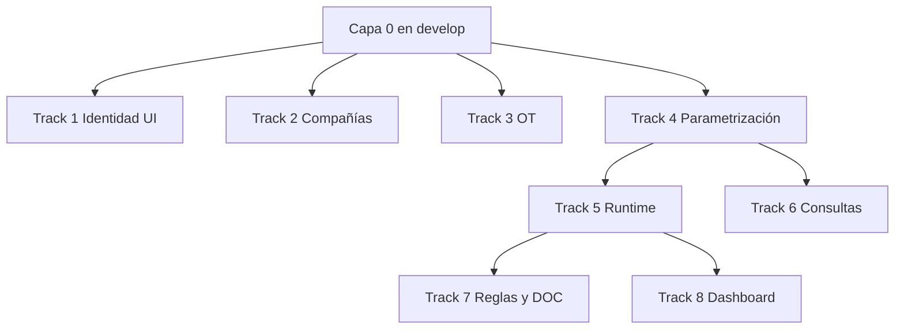

# Guía de paralelización e integración a `develop` — Trámites 2.0

**Audiencia:** desarrolladores backend, frontend y base de datos.  
**Fecha:** 2026-06-03 · **Proyecto:** FLIT - EVOLUTION  
**Referencias:** [02-plan-implementacion.md](./02-plan-implementacion.md) · [03-detalle-features-hu.md](./03-detalle-features-hu.md) · [ejemplos-datos.html](./ejemplos-datos.html)

---

## 1. Objetivo de este documento

Indicar **qué puede hacerse en paralelo**, **en qué orden integrar a `develop`** y **qué no debe empezarse** hasta que otro bloque esté mergeado. El objetivo es evitar PRs gigantes, rebases dolorosos y HUs bloqueadas por dependencias implícitas.

**Rama de integración:** siempre `develop` (convención FLIT).  
**Ramas de trabajo:** `feature/AB-{idHu}-descripcion-corta` (ej. `feature/AB-9413-f0-schemas-audit`).

---

## 2. Reglas de oro (todos)

| # | Regla |
|---|--------|
| 1 | **Una HU = un PR preferiblemente** (máx. ~800 líneas). Si crece, partir la HU. |
| 2 | **Orden dentro de la HU:** migración/DDL → API/backend → UI. Nunca UI antes que exista la API. |
| 3 | **No mezclar schemas en un solo PR** salvo migración coordinada (solo database-agent / acuerdo explícito). |
| 4 | **Migraciones:** solo archivos nuevos en `services/core-api/` (o ruta acordada); nunca editar migraciones ya aplicadas en DEV. |
| 5 | **Integrar a `develop` en olas** (ver §5); no acumular 10 ramas sin mergear. |
| 6 | **Mocks en DEV** para integraciones externas (Verifik, QX) hasta que `INT-01` / `INT-02` estén en `develop`. |
| 7 | Antes de `Active` en ADO: dependencias de la HU **mergeadas** o **documentadas como mock** en el AC. |

---

## 3. Puerta de entrada (Gate) — Capa 0

**Nadie inicia Track B, C o D hasta que Capa 0 esté en `develop`.**

Capa 0 = plataforma mínima usable (login + multi-tenant + archivos + stub integraciones).

| Orden merge | HU | ID ADO | Responsable típico | Entregable |
|-------------|-----|--------|-------------------|------------|
| 1 | F0-01 | #9413 | Backend/DB | `ddl/00`, audit, uuidv7, validadores reglas |
| 2 | F0-02 | #9424 | Backend/DB | `ddl/10` catálogos + seeds |
| 3 | IDN-01 | #9412 | Backend/DB | `ddl/20` identity + RLS |
| 4 | F0-03 | #9414 | Backend | Interceptor `app.current_tenant_id` + tests |
| 5 | FIL-01 | #9453 | Backend/DB | `ddl/25` + adapter MinIO |
| 6 | IDN-02 | #9415 | Backend | Login + refresh tokens |
| 7 | IDN-03 | #9416 | Backend | Bloqueos / login_attempts |
| 8 | INT-01 | #9431 | Backend | `ddl/70` stub + `IExternalQueryProvider` mock |
| 9 | INF-01 | #9423 | Infra/DB | Pipeline migraciones por ambiente |
| 10 | SEC-01 | #9422 | Security | Revisión PII + data_access_log |

**Verificación del gate:** `pnpm migrate` en local/DEV aplica 00→25 sin error; login con usuario de prueba devuelve JWT con `tenant_id`.

---

## 4. Tracks paralelos (después del Gate)

Tras Capa 0 en `develop`, el equipo puede dividirse en **4 tracks** que avanzan en paralelo con **pocos cruces**.

### Track 1 — Identidad aplicación (#9466)

**Quién:** 1 backend + 1 frontend.  
**Depende de:** Capa 0 (`IDN-01`, `IDN-02`).

| Fase | HUs (orden merge) | IDs |
|------|-------------------|-----|
| Backend | IDN-04 → IDN-05 → IDN-06 | #9417, #9418, #9419 |
| Frontend | IDN-07 (tras IDN-02,05) → IDN-08 (tras IDN-06) | #9420, #9421 |

**Paralelo permitido:** IDN-04 e IDN-05 en ramas distintas si no tocan los mismos archivos; merge IDN-04 primero.

---

### Track 2 — Compañías B2B + Escrituras (#9381, #9383)

**Quién:** 1 backend + 1 frontend.  
**Depende de:** Capa 0 + `FIL-01` para adjuntos PDF.

| Fase | HUs (orden merge) | IDs |
|------|-------------------|-----|
| DB | CMP-01 → ESC-01 | #9444, #9450 |
| Backend | CMP-02 → CMP-03 → CMP-05 → ESC-02 | #9445, #9446, #9448, #9451 |
| Backend (después INT-01) | CMP-04 contingencia RUNT | #9447 |
| Frontend | CMP-06 → ESC-03 | #9449, #9452 |

**Paralelo permitido:** CMP-02 y CMP-03 en paralelo **después** de CMP-01 mergeado.

---

### Track 3 — OT + Orden consolidado (#9378, #9379)

**Quién:** 1 backend + 1 frontend.  
**Depende de:** Capa 0 (`IDN-01` para FK users en seed).

| Fase | HUs (orden merge) | IDs |
|------|-------------------|-----|
| DB | OT-01 → ORD-01 | #9454, #9460 |
| Backend | ORD-02 → OT-03* → INT-02 → OT-02 | #9461, #9456, #9459, #9455 |
| Frontend | OT-04 → ORD-03 → OT-05 | #9457, #9462, #9458 |

\* `OT-03` idealmente después de `RGL-01` (#9437). **Alternativa sin bloqueo:** implementar `ot_rules` con validadores de `F0-01` y alinear con reglas globales en una HU posterior.

**Paralelo permitido:** ORD-02 y OT-04 en paralelo tras OT-01 + ORD-01.

---

### Track 4 — Parametrización (#9409-A)

**Quién:** 1 backend “dueño” de `procedures_config` + 1 frontend formularios.  
**Depende de:** Capa 0; **recomendado** OT-01 mergeado para activaciones por OT (o seed con `traffic_agency_id` NULL al inicio).

| Fase | HUs (orden merge) | IDs |
|------|-------------------|-----|
| DB | MTR-01 | #9425 |
| Backend | MTR-02 → MTR-03 → MTR-05 | #9426, #9427, #9429 |
| Frontend | MTR-06 | #9430 |
| QA | QA-01 (al cerrar slice) | #9432 |

**Paralelo permitido:** MTR-03 y MTR-05 tras MTR-02; no tocar `MTR-01` en la misma rama que MTR-02.

---

### Track 5 — Runtime trámites (#9408)

**Quién:** 1 backend core trámites + 1 frontend wizard.  
**Depende de:** `MTR-02` en `develop` (resolver + API config).

| Fase | HUs (orden merge) | IDs |
|------|-------------------|-----|
| DB | TRA-01 | #9433 |
| Backend | TRA-02 → TRA-03 | #9434, #9435 |
| Frontend | TRA-04 | #9436 |

**No iniciar** TRA-01 hasta MTR-01 mergeado (FK a `procedure_types`).

---

### Track 6 — Consultas externas (#9467)

**Quién:** 1 backend integraciones.  
**Depende de:** `MTR-02` + `INT-01` en `develop`.

| HUs | IDs |
|-----|-----|
| MTR-04 (mock Verifik DEV) | #9428 |

Puede ir en paralelo con TRA-02 **si** usa solo `procedure_query_results` y no cambia contratos de TRA.

---

### Track 7 — Reglas y documental (#9410)

**Quién:** 1 backend + 1 frontend constructor.  
**Depende de:** `MTR-01`, `TRA-02`, `ORD-02`, `TRA-03` para DOC-02.

| Fase | HUs (orden merge) | IDs |
|------|-------------------|-----|
| DB | RGL-01 | #9437 |
| Backend | RGL-03 → RGL-02 | #9439, #9438 |
| Backend doc | DOC-01 → DOC-02 | #9442, #9443 |
| Frontend | RGL-04 → RGL-05 | #9440, #9441 |

**Paralelo:** RGL-04 tras RGL-01; RGL-02 espera TRA-02.

---

### Track 8 — Dashboard (#9369)

**Quién:** 1 backend + 1 frontend.  
**Depende de:** `TRA-01` con datos de prueba (instancias en varios estados).

| HUs | IDs |
|-----|-----|
| DSH-01 → DSH-02 → DSH-03 | #9463, #9464, #9465 |

**Último track** en integrar a `develop`.

---

## 5. Olas de integración a `develop` (calendario sugerido)

Cada **ola** termina cuando todo lo listado está mergeado y CI verde. La siguiente ola no empieza desarrollo nuevo que dependa de la anterior.

| Ola | Nombre | Contenido principal | SP aprox. | Paralelismo |
|-----|--------|---------------------|-----------|-------------|
| **0** | Gate Capa 0 | F0, IDN-01..03, FIL-01, INT-01, INF, SEC | ~35 | Secuencial estricto (pocos devs) |
| **1** | Dominios base | Track 1 + Track 2 (CMP/ESC) + Track 3 (OT/ORD) + MTR-01 | ~50 | 3–4 devs en tracks distintos |
| **2** | APIs dominio | IDN-04..08, CMP-02..06, OT-02..05, MTR-02..03 | ~55 | Backend + frontend por track |
| **3** | Runtime | TRA-01..04, MTR-04..06, MTR-05 | ~45 | 2 devs (runtime + consultas) |
| **4** | Reglas y PDF | RGL-01..05, DOC-01..02 | ~44 | 2 devs |
| **5** | Cierre | DSH-01..03, QA-01, deuda transversal | ~25 | 1–2 devs |

> **Nota:** En ADO muchas HUs están en Sprint 1; esta tabla es el orden **real de merge a develop**, no el sprint nominal.

---

## 6. Asignación sugerida por rol (equipo de 5–6 personas)

| Rol | Tracks | HUs prioritarias |
|-----|--------|------------------|
| **Dev Backend Plataforma** | Gate + INT | F0-01, F0-03, IDN-01, IDN-02, INT-01, INF-01 |
| **Dev Backend Compañías** | 2 | CMP-*, ESC-*, FIL-01 si no lo tomó plataforma |
| **Dev Backend OT** | 3 | OT-*, ORD-*, INT-02 |
| **Dev Backend Trámites** | 4, 5, 6 | MTR-*, TRA-* |
| **Dev Backend Reglas/DOC** | 7 | RGL-*, DOC-* (entra después ola 3) |
| **Dev Frontend A** | 1, 2 | IDN-07/08, CMP-06, ESC-03 |
| **Dev Frontend B** | 3, 4, 5 | OT-04/05, MTR-06, TRA-04, RGL-04/05 |
| **Dev Frontend C** | 8 | DSH-03 (al final) |

Ajustar según capacidad real; lo importante es **no asignar dos HUs que comparten el mismo módulo .NET abierto** sin coordinación diaria.

---

## 7. Checklist antes de abrir PR

- [ ] Rama desde `develop` actualizado (`git pull origin develop`).
- [ ] Nombre rama: `feature/AB-{huId}-...`
- [ ] Commits: `HU{id}: descripción breve`
- [ ] Si hay migración: ejecutada local + `db-schema-validator` / revisión database-agent
- [ ] Tests unitarios del módulo tocado
- [ ] PR ≤ 800 líneas; target `develop`
- [ ] En descripción del PR: **HU #**, **tablas tocadas**, **dependencias mergeadas**
- [ ] Sin secretos ni PII en logs/commits

---

## 8. Qué hacer cuando hay dependencia entre tracks

| Situación | Acción |
|-----------|--------|
| Necesito tabla que otro track aún no mergeó | Usar **rama de integración temporal** `integration/ola-N` solo con acuerdo del TL, o **mock/stub** en tests hasta merge |
| Mi PR choca con migración de otro | Coordinar orden: **migraciones primero**, luego APIs; rebasar sobre la migración más reciente |
| CMP-04 o MTR-04 bloqueados por INT-01 | Implementar contra **interfaz** `IExternalQueryProvider` con implementación mock en el mismo PR si INT-01 no está listo (solo si el contrato ya está en `develop`) |
| Cambio en `procedures_config` con trámites radicados | Respetar ADR-0010: no romper `config_snapshot`; AC de regresión obligatorio |

---

## 9. Coordinación diaria (15 min)

1. ¿Qué se mergeó ayer a `develop`?
2. ¿Quién desbloquea el Gate / la ola actual?
3. ¿Algún conflicto en `ddl/` o `Flit.Modules.*`?
4. ¿PRs listos para review (≤800 líneas)?

**Canal sugerido:** hilo en Discussion del Feature o standup con tabla:

| Dev | HU activa | Bloqueado por | PR # |
|-----|-----------|---------------|------|

---

## 10. Enlaces rápidos

| Recurso | Ruta |
|---------|------|
| DDL orden 00→90 | `docs/designs/tramites-2.0/ddl/` |
| Ejemplos de datos | `docs/designs/tramites-2.0/ejemplos-datos.html` |
| ER visual | `docs/designs/tramites-2.0/er.html` |
| ADRs | `docs/decisions/ADR-0009` … `ADR-0012` |
| Convenciones datos | `docs/database-conventions.md` |

---

**Mantenimiento:** actualizar este documento cuando cambie el orden de merge o se creen nuevas Features/HUs.
