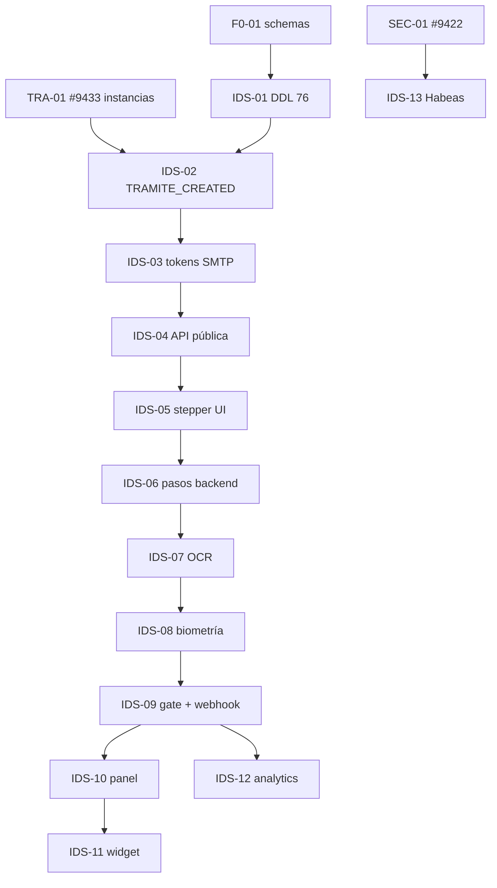

# Feature #9469 — IDSecure-Trámites · Historias y modelo de datos

**ADO:** [Feature #9469](https://dev.azure.com/FlitDevOps/FLIT%20-%20EVOLUTION/_workitems/edit/9469)  
**Título:** `[TRAMITES] - IDSecure-Trámites - Validación de identidad automatizada multi-trámite`  
**Estado:** New · **Tags:** `adopcion-ia`, `DOR`, `fase-1-diseño`  
**Asignado:** hector.rivera@flitsas.com  
**Fuente:** `PRD_IDSecure_Tramites.md` v1.1

## 1. Análisis del Feature

### Objetivo
Evolución de **IDSecure-Traspasos** hacia un módulo **multi-trámite**: validación documental + biométrica (OCR, liveness, match facial Vertex AI) desacoplada por eventos (`TRAMITE_CREATED`), con tokens de invitación 48h, stepper móvil de 4 pasos, dictamen `Approved`/`Rejected`, backoffice y widget en el detalle del trámite core.

### Relación con el diseño Trámites 2.0 existente

| Artefacto existente | Uso en #9469 |
|---|---|
| `ddl/75-identity_verification.sql` | Base: `verification_sessions`, `verification_evidences` |
| `ddl/80-procedures.sql` → `procedure_identity_validations` | Enlace instancia ↔ sesión reutilizable |
| `ddl/76-idsecure-tramites.sql` (**nuevo**) | Invitaciones, config por tipo, pasos, OCR, dictamen, overrides, plantillas email |
| Feature **#9408** (runtime trámites) | Emite `TRAMITE_CREATED`; bloquea avance hasta 100% `Approved` |
| Feature **#9409** (parametrización) | `procedure_types` + matriz de aristas para mapeo participantes |
| `python-ml` / Vertex AI | OCR y biometría (provider `vertex_ai`; DEV: `mock`) |

### Recomendación de split (regla FLIT ≤8 HU / ≤40 SP por Feature)

| Sub-feature propuesto | HUs | SP | Fase PRD |
|---|---|---|---|
| **#9469-A** Activación + stepper | IDS-01 … IDS-06 | 39 | Fase 1–2 |
| **#9469-B** IA + integración core | IDS-07 … IDS-09 | 24 | Fase 2 PRD |
| **#9469-C** Backoffice + analytics | IDS-10 … IDS-13 | 18 | Fase 3 |

> Mientras el Feature padre siga siendo uno solo, las HUs usan prefijo **IDS-** y sprint escalonado (4→6).

### Dependencias críticas (gates)

---

## 2. Inventario de tablas (DDL 75 + 76)

| Tabla | Función |
|---|---|
| `procedure_type_verification_configs` | Mapeo tipo trámite → participante/arista obligatorio + plantilla email |
| `verification_invitations` | Token hash 48h, un uso, email destinatario, idempotencia |
| `verification_sessions` *(extendida)* | Sesión por participante; `procedure_instance_id`, `current_step`, `provider` |
| `verification_session_steps` | Progreso secuencial stepper (4 pasos) |
| `verification_evidences` | Binario en `files`; tipos incl. `signature_canvas` |
| `verification_ocr_results` | Campos extraídos + confidence (PII alta) |
| `verification_ai_verdicts` | Dictamen JSON Approved/Rejected |
| `verification_manual_overrides` | Override auditado operador (RF-4.7) |
| `verification_email_templates` | SMTP HTML por trámite/tenant |
| `verification_domain_events` | Idempotencia `TRAMITE_CREATED` (append-only) |
| `procedures.procedure_identity_validations` | Agregado 100% Approved por instancia |

---

## 3. Historias de Usuario (13 · 81 SP)

| Código | ADO (al crear) | Capa | Título | SP | Sprint | Depende |
|---|---|---|---|---|---|---|
| IDS-01 | TBD | BACKEND | Migración IDSecure DDL 76 + extensión sesiones | 8 | 4 | F0-01, TRA-01 |
| IDS-02 | TBD | BACKEND | Consumer `TRAMITE_CREATED` + mapeo participantes | 8 | 4 | IDS-01, TRA-02 |
| IDS-03 | TBD | BACKEND | Tokens invitación 48h + SMTP HTML + reenvío controlado | 5 | 4 | IDS-02 |
| IDS-04 | TBD | BACKEND | API pública validación token + bootstrap sesión | 5 | 4 | IDS-03 |
| IDS-05 | TBD | FRONTEND | Stepper móvil 4 pasos (UI Kit, 4 estados) | 8 | 4 | IDS-04 |
| IDS-06 | TBD | BACKEND | Persistencia pasos + firma canvas + gating secuencial | 5 | 5 | IDS-05 |
| IDS-07 | TBD | BACKEND | Pipeline OCR Vertex + `verification_ocr_results` | 8 | 5 | IDS-06 |
| IDS-08 | TBD | BACKEND | Match biométrico + liveness + dictamen JSON | 8 | 5 | IDS-07 |
| IDS-09 | TBD | BACKEND | Cross-matching + gate 100% Approved + webhook core | 8 | 5 | IDS-08, TRA-03 |
| IDS-10 | TBD | BACKEND | Panel Enviadas/Aprobadas/Rechazadas + ficha + override | 5 | 6 | IDS-09 |
| IDS-11 | TBD | FRONTEND | Widget semáforo en detalle trámite (tiempo real) | 5 | 6 | IDS-09, TRA-04 |
| IDS-12 | TBD | BACKEND | Analytics People & Fraud (MV / dashboard) | 5 | 6 | IDS-09 |
| IDS-13 | TBD | BACKEND | Habeas Data: retención, cifrado evidencias, consentimiento | 3 | 6 | IDS-01, SEC-01 |

---

## 4. Detalle por HU (Description + AC resumidos)

### IDS-01 — Migración IDSecure DDL 76
**Como** desarrollador backend, **quiero** aplicar el DDL 76 sobre `identity_verification`, **para** persistir invitaciones, pasos, OCR y dictámenes sin desviarme de convenciones FLIT.

**AC1 positivo:** Given F0-01 aplicado, When ejecuto migración EF desde `ddl/76-idsecure-tramites.sql`, Then existen las 9 tablas nuevas + columnas en `verification_sessions` con RLS y triggers de auditoría.  
**AC2 negativo:** Given migración parcial fallida, When re-ejecuto, Then la migración es idempotente o revierte sin dejar tablas huérfanas sin RLS.

**Tablas:** todas las de §2.

---

### IDS-02 — Consumer TRAMITE_CREATED
**Como** sistema de trámites, **quiero** reaccionar al evento `TRAMITE_CREATED` con idempotencia, **para** activar IDSecure solo una vez por radicación.

**AC1:** Given instancia en estado inicial, When publico evento con `idempotency_key` único, Then se registran invitaciones según `procedure_type_verification_configs`.  
**AC2:** Given mismo `idempotency_key`, When repito evento, Then no se duplican invitaciones (409 o no-op).

**Tablas:** `verification_domain_events`, `verification_invitations`, `procedure_type_verification_configs`.

---

### IDS-03 — Tokens + SMTP
**Como** ciudadano invitado, **quiero** recibir un enlace único por email, **para** iniciar validación en menos de 3 minutos.

**AC1:** Given invitación creada, When envío correo, Then URL contiene token de un solo uso y expira en 48h.  
**AC2:** Given token consumido, When intento reutilizar URL, Then 410 Gone.

**Tablas:** `verification_invitations`, `verification_email_templates`.

---

### IDS-04 — API pública token
**Como** participante externo, **quiero** validar mi token sin autenticación corporativa, **para** abrir la sesión móvil.

**AC1:** Given token válido no expirado, When GET `/public/idsecure/session`, Then retorna `verification_session_id` y paso actual.  
**AC2:** Given token expirado, When GET, Then 401 con mensaje de reenvío.

---

### IDS-05 — Stepper móvil (FRONTEND)
**Como** solicitante, **quiero** un flujo guiado de 4 pasos en móvil, **para** capturar documento, selfie, liveness y firma.

**AC1:** Given sesión activa, When avanzo paso a paso, Then UI muestra vacío/cargando/error/lleno en cada paso.  
**AC2:** Given token inválido, When abro URL, Then pantalla de error sin exponer datos del trámite.

---

### IDS-06 — Persistencia pasos + firma
**Como** backend IDSecure, **quiero** persistir el progreso secuencial y la firma canvas, **para** reanudar el flujo y auditar.

**AC1:** Given paso 2 incompleto, When intento saltar al paso 4, Then 422 secuencia inválida.  
**AC2:** Given firma capturada, When guardo, Then `verification_evidences` tipo `signature_canvas` referencia `files.files`.

**Tablas:** `verification_session_steps`, `verification_evidences`.

---

### IDS-07 — OCR Vertex
**Como** motor IA, **quiero** extraer nombre, documento y fecha del anverso/reverso, **para** alimentar cross-matching.

**AC1:** Given imágenes de documento, When proceso OCR, Then `verification_ocr_results.extracted_fields` contiene campos normalizados.  
**AC2:** Given imagen ilegible, When OCR falla, Then sesión en `failed` con razón en metadata.

---

### IDS-08 — Biometría + liveness + dictamen
**Como** sistema antifraude, **quiero** match facial y liveness Vertex, **para** emitir dictamen Approved/Rejected.

**AC1:** Given selfie y documento, When match score ≥ umbral, Then `verification_ai_verdicts.verdict = approved`.  
**AC2:** Given liveness fallido (CF-I10), When evalúo, Then `rejected` con `failure_reasons`.

---

### IDS-09 — Cross-matching + gate + webhook
**Como** motor de trámites, **quiero** bloquear avance hasta 100% participantes Approved, **para** cumplir CF-G2.

**AC1:** Given traspaso 2 participantes y solo 1 Approved, When consulto gate, Then instancia no avanza.  
**AC2:** Given todos Approved, When webhook a core, Then `procedure_identity_validations` actualizado y trámite desbloqueado.

**Tablas:** `procedure_identity_validations`, `verification_ai_verdicts`.

---

### IDS-10 — Panel backoffice
**Como** operador, **quiero** listar validaciones y override auditado, **para** resolver excepciones (RF-4.7).

**AC1:** Given permiso `idsecure.review`, When filtro por trámite, Then listado Enviadas/Aprobadas/Rechazadas.  
**AC2:** Given override, When confirmo, Then fila en `verification_manual_overrides` + `audit_log`.

---

### IDS-11 — Widget semáforo (FRONTEND)
**Como** operador de trámite, **quiero** ver semáforo por participante en el detalle, **para** estado en tiempo real (CF-I8).

**AC1:** Given instancia con 2 actores, When abro detalle, Then widget verde/rojo/amarillo por participante.  
**AC2:** Given cambio de dictamen, When SignalR notifica, Then widget se actualiza sin recargar.

---

### IDS-12 — Analytics People & Fraud
**Como** dirección, **quiero** dashboard de fraude por tipo de trámite, **para** cumplimiento (CF-I9).

**AC1:** Given datos históricos, When consulto analytics, Then KPIs por `procedure_type` y tasa rechazo.  
**AC2:** Given tenant aislado, When TA consulta, Then solo ve su `tenant_id` (RLS).

---

### IDS-13 — Habeas Data IDSecure
**Como** responsable de datos, **quiero** retención y cifrado de evidencias biométricas, **para** Ley 1581.

**AC1:** Given política de retención, When job de purga ejecuta, Then evidencias expiradas eliminadas en MinIO y metadatos anonimizados.  
**AC2:** Given acceso a ficha PII, When operador consulta, Then registro en `audit.data_access_log`.

---

## 5. Contratos de integración (stubs DEV)

| Contrato | DEV | Producción |
|---|---|---|
| `IIdentityVerificationProvider` | `MockIdentityVerificationProvider` | `VertexIdentityVerificationProvider` |
| Evento `TRAMITE_CREATED` | RabbitMQ local / outbox en `procedures` | Mismo |
| Webhook estado IDSecure → core | `POST /internal/procedures/{id}/identity-status` | Igual |

---

## 6. Orden de merge sugerido

1. `feature/AB-9469-ids-01-ddl` (IDS-01)  
2. `feature/AB-9469-ids-02-activation` (IDS-02, IDS-03)  
3. Paralelo: IDS-04 + IDS-05 tras IDS-03  
4. Ola IA: IDS-06 → IDS-09  
5. Ola UI operador: IDS-10, IDS-11, IDS-12, IDS-13  

---

*Generado para descomposición del Feature #9469 · Trámites 2.0*
